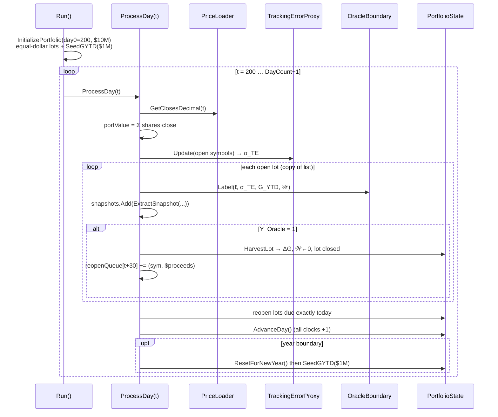
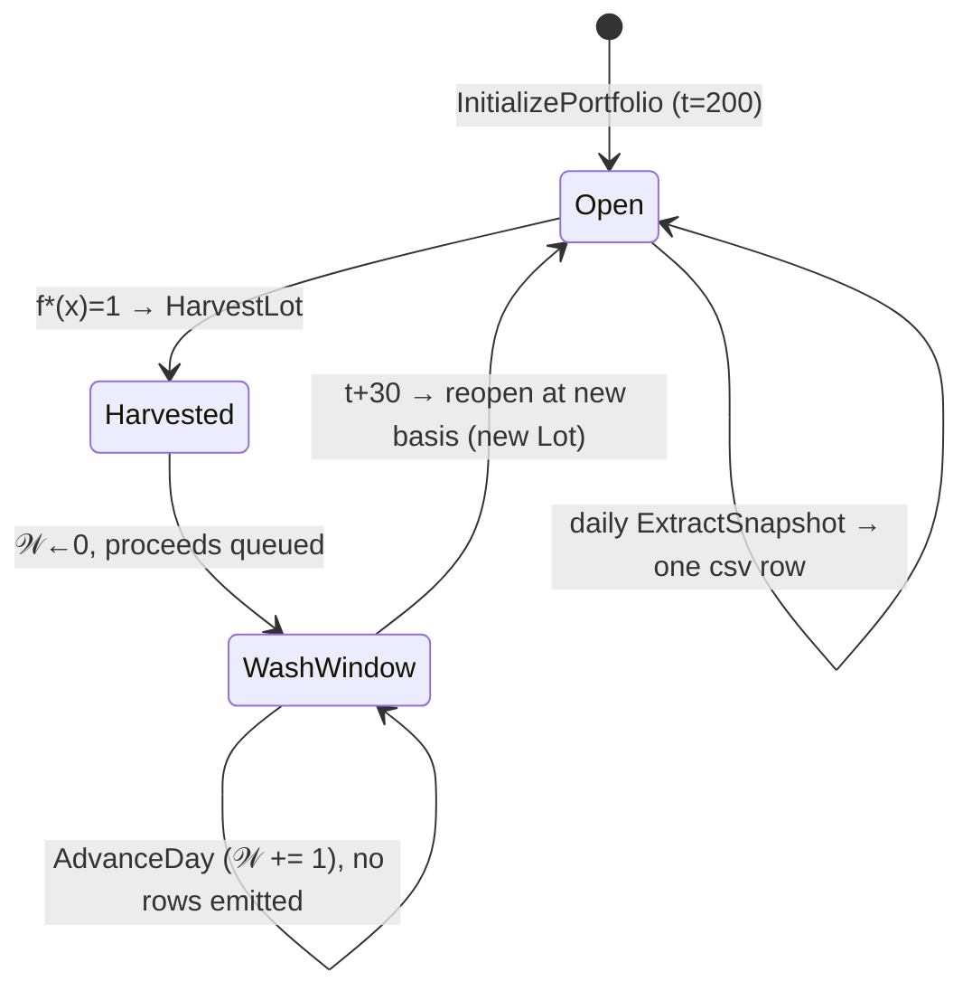

# v0.2 Lifecycle — Architecture & Mathematical Synthesis

> **Purpose.** One document that walks the *entire* v0.1–0.2 codebase from first principles:
> what every layer does, in what order, why it exists, and the math it implements — with the
> same explicit-domain "statically typed math" discipline as
> `ML_Derivations_Explicit_Rigorous_DollarMath.md` (every symbol declares its set; every layer
> declares its signature). Section 8 directly audits the intuition map from the simulation-layer
> code review (the I–V questions), confirming or correcting each. Diagrams are Mermaid
> (renders natively on GitHub / VS Code preview — no compile step) with ASCII fallbacks.

---

## 0. The whole program is one composed function

The four layers are maps between concrete artifacts on disk. Declared as types:

$$
\underbrace{\mathrm{download}}_{\texttt{dotnet run download}}:\ \varnothing \to \mathcal J,
\qquad
\underbrace{\mathrm{simulate}}_{\texttt{dotnet run simulate}}:\ \mathcal J \to (\mathcal X\times\mathcal Y)^N,
$$

$$
\underbrace{\mathrm{mlnet}}_{\texttt{dotnet run mlnet-all}}:\ (\mathcal X\times\mathcal Y)^N \to \widehat{H},
\qquad
\underbrace{\mathrm{report}}_{\texttt{dotnet run report}}:\ \widehat{H} \to \text{paper},
$$

where

- $\mathcal J$ = the raw price cache: one JSON array per ticker under `data/raw/`, plus `data/constituents.json`;
- $(\mathcal X\times\mathcal Y)^N$ = the dataset `data/lots.csv`: $N = 170{,}751$ observations, $\mathcal X\subset\mathbb R^{15}\times\text{Sector}$, $\mathcal Y=\{0,1\}\times[0,1]\times([0,1]\cup\{\texttt{NaN}\})$;
- $\widehat H$ = the trained-model artifact set `data/artifacts-mlnet/` (leaderboards, metrics JSON, coefficient CSVs, model zips);
- paper = `src/Export/report/` (executed notebook, HTML, codebook).

```mermaid
flowchart LR
    subgraph L1["Layer 1 · DataCollection"]
        DL[MarketDataDownloader]
    end
    subgraph L2["Layer 2 · Core/Simulation"]
        PL[PriceLoader] --> SE[SimulationEngine]
        SE --> SLB[SoftLabelBuilder]
        SLB --> EXP[SimulationExporter]
    end
    subgraph L3["Layer 3 · ML/CSharp/MLNet"]
        RD[LotStateVectorCsvReader] --> PIPE[MLnetPipeline]
        PIPE --> GS[GridSearchCV × 5 models]
    end
    subgraph L4["Layer 4 · ML/Python (report)"]
        REP[scripts.report → nbclient → nbconvert]
    end
    FMP[(FMP API)] --> DL
    SSGA[(SSGA SPY xlsx)] --> DL
    DL -->|"data/raw/*.json<br/>constituents.json"| PL
    EXP -->|"data/lots.csv"| RD
    GS -->|"data/artifacts-mlnet/*.json"| REP
    RD -->|"lots.csv (EDA cells)"| REP
```



Each arrow is a **file**, not a shared object — layers communicate only through serialized
artifacts.[^1] That is the architectural thesis of the project: a layer can be rerun, replaced
(Python → ML.NET, issue #10), or audited in isolation because its entire input is inspectable
on disk.

[^1]: One deliberate exception *inside* layer 2: `SimulationEngine → SoftLabelBuilder → SimulationExporter` pass an in-memory `List<LotStateVector>` because they execute within a single `dotnet run simulate` invocation. The file boundary is at the layer's edge (`lots.csv`), not between its internal passes.

The Program.cs switch is the only place these compositions are spelled out:

```
Program.cs case          calls                                              writes
─────────────────────    ───────────────────────────────────────────────    ─────────────────────────
download                 MarketDataDownloader.DownloadAllHistoricalData     data/raw/, constituents.json
simulate                 PriceLoader.Load → SimulationEngine.Run            data/lots.csv
                         → SoftLabelBuilder.Label → SimulationExporter
simulate-mc              MonteCarloEngine.Run (synthetic GBM prices)        data/lots-mc.csv
mlnet-all                LotStateVectorCsvReader.Read                       data/artifacts-mlnet/
                         → RunUnsupervised → RunAllSupervised ×2 targets    + Export/eda-, models-mlnet/
                         → RunRender (Python)
report                   PythonRunner → scripts.report                      src/Export/report/
submission               PythonRunner → scripts.package_submission          submission.zip
```

---

## 1. First principles: why each layer must exist

Start from the tax code and derive the codebase.

**P1 — The tax asymmetry.** Realized losses offset realized gains. A lot trading below cost
basis holds an *option* worth $\tau(h)\cdot|q_k(P_t-p_k)|$ dollars (with
$\tau(h)\in\{0.37, 0.20\}$ for short/long-term), exercisable by selling. Direct indexing
exists because that option only exists at lot granularity — an index-fund holder owns no lots.

**P2 — The decision rule.** Exercising the option is constrained (wash-sale lockout, gains
budget, tracking-error budget), so "should I harvest lot $k$ today?" has a *correct* answer
computable from observable state. That answer is the oracle:

$$
f^*(x)=\mathbb 1[L\le-\theta_1]\cdot\mathbb 1[\sigma_{TE}\le\theta_2]\cdot
\mathbb 1[G^{\mathrm{YTD}}>0]\cdot\mathbb 1[\mathcal W\ge 30],
\qquad f^*:\mathcal X\to\{0,1\},
$$

with $\theta_1=0.02$, $\theta_2=0.05$ (named constants in `OracleBoundary`, never magic
numbers). Geometrically: the intersection of four half-spaces — a convex polytope
$\Omega\subset\mathcal X$ — and $f^*=\mathbb 1_\Omega$.

**P3 — Why a simulator.** No public dataset records lot-level state under this rulebook. But
the rulebook is *executable*, so the data can be **generated**: replay real prices through a
portfolio that obeys P2, and log every (lot, day) state. The simulation layer is not an
approximation of the problem — it *is* the problem's physics, with real price risk.

**P4 — Why machine learning at all, when $f^*$ is known code?** Three reasons, in increasing
order of importance:

1. *Recoverability sanity check.* If a model cannot re-learn a known, deterministic
   $f^*$ from 170K labeled examples, the pipeline (features, splits, weights, metrics) is
   broken. The oracle target is a unit test executed in distribution space. Observed: trees
   ≈ perfect (CV PR-AUC ≥ 0.999); elastic net and least squares fail (0.44 / 0.37); plain
   logistic lands surprisingly high (0.987) — because with the \$1M gains seed the
   $G^{\mathrm{YTD}}$ gate never closes (100% of rows), so the 4-way AND nearly collapses
   to the single half-space $L\le-0.02$, which *is* linearly separable. A conjunction is
   only as non-linear as the number of gates that actually bind.
2. *The real target is the future, and $f^*$ cannot see it.* The practically valuable
   question is not "does the rulebook fire today?" (just run the rulebook) but "**will it
   fire within the next 30 trading days?**" — harvest *propensity*, the thing an advisor
   ranks lots by. That quantity depends on unrealized future prices; at decision time no
   code can compute it. It can only be *estimated from current state* — which is precisely
   a supervised learning problem.
3. *Distillation toward v0.4.* The soft-label model $\hat\eta(x)\approx
   \mathbb E[\text{future harvestability}\mid x]$ compresses a 30-day forward simulation
   (or 200 Monte-Carlo paths) into one function evaluation — a learned value-function
   surrogate, the stepping stone to the RL policy layer (issues #16, #15).

**P5 — The label/feature information asymmetry.** The single most important invariant in the
whole project:

> **Labels may peek at the future (at dataset-construction time). Features never may.**

$Y_{\text{Soft\_BT}}$ is computed from prices at $t+1,\dots,t+30$ — legal, because labels are
the *answer key* and exist only at training time. Every feature is
$\sigma(\mathcal F_t)$-measurable (computable from information available at day $t$). At
deployment the future doesn't exist; the model bridges the gap. This is what supervised
learning *is*, formalized.

---

## 2. Layer 1 — Download (`DataCollection/MarketDataDownloader.cs`)

**Signature and call chain.**

```
DownloadAllHistoricalData(outputDir, years=2, warmupTradingDays=200)
 ├─ fetch SSGA SPY holdings xlsx  → [(Symbol, Name, Sector, Weight)]   (issue #7)
 ├─ write constituents.json
 └─ per symbol (≈503, 250ms apart):
      ├─ cache hit & complete?  → skip
      ├─ else fetch FMP /stable/historical-price-eod/full
      ├─ merge with existing JSON, dedupe by date
      └─ write data/raw/{SYMBOL}.json   (newest-first DailyPrice[])
```

The window is $2\text{ years} + 200$ trading days: the warmup exists so that
$\mathrm{MA}_{200}$ — and therefore the feature `DeltaMA200` — is defined on the *first* day
the portfolio opens. A feature's data requirement propagates backwards into the download
contract; this is the first instance of the schema-first pattern (the downstream schema
dictates the upstream fetch).

---

## 3. Layer 2 — Simulation (the heart)

### 3.1 PriceLoader — the price field as a total data structure

After `Load(rawDataDir, constituentsFile)`, the loader holds, per ticker, **aligned arrays**
on one shared trading calendar:

$$
\texttt{\_close}:\ \mathcal S \to \mathbb R^T,\qquad
\texttt{\_return},\ \texttt{\_rangeVol},\ \texttt{\_ma50},\ \texttt{\_ma200}:\ \mathcal S \to \mathbb R^T,
$$

where $\mathcal S$ = the ticker universe ($|\mathcal S| = 503$), $T$ = calendar length, and
missing data is `NaN` *in place* (a ticker absent on a date keeps its array slot). So the
mathematical object really is a dense matrix

$$
P \in (\mathbb R_{>0}\cup\{\texttt{NaN}\})^{|\mathcal S|\times T},
\qquad P[i,t] = P_t^{(i)},
$$

stored as a `Dictionary<string, float[]>` — rows keyed by symbol instead of integer index.
The three-phase `LoadPrices`:

```
Phase 1  deserialize every data/raw/*.json, sort ascending          (per-ticker, ragged)
Phase 2  union of all dates → SortedSet → _calendar, _dateToIndex   (the shared time axis)
Phase 3  scatter each ticker onto the axis, NaN-fill gaps;
         precompute r_t, (H−L)/P_{t−1}, MA50, MA200                 (the matrix, plus features)
```

Phase 2 is the alignment step that turns ragged per-ticker series into one rectangular
field — after it, every lookup is $O(1)$ array indexing, which is what lets the engine's day
loop and the covariance estimator be tight loops over indices.

The **getter API is the layer's contract** — `GetClose`, `DailyReturn`, `RangeVol`,
`DeviationFromMA`, `GetClosesDecimal`, `GetReturnArray`, `GetSector` — and after `Load`
returns, the object is **read-only forever**. Nothing downstream mutates it (see §8.V).

`CreateForTesting(dailyReturns)` is the same contract *constructed without I/O*: it accepts
synthetic return arrays, reconstructs closes from base 100, fabricates a sequential calendar,
and fills only the fields that `TrackingErrorProxy` and `SoftLabelBuilder` consume. It is
dependency injection by static factory: tests exercise the *mathematical mappings* with the
JSON/API dependency deleted.

### 3.2 The state objects — one mutable world, immutable photographs

$$
\text{world at } t:\quad
\mathcal S_t=(\mu_t,\ G_t^{\mathrm{YTD}},\ \mathcal W_t)
$$

| Object | C# | Mutability | Math |
|---|---|---|---|
| `Lot` | mutable class | evolves (`IsOpen`) | one Dirac atom $q_k\,\delta_{(p_k,s_k)}$ |
| `PortfolioState` | mutable class | evolves daily | the triple $\mathcal S_t$: lot measure $\mu_t$, scalar $G_t^{\mathrm{YTD}}\in\mathbb R$, clock map $\mathcal W_t:\mathcal S\to\mathbb Z_{\ge0}$ |
| `LotStateVector` | **immutable record** | frozen at extraction | one point $(x,y)\in\mathcal X\times\mathcal Y$ |

The invariant: the ML layer **only ever sees the immutable photographs**, never the living
world. `ExtractSnapshot` is the boundary map

$$
g:\ (\text{Lot},\ \mathcal S_t,\ P[\cdot,t],\ \hat\sigma_{TE,t})\ \longrightarrow\ \mathcal X\times\mathcal Y,
$$

evaluated once per open lot per day. Wash-clock bookkeeping detail: `_washClocks` only has
entries for tickers harvested at least once; `GetWashClock` returns the sentinel **999**
otherwise — "never harvested" encodes as "wash-sale window long since cleared", which is
exactly the right semantics for gate 4.

### 3.3 SimulationEngine — the day loop



Notes that matter mathematically:

- **Snapshot precedes harvest.** The row records the state *at decision time*; the harvest
  is the consequence, applied after. So `lots.csv` rows with $Y_{\text{Oracle}}=1$ show the
  world that *caused* the fire, not the world after it.
- **Initialization.** $\text{perLot}=V_0/n$, $q_i=\lfloor \text{perLot}/P^{(i)}_{t_0}\rfloor$
  (min 1 share). $G^{\mathrm{YTD}}$ seeded to $0.10\,V_0=\$1{,}000{,}000$ — calibrated to the S&P 500's
  long-run ~10% annual return (the client realizes gains elsewhere at the index's pace);
  without external
  gains the third gate never opens and the dataset has zero positives.[^2]
- **Harvest transition.** $\Delta G = q_k(P_t-p_k)<0$ for a loss;
  $\mu_{t+1}=\mu_t - q_k\delta_{(p_k,s_k)}$; $\mathcal W^{(A_k)}\leftarrow 0$; proceeds
  $q_kP_t$ queued for reopen at exactly $t+30$, repurchasing
  $\lfloor q_kP_t / P_{t+30}\rfloor$ shares. The reopened lot is a *new atom* with fresh
  basis $P_{t+30}$ and fresh purchase day — the measure-theoretic encoding of "you bought it
  back."
- **Year-end.** $G^{\mathrm{YTD}}\leftarrow 0$ then re-seed $\$1M$; wash clocks
  deliberately persist (the IRS window crosses Dec 31).
- **TaxAlpha** (feature, not label):
  $\alpha_{\text{tax}} = \tau(h)\cdot|q_k(P_t-p_k)|\cdot\mathbb 1[G^{\mathrm{YTD}}>0]$,
  $\tau(h)=0.37$ if $h<365$ else $0.20$.

[^2]: The seed was 5% ($500K) through most of v0.1–0.2 development; it was recalibrated to 10% ($1M) — the index's historical annual return — just before the v0.2 freeze, roughly doubling the positive rates. `SimulationMath.md` §2.1–2.2 reflects the current value.

The **lot lifecycle** as a state machine (this is the event-chain view of the same loop):



A lot emits one row per day **only while open** — harvested capital is invisible to the
dataset for exactly 30 days, then reappears as a new atom. This makes the dataset size
**endogenous to the market path**, not the static $252 \times \text{years} \times N$:

$$
N_{\text{rows}} = n_0 T - \sum_{\text{harvests}} \min(30,\, T_{\text{end}}-t_h) - \varepsilon
\;=\; 251{,}500 - 80{,}426 - 323 = 170{,}751,
$$

with $\varepsilon$ (0.13%) from NaN-close days and zero-share reopens. More drawdowns ⇒ more
harvests ⇒ *fewer* rows — the 5%→10% seed change alone removed ~30K lot-days this way.

### 3.4 OracleBoundary — a pure function, deliberately stateless

```csharp
public static int Label(decimal unrealizedReturn, float sigmaTE, decimal gYtd, int washClock)
```

No fields, no constructor, no injection — $f^*$ is *referentially transparent*, which is what
allows three different callers to share it with zero coupling: the engine (live decision),
`SoftLabelBuilder` (counterfactual future evaluation), and tests. If the oracle held state,
the soft labels would be incomputable as a second pass.

### 3.5 TrackingErrorProxy — what it actually is (§8.IV expands)

**Definition.** Tracking error is the annualized standard deviation of the portfolio's
return *minus* the benchmark's return. This class estimates it **forward-looking** from
today's holdings, not backward from realized returns:

$$
\hat\sigma_{TE,t}=\sqrt{\,\delta w_t^\top \hat\Sigma\,\delta w_t \cdot 252\,},
\qquad
\hat\sigma_{TE}:\ 2^{\mathcal S}\to\mathbb R_{\ge0},
$$

$$
\delta w_i=
\begin{cases}
\dfrac{1}{n_t^{\text{open}}}-\dfrac{1}{N} & A_i \text{ open at } t\\[6pt]
-\dfrac{1}{N} & A_i \text{ closed (wash window)}
\end{cases}
\qquad
\hat\Sigma\in\mathbb R^{N\times N}\ \text{daily-return covariance.}
$$

Built **once** at construction (pairwise available-case, Bessel-corrected, $O(N^2T)$); each
day costs one matrix-vector product $O(N^2)$. The input is just *which tickers are open* —
the deviation from holding everything equal-weight. Every closed lot contributes $-1/N$ of
active weight, and $\hat\Sigma$ prices how much that deviation is expected to wiggle relative
to the index: two harvested tickers that are highly correlated with the rest cost little TE;
an idiosyncratic one costs a lot. That is also the forward hook for issue #5
(replace $\hat\Sigma$ with a Marchenko–Pastur-cleaned $\hat\Sigma$).

It is computed **daily, before the lot loop** — because it is an *input to the decision*
(gate 2), not a consequence of it. And its history is the project's best war story: v0.0
computed portfolio returns from total dollar value, so every harvest looked like a
$-1/503$ price crash, inflating $\hat\sigma_{TE}$ to a median of 33% and permanently closing
gate 2 (`SimulationMath.md` §5.4). The estimator was rebuilt twice (rolling scalar → quadratic
form) to make TE *structurally invariant* to harvest/reopen events.

### 3.6 SoftLabelBuilder — the second pass (§8.III expands)

After the day loop, every snapshot has $Y_{\text{Oracle}}$ set and zeros in the soft slots.
`Label(snapshots)` runs a `Parallel.For` that *replaces* each immutable record with a
`with`-copy carrying the two soft labels. Both are answers to:

> Holding the portfolio state **frozen** at the snapshot ($G^{\mathrm{YTD}}$, $\sigma_{TE}$,
> cost basis fixed; only the wash clock advances $\mathcal W + s$), would the oracle fire
> during the next 30 trading days?

**Deterministic variant** — the realized path:

$$
Y_{\text{Soft\_BT}}(k,t)=\frac{1}{30}\sum_{s=1}^{30}
f^*\!\Big(\tfrac{P^{(A_k)}_{t+s}-p_k}{p_k},\ \sigma_{TE},\ G^{\mathrm{YTD}},\ \mathcal W+s\Big)
\ \in\ \{0,\tfrac1{30},\dots,1\},
$$

and $Y_{\text{Soft\_BT}}=\texttt{NaN}$ iff $t+30\ge T$ (the structural missingness cliff at
timesteps 670–699).[^3]

**Stochastic variant** — 200 hypothetical paths from `GbmSimulator`:

$$
Y_{\text{Soft\_GBM}}(k,t)=\frac{1}{200}\sum_{j=1}^{200}
\mathbb 1\big[\exists\,s\in[1,30]:\ f^*(\cdot\,;S^{(j)}_s)=1\big],
$$

with per-path dynamics $S_{s+1}=S_s\exp\big((\mu-\tfrac{\sigma^2}{2})\Delta+\sigma\sqrt\Delta\,Z\big)$,
$Z\sim\mathcal N(0,1)$ via Box–Muller, $\Delta=1/252$, $\mu=0$, and $\sigma$ calibrated from
the trailing 21-day realized vol ($\sqrt{252}\cdot\hat s_{r,21}$, fallback 0.20). The RNG is
seeded deterministically per (Symbol, Timestep) with a stable polynomial hash, so
$Y_{\text{Soft\_GBM}}$ is reproducible across runs and safe under the `Parallel.For`. Note the
two variants average **different things**: BT averages the predicate *along one real path*
(fraction of firing days); GBM uses **first-passage** semantics — each path counts at most
once, because once harvested, the rest of that path is counterfactual.

There is **no ML and no optimization inside the labeler** — no extrema search, no "best day
to harvest." It evaluates a fixed predicate forward and averages. The hindsight is
legitimate by P5: labels are the answer key.

[^3]: Honesty footnote: `ComputeBT` skips forward days where the ticker has no price (`continue`) but still divides by 30 — missing forward days count as "did not fire". A defensible convention (absence of evidence → no harvest), but it slightly biases $Y_{\text{Soft\_BT}}$ downward for sparsely-traded tickers; worth revisiting alongside issue #17's richer soft-label families.

### 3.7 SimulationExporter — serialization, nothing else

`WriteCsv(snapshots, "../data/lots.csv")`: a plain `StreamWriter` that writes the header in
`LotStateVector` declaration order and formats `NaN → ""` (pandas/R read empty as NaN —
which is why the *schema* of missingness survives the language boundary). No math, no
mutation, no third-party CSV dependency. The data flow correction for §8.V: the exporter
reads **only the snapshot list**; `PriceLoader` and `PortfolioState` never reach it.

---

## 4. Layer 3 — ML.NET: from dataset to champion

### 4.1 The learning problem, typed

The dataset is the empirical distribution $\hat{\mathcal D}_N$ on $\mathcal X\times\mathcal Y$.
Two binary targets are studied:

$$
y^{\text{orc}} = Y_{\text{Oracle}}\in\{0,1\}
\quad(\text{base rate }1.6\%),
\qquad
y^{\text{soft}} = \mathbb 1[Y_{\text{Soft\_BT}}>0]\in\{0,1\}
\quad(\text{base rate }19.9\%,\ \text{NaN rows dropped}).
$$

Each model family is a hypothesis space $\mathcal H\subset\{h:\mathcal X\to\mathbb R\}$ plus
an objective; training selects $\hat\eta\in\mathcal H$. (Full per-model derivations:
`ML_Derivations_Explicit_Rigorous_DollarMath.md` §§5–10.)

| Model | Hypothesis space (the set being searched) | Grid |
|---|---|---|
| Logistic (L2) | $\{\sigma(w^\top x+b): w\in\mathbb R^{15},b\in\mathbb R\}$ | $C\in\{0.01,0.1,1,10\}$ |
| Elastic net | same set, different penalty $\lambda_1\|w\|_1+\lambda_2\|w\|_2^2$ | $3\times3$ |
| Random forest | $\{\frac1B\sum_b T_b(x)\}$, $T_b$ trees on bootstraps + feature subsets | trees × leaves $=4$ |
| Gradient boosted trees | $\{\sum_m \nu\, T_m(x)\}$, trees fit sequentially on residuals | trees × lr × leaves $=8$ |
| Ridge regression (demo) | $\{w^\top x+b\}$ fit to *continuous* $Y_{\text{Soft\_BT}}$ by least squares | $\lambda_2$, 3 values |

### 4.2 The §6 footnote, delivered: how $J$ becomes $\hat\eta$, and training vs testing

This is the synthesis the derivations memo's logistic footnote asks for, stated once for all
models.

**Training is optimization over parameters; prediction is function application.** Two
different computations that share only the final parameter vector:

$$
\underbrace{(w^*,b^*)=\arg\min_{w,b} J(w,b;\ \{(x_i,y_i)\}_{i\in I_{\text{train}}})}_{\text{training: search }\mathbb R^{15}\times\mathbb R,\ \text{sees labels}}
\qquad\Longrightarrow\qquad
\underbrace{\hat\eta(\cdot)=\sigma(w^{*\top}(\cdot)+b^*)}_{\text{a frozen function }\mathcal X\to(0,1)}
$$

$$
\text{testing: evaluate } \hat\eta(x_j) \text{ for } j\in I_{\text{test}},\ \text{then compare to } y_j\ —\ \text{labels used only for scoring, never for fitting.}
$$

The objective $J$ is a *functional on parameter space built from the training sample*; it is
consumed entirely during training and does not exist at prediction time. What survives is
$\hat\eta$ — the "empirically learned function." For trees, replace
$(w,b)\in\mathbb R^{16}$ with tree structures (greedy split search rather than gradient
descent), but the type signature of the whole procedure is identical:

$$
\mathrm{fit}:\ \mathcal H\times(\mathcal X\times\mathcal Y)^{n_{\text{train}}}\to\mathcal H,
\qquad
\mathrm{predict}:\ \mathcal H\times\mathcal X\to\mathbb R .
$$

**Where the splits enter.** Three nested uses of held-out data, each answering a different
question:

```
170,751 rows  (159,589 for soft target — NaN labels dropped)
   │  StratifiedSplit (80/20, per-class shuffle, seed 42)
   ├────────────────────────────── TEST 20% ── sealed until the very end;
   │                                            opened once, champions only
TRAIN 80%
   │  StratifiedKFold (k=5, same per-class trick)
   ├── fold 1 = judge, folds 2–5 = fit ┐
   ├── fold 2 = judge, …               │  × every grid config:
   ├── …                               │  score = PR-AUC on the judge fold
   └── fold 5 = judge, …               ┘  config's CV score = mean of 5
```

- The **fold loop** answers: *which hyperparameters generalize?* (model-selection question)
- The **final refit** on all of TRAIN with the winning config answers: *what is the best
  version of this model?*
- The **test set** answers, exactly once: *how good is it on data that influenced nothing?*

Stratification (each class shuffled and split separately) is what keeps a 1.6%-positive
label from landing unevenly; the notebook's fold check shows all five folds within ~0.01pp of
the same positive rate.

**The leakage invariants are types, not conventions** (`MLNetLeakageAudit.md`): inside every
fold, `MedianImputer.Fit(trainFold)` and `ClassWeights.AttachBalancedWeights(trainFold, …)`
*only accept a training fold* — there is no overload taking the full dataset — and the
normalization/one-hot live inside the `EstimatorChain` fit on the train view. The accident
sklearn gets right implicitly, the C# pipeline makes unrepresentable.

### 4.3 Champion-selection call stack (`mlnet-all`)

```
LotStateVectorCsvReader.Read("../data/lots.csv")          csv → List<LotStateVector> (typed, no IDataView round-trip)
MLnetPipeline.RunUnsupervised(data, artifacts/)            PCA scree/loadings + K-means elbow/assignments
MLnetPipeline.RunAllSupervised(data, "soft_bt", …)
 ├─ {Logistic,GBT,RF,ElasticNet,LinReg}Trainer.RunCV()    CV phase only — test set untouched
 ├─ champions = top-2 classifiers by mean CV PR-AUC       (linreg excluded by construction)
 ├─ write soft_bt_cv_leaderboard.json                     ranking + per-fold scores + every config tried
 ├─ RunSupervisedModel(champion₁ / champion₂)             full split → refit best config → TEST eval
 └─ RunSupervisedModel("linreg")                          always runs — the failure demonstration
MLnetPipeline.RunAllSupervised(data, "oracle", …)         same, second target
MLnetPipeline.RunRender(…)                                Python: eda.py + render.py → PNGs + index.html
```

The rubric's "only the best one or two models touch the test set" is implemented as code
shape: non-champions simply never reach `RunSupervisedModel`.

**Why PR-AUC as the scorer.** With prevalence $\pi=0.016$, ROC-AUC conditions on class and
is blind to the false-positive *flood* (TN is huge); precision
$=\frac{TP}{TP+FP}$ is the quantity that collapses. PR-AUC integrates precision over recall
— the only summary that punishes drowning the 2,730 positives in alarms. (Observed concretely:
linreg's soft-target ROC-AUC is 0.842 — sounds fine — while its PR-AUC is 0.558.)

### 4.4 What the numbers mean (synthesis, not recitation)

```
                        soft target (the real problem)        oracle target (sanity check)
                        mean CV PR-AUC                        mean CV PR-AUC
GBT          ★          0.858   ──┐ tier 1: interactions      0.9997 ── trees represent the AND exactly
RF           ★          0.694   ──┘ + sharp boundaries        0.9987
Logistic                0.650   ──┐                           0.987  ── nearly linear once only the
Elastic net             0.635   ──┤ tier 3: linear ceiling           L-gate binds (G_YTD > 0 always)
LinReg (demo)           0.559   ──┘                           0.442 / 0.372 ── over-shrunk / miscalibrated
```

- The linear models all chose their **weakest penalties** (logistic $C=10$; elnet at the
  weak corner, ~0.08 PR-AUC above the strong corner): regularization only costs this family
  capacity — the ceiling is the functional form.
- GBT's CV→test gap on the soft target is **+0.004** (0.8576 → 0.8615): tuned honestly,
  nothing leaked, nothing overfit to folds.
- The GBT–RF gap (0.16) is the interesting scientific result: same trees, different
  composition — boosting *sharpens* the thin positive region that bagging *blurs*.
- Logistic's 0.987 on the oracle is the calibration lesson: with the \$1M seed the gains
  gate never closes, so the polytope $\Omega$ degenerates toward one half-space — the
  problem's non-linearity is set by the *economics*, not the rulebook's arity.
- LinReg's `fractionOutsideUnit` = 10% is the structural failure exhibit: least squares
  does not know $[0,1]$ exists.

---

## 5. Layer 4 — Report (`scripts/report.py` + `notebooks/final_report.ipynb`)

```
dotnet run report
 └─ PythonRunner.Run("scripts.report", --lots --artifacts --notebook --out)
     ├─ preflight: every required artifact exists, else exit 2 + actionable message
     ├─ scripts.codebook.generate()        codebook_schema.py (single source of truth)
     │                                      + header-drift assert against lots.csv
     ├─ nbclient.NotebookClient.execute()  runs the authored notebook: EDA cells compute
     │                                      live from lots.csv; model cells read artifacts
     └─ nbconvert.HTMLExporter             → src/Export/report/final_report.{ipynb,html}
```

The hybrid rule mirrors the layer boundary: **anything statistical about the raw data** is
recomputed live in notebook cells (transparent, rubric-visible code); **anything about
models** is read from the C# artifacts (ML.NET stays the single source of truth — the report
cannot silently disagree with the pipeline that trained the models).

---

## 6. One observation, end to end

Follow a single atom to make the abstractions concrete — AAPL, day 412 (the specific
numbers below are illustrative, not pulled from the run; the *types* and the path are exact):

1. **L1** wrote `data/raw/AAPL.json` months of closes ago; `constituents.json` carries its weight.
2. **L2 / PriceLoader** scattered those closes into `_close["AAPL"]` on the shared calendar;
   precomputed $r_{412}$, range vol, MA deviations.
3. **L2 / engine, day 412**: the AAPL lot (basis \$182.40 from the day-200 open) marks to
   close \$176.93 → $L=-0.0300$. TE proxy says $\hat\sigma_{TE}=0.031$. State:
   $G^{\mathrm{YTD}}=+\$214K$, $\mathcal W=999$. All four gates open → $f^*(x)=1$.
   `ExtractSnapshot` freezes the 21-tuple **first** (one row of `lots.csv`, $Y_{\text{Oracle}}=1$),
   *then* `HarvestLot` realizes $\Delta G<0$, closes the atom, queues a day-442 reopen.
4. **L2 / SoftLabelBuilder** later revisits that frozen row: along the real path, the
   oracle would also fire on 11 of the next 30 days → $Y_{\text{Soft\_BT}}=0.367$; across 200
   GBM paths it fires at least once on 154 → $Y_{\text{Soft\_GBM}}=0.77$.
5. **L3** reads the row among 170,751; stratified hashing sends it to TRAIN, fold 3. It is
   median-imputed (no-op — nothing missing), weighted (~1:10 class weight for the soft
   target), normalized, and contributes to the gradients/splits of every config of every
   model. The champion GBT, refit on all of TRAIN, ultimately scores *other* rows like it in
   TEST.
6. **L4** renders it twice: anonymously inside every EDA histogram, and statistically inside
   the confusion matrix where rows of its kind are the TPs.

---

## 7. Lifecycle of the *project* (versioned, from the repo record)

| Stage | Artifact of record | What was learned / fixed |
|---|---|---|
| Domain model | PR #1 (`Lot`, `PortfolioState`, `LotSnapshot`) | schema-first: define the observation type before the simulator exists |
| Simulation | PR #2 (engine, GBM, MC, 21 tests) | TE dollar-value bug → estimator rebuilt (v0.0→v0.1→v0.2 quadratic form) |
| Math memos | issues #4, #9; PRs #13/#14 | models defined as explicit sets *before* implementation |
| ML layer swap | issue #10 → PR #11 (ML.NET branch) | leakage accidents → leakage invariants (typed `Fit(trainFold)` signatures) |
| Champion run | `mlnet-compare` / leaderboards | three-tier result; GBT champion; linear ceiling diagnosed as representational |
| Report layer | v0.2 (this cycle) | hybrid notebook: live EDA + artifact-fed model sections; codebook with drift assert |
| Post-course | issues #5, #12, #15, #16, #17, #19 | RMT covariance; economic eval (PR-AUC ≠ tax alpha); RL; distillation; richer labels; longer history |

---

## 8. Intuition audit — the five DNI questions, answered against the code

> Format: **your model** → **verdict** → what the code actually does.

### I. PriceLoader — "dictionaries as 2D arrays with different datatypes; CreateForTesting = parallel path without JSON/API"

**Verdict: essentially correct, sharpen two points.** `Dictionary<string, float[]>` here is
*not* ragged — Phase 2 aligns every ticker to one shared calendar, so it is a true dense
matrix $P\in(\mathbb R\cup\{\texttt{NaN}\})^{503\times T}$ whose rows are keyed by symbol
instead of integer. One dictionary per *feature* (close, return, rangeVol, MA50, MA200), all
sharing the same time axis — think five stacked matrices, not "different datatypes in one
structure". The getters are the layer's public contract; after `Load` the object is
immutable in practice. And yes — `CreateForTesting` is exactly the parallel construction you
described: same contract, synthetic returns, no I/O; it exists so `TrackingErrorProxy` and
`SoftLabelBuilder` math can be unit-tested as pure mappings.

### II. SimulationEngine — "Run starts the chain; ProcessDay uses ExtractSnapshot (which uses ComputeTaxAlpha), Harvest"

**Verdict: correct and complete except two methods you didn't name.** The full set inside
`ProcessDay`: portfolio valuation, `_te.Update` (σ_TE *before* the lot loop — it's a decision
input), `ExtractSnapshot` → `OracleBoundary.Label` + `ComputeTaxAlpha`, conditional
`Harvest`, then the **reopen queue drain** and **`AdvanceDay` + year-end reset** — the last
two are easy to miss but they are what make wash-sale dynamics and the January
$G^{\mathrm{YTD}}$ jump exist in the data. Order matters: snapshot *then* harvest (rows
record decision-time state), reopen *then* AdvanceDay.

### III. SoftLabelBuilder — "labels from discrete extrema per interval? GameStop hindsight — buying right before the spike? does this require ML?"

**Verdict: right instinct (hindsight), wrong mechanism (no extrema, no optimization, no ML).**
The labeler never searches for a best moment. For each frozen snapshot it asks one dumb,
exhaustive question: *walking forward 30 days, on which days would the rulebook have fired?*
— BT averages that 0/1 answer over the real path ($\in\{0,\frac1{30},\dots,1\}$); GBM replaces
the real path with 200 simulated ones and counts first-passages (a probability). The
GameStop analogy fixed: it is **not** "go back and buy the bottom" (that's optimal timing —
an $\arg\max$ over the window, which would make labels about *extrema*); it is "go back and
write down, for every day, whether the *fixed rule* would have triggered" — an *average of a
predicate*, not an extremum. Hindsight is legal here by the project's core invariant (§1,
P5): labels may peek, features never do. And no ML runs inside the labeler — ML happens
later, in layer 3, trying to *predict* this number from day-$t$ features alone.

### IV. TrackingErrorProxy — "no idea; thought TE would be computed at harvest; fixes inflated TE?"

**Verdict: the 'inflated TE fix' memory is real history; the 'computed at harvest' model is
backwards.** σ_TE is gate 2 — an **input** to the harvest decision — so it must exist every
day for every decision, independent of whether anything is harvested; it's computed once per
day before the lot loop. What it measures: take today's open set, form the active-weight
deviation $\delta w$ from the equal-weight benchmark (every wash-locked ticker contributes
$-1/N$), and price that deviation through the historical covariance matrix:
$\hat\sigma_{TE}=\sqrt{\delta w^\top\hat\Sigma\,\delta w\cdot 252}$ — "given which tickers
I'm missing and how stocks co-move, how much should my portfolio wiggle relative to the
index going forward?" The inflated-TE story you half-remember is v0.0: portfolio returns
computed from total dollar value made each harvest a fake $-0.2\%$ return day, median TE hit
33%, gate 2 jammed shut, dataset had no positives. v0.1 fixed the structural jump
(equal-weight ticker returns); v0.2 upgraded to the quadratic form because it is
forward-looking, exposes cross-correlations, and is the plug-in point for RMT cleaning
(issue #5).

### V. SimulationExporter — "PriceLoader data mutated by SoftLabelBuilder to populate soft-label dictionaries; engine mutates via portfolio state; then CSV from PriceLoader"

**Verdict: the pipeline order is right; the data flow is not — nothing ever mutates
PriceLoader, and the CSV does not come from it.** Corrected flow, with mutability annotated:

```
PriceLoader      (read-only after Load)
     │ read              │ read
     ▼                   ▼
SimulationEngine ──► List<LotStateVector>  ◄── SoftLabelBuilder
  (mutates its own        (the ONLY shared        (replaces each record with
   PortfolioState,         mutable artifact)       a with-copy: soft labels filled)
   internal to engine)            │
                                  ▼ read
                         SimulationExporter ──► data/lots.csv
```

There are no soft-label dictionaries in `PriceLoader` — the soft labels live *in the
snapshot rows themselves* (`LotStateVector.Y_Soft_GBM/BT`), filled by replacing immutable
records in the shared list (`snap with { … }`). `PortfolioState` never reaches the exporter
either: its values ($G^{\mathrm{YTD}}$, clocks, σ_TE) were already *copied into* each
snapshot at extraction time — that copying is precisely the "portfolio state is encoded as
features, not hidden confounders" argument that justifies treating rows as conditionally
independent. The exporter is a dumb serializer over the snapshot list, by design.

---

## 9. Cheat sheet

**Mathematical objects, typed:**

| Symbol | Type | Lives in |
|---|---|---|
| $P$ | $(\mathbb R_{>0}\cup\{\texttt{NaN}\})^{503\times T}$ | `PriceLoader` aligned arrays |
| $\mathcal S_t=(\mu_t,G_t^{\mathrm{YTD}},\mathcal W_t)$ | measure × $\mathbb R$ × $(\mathcal S\to\mathbb Z_{\ge0})$ | `PortfolioState` |
| $f^*$ | $\mathcal X\to\{0,1\}$ (indicator of polytope $\Omega$) | `OracleBoundary.Label` |
| $\hat\sigma_{TE}$ | $2^{\mathcal S}\to\mathbb R_{\ge0}$ | `TrackingErrorProxy.Update` |
| $Y_{\text{Soft\_BT}}$ | $\{0,\tfrac1{30},\dots,1\}\cup\{\texttt{NaN}\}$ | `SoftLabelBuilder.ComputeBT` |
| $Y_{\text{Soft\_GBM}}$ | $\{0,\tfrac1{200},\dots,1\}$ (first-passage MC) | `SoftLabelBuilder.ComputeGBM` |
| $(x,y)$ | $\mathcal X\times\mathcal Y$, immutable | `LotStateVector` = one csv row |
| $\hat\eta$ | $\mathcal X\to(0,1)$ (or raw score $\mathbb R$) | `*_model.zip` |

**Constants:** $\theta_1=2\%$ loss gate · $\theta_2=5\%$ TE cap · 30d wash window ·
$\tau=37\%/20\%$ short/long · \$10M start · \$1M (10%) G_YTD seed · 200-day warmup ·
999 = never-harvested clock sentinel · seeds: 42 everywhere.

**Headline results:** GBT champion — soft target CV 0.858 / test 0.862 PR-AUC (base rate
19.9%); oracle target recovered at ≥0.999 by trees and 0.987 by logistic (the \$1M gains
seed keeps $G^{\mathrm{YTD}}>0$ on 100% of rows, collapsing the conjunction toward the
single loss gate), while elnet/linreg fail (0.44/0.37); every linear model prefers its
weakest penalty ⇒ the linear tier is representation-limited.

**Commands:** `download → simulate → mlnet-all → report → submission` (each idempotent,
each replayable from its on-disk inputs).
