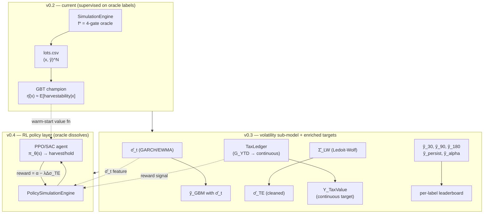

# Data Memo Theory — Part II
### Gabriel Kung, Co-Authored by Claude Sonnet
## *Post-Course Reconciliation and the v0.3–v0.4 Theoretical Program*

---

## Preface — Relation to Part I

Part I (`data_memo_theory.md`) was a **pre-implementation** theory document written before any code existed: it formalized the probability space $(\mathcal{X} \times \mathcal{Y}, \mathcal{F}, \mathcal{D})$, the oracle polytope $\Omega$, the boundary–interior analogy via generalized Stokes currents, the ERM/Rademacher generalization framework, the PCA factor model for stock-subset selection, the Mahalanobis tracking-error geometry, and the tax-alpha expected-value formalization. It pre-planned v0.1–v0.2, the PSTAT 231 course project.

Part II serves three purposes:

1. **Part A — Reconciliation.** Restate the theory of the built system (download, simulation, ML layers) at Part I's conceptual altitude, synthesizing and cross-referencing the detailed implementation documents rather than re-deriving them.
2. **Part B — Deviance & convergence audit.** For each section of Part I, state whether the pre-plan converged with, deviated from, or exceeded the build — or remained conceptual scaffolding never operationalized in code.
3. **Part C — v0.3–v0.4 pre-plan.** Pre-plan the post-course program (a supervised volatility sub-model and a reinforcement-learning policy layer) with Part I's rigor, in direct service of a system that dissolves the hand-coded oracle.

**Cross-reference map — detailed implementation documents (do not duplicate):**

| Document | Content |
|---|---|
| `ML_Derivations_Explicit_Rigorous_DollarMath.md` | Per-model objectives, 4-gate oracle, both soft-label families, PCA/K-means — all typed |
| `SimulationMath.md` | Simulation physics: seeding, year-end resets, TE estimator history, endogenous-$N$ identity |
| `PortfolioMath.md` | Portfolio state machine, lot measure, $G^{\mathrm{YTD}}$ sign convention |
| `Lifecycle_v02.md` | First-principles codebase walk: typed layer signatures, sequence diagrams, §8 intuition audit |
| `GYTD_Redesign_Plan.md` | v0.3 tax-ledger design: Options A/B/C, gains-realization process, RL bridge |
| `MLNetLeakageAudit.md` | Where every fit happens and why none of them leak |
| `MLNetSemanticReconciliation.md` | sklearn ↔ ML.NET parameter/solver/metric reconciliation |
| `PROJECT_RECAP.md` | Engineering roadmap, issue ledger, the recommended critical path |

---

# Part A — The Built System, Reconciled

## A.1 The Pipeline as a Composition of Measurable Maps

The built system is four layers, each a map between concrete artifacts on disk. Stated as typed compositions:

$$
\mathrm{download}:\ \varnothing \to \mathcal{J},
\qquad
\mathrm{simulate}:\ \mathcal{J} \to (\mathcal{X} \times \mathcal{Y})^N,
$$

$$
\mathrm{mlnet}:\ (\mathcal{X} \times \mathcal{Y})^N \to \widehat{H},
\qquad
\mathrm{report}:\ \widehat{H} \to \mathrm{paper},
$$

where:

- $\mathcal{J}$ = the raw price cache (`data/raw/*.json` + `constituents.json`), a finite collection of real-valued time series.
- $(\mathcal{X} \times \mathcal{Y})^N$ = the manufactured dataset `data/lots.csv`: $N$ observations with $\mathcal{X} \subset \mathbb{R}^{15} \times \mathcal{Z}$ (features plus sector) and $\mathcal{Y} = \{0,1\} \times [0,1] \times ([0,1] \cup \{\texttt{NaN}\})$ (hard label, GBM soft, BT soft).
- $\widehat{H}$ = the trained-model artifact set (`data/artifacts-mlnet/`).
- $\mathrm{paper}$ = the report layer output (`src/Export/report/`).

The **architectural thesis**: every arrow is a file, not a shared object. Layers communicate only through serialized artifacts. This makes every layer independently rerunnable, replaceable (the ML layer was replaced — Python → ML.NET, issue #10), and auditable. The typed layer signatures are derived in full in `Lifecycle_v02.md` §0.

---

## A.2 Layer 1 — The Real-Price Probability Space and Its Filtration

### A.2.1 The underlying stochastic process

The download layer materializes a discrete sample from a real-valued stochastic process. Fix a filtered probability space $(\Omega_{\mathrm{prob}}, \mathcal{F}, \{\mathcal{F}_t\}_{t \geq 0}, \mathbb{P})$ where:

- $\Omega_{\mathrm{prob}}$ is the sample space of all possible market histories (not to be confused with the harvest region $\Omega \subset \mathcal{X}$).
- $\{\mathcal{F}_t\}_{t \geq 0}$ is the natural filtration generated by the price processes: $\mathcal{F}_t = \sigma(\{P^{(i)}_s : i \in \mathcal{S},\ s \leq t\})$.

The price field is a collection of adapted processes:

$$
P^{(i)} : \Omega_{\mathrm{prob}} \times \{0, \ldots, T\} \to \mathbb{R}_{>0},
\qquad
i \in \mathcal{S},
\qquad
|\mathcal{S}| = 503,
$$

where $\mathcal{S}$ is the ticker universe (S&P 500 constituents at download time) and $T$ is the calendar length.

After download, `PriceLoader.Load` aligns the ragged per-ticker series onto one shared trading calendar, producing a dense matrix:

$$
P \in (\mathbb{R}_{>0} \cup \{\texttt{NaN}\})^{|\mathcal{S}| \times T},
\qquad
P[i, t] = P^{(i)}_t.
$$

Five feature-matrices are precomputed on this field: closes, daily returns $r^{(i)}_t = (P^{(i)}_t - P^{(i)}_{t-1})/P^{(i)}_{t-1}$, range volatility, $\mathrm{MA}_{50}$, $\mathrm{MA}_{200}$. After construction the object is **read-only forever** — an immutable data structure whose getters form the layer's public contract (ref `Lifecycle_v02.md` §3.1).

### A.2.2 The measurability invariant, grounded

Part I §2.2 stated the i.i.d.-conditional-on-features assumption. The built system operationalizes it via a sharper principle (Part I did not state this explicitly):

> **Every feature is $\mathcal{F}_t$-measurable.** That is, every coordinate of $x_{k,t} \in \mathcal{X}$ is computable from information available by the end of trading day $t$ — the filtration up to $t$.

The warmup window (200 trading days before the portfolio opens) exists as a **measurability requirement**: $\Delta\mathrm{MA}_{200}$ needs 200 prior closes to be well-defined, so the download window is `years + warmup` to ensure every feature is $\mathcal{F}_t$-measurable on the first portfolio day. A feature's data requirement propagates backward into the download contract — the downstream schema dictates the upstream fetch.

The current dynamic download range (commit `c421c4f`, issues #19/#20) generalizes this from a fixed 2-year window to a configurable $T$, preserving the warmup invariant.

---

## A.3 Layer 2 — The Simulator as Executable DGP

### A.3.1 Portfolio state as a Markov process

The simulation layer turns the stochastic price process into a labeled dataset by executing a deterministic rulebook against it. The portfolio state at day $t$ is a triple:

$$
\mathcal{S}_t = (\mu_t,\ G^{\mathrm{YTD}}_t,\ \mathcal{W}_t),
\qquad
\mathcal{S}_t \in \mathcal{M}(\mathcal{S}) \times \mathbb{R} \times (\mathcal{S} \to \mathbb{Z}_{\geq 0}),
$$

where:

- $\mu_t$ is the **lot measure** — a finite sum of Dirac atoms $\mu_t = \sum_k q_k \delta_{(p_k, s_k)}$ representing open positions (each lot is a mass $q_k$ at cost basis $p_k$ purchased on day $s_k$).
- $G^{\mathrm{YTD}}_t \in \mathbb{R}$ is the net realized gain/loss this calendar year.
- $\mathcal{W}_t : \mathcal{S} \to \mathbb{Z}_{\geq 0} \cup \{999\}$ is the wash-clock map (days since last harvest per ticker; 999 = never harvested).

The transition $\mathcal{S}_t \to \mathcal{S}_{t+1}$ is deterministic given $P[\cdot, t]$ and $\mathcal{S}_t$ — the portfolio is a **deterministic function of the price path** once the rulebook is fixed. The only source of randomness in the dataset is the market itself ($P$). This is the Markov property that Part I §2.2 anticipated.

### A.3.2 The feature-extraction map

The map from the living world to a frozen observation is:

$$
\phi_{\mathrm{lot}} : (\mathrm{Lot}_k, \mathcal{S}_t, P[\cdot, t], \hat{\sigma}_{TE,t}) \longrightarrow x_{k,t} \in \mathcal{X},
\qquad
\phi_{\mathrm{lot}} : \mathrm{Lot} \times \mathcal{S} \times \mathbb{R}_{>0}^{|\mathcal{S}|} \times \mathbb{R}_{\geq 0} \to \mathcal{X}.
$$

This is `ExtractSnapshot` in the code. It is evaluated **once per open lot per day**, producing one immutable `LotStateVector` record = one row of `lots.csv`. The critical invariant is that the snapshot is taken **before** the harvest (if any): the row records the state that *caused* the decision, not the state after it (ref `Lifecycle_v02.md` §3.3).

The conditional independence argument from Part I §2.2 is operationalized by the structure of $\phi_{\mathrm{lot}}$: the temporal and cross-sectional dependencies of the portfolio process are **encoded as features** in $x_{k,t}$ itself ($\sigma_{TE}$, $G^{\mathrm{YTD}}$, $H$, $\mathcal{W}$). The ML model conditions on this sufficient statistic, so the panel can be treated as conditionally i.i.d. — exactly the argument Part I made abstractly.

### A.3.3 The built oracle — a 4-gate polytope

Part I §3 defined the oracle as a 3-gate conjunction. The built system has **four gates**:

$$
f^*(x) = \underbrace{\mathbf{1}[L \leq -\theta_1]}_{g_1} \cdot \underbrace{\mathbf{1}[\sigma_{TE} \leq \theta_2]}_{g_2} \cdot \underbrace{\mathbf{1}[G^{\mathrm{YTD}} > 0]}_{g_3} \cdot \underbrace{\mathbf{1}[\mathcal{W} \geq \theta_3]}_{g_4},
\qquad
f^* : \mathcal{X} \to \{0,1\},
$$

with $\theta_1 = 0.02$, $\theta_2 = 0.05$, $\theta_3 = 30$ (named constants in `OracleBoundary`, never magic numbers). The fourth gate $g_4$ (wash-sale lockout, absent from Part I) ensures a lot cannot be harvested within 30 days of the last harvest of the same ticker. The harvest region is:

$$
\Omega = \bigcap_{j=1}^{4} H_j \subset \mathcal{X},
\qquad
H_j = \{x \in \mathcal{X} : g_j(x) = 1\},
$$

a convex polytope in $\mathcal{X}$, now the intersection of four (not three) half-spaces. This is the **first deviation from Part I** — minor but load-bearing. See Part B §3 for the full audit.

`OracleBoundary.Label` is implemented as a **pure, stateless function** — referentially transparent. This is not merely a code style choice; it is what allows the oracle to be shared by the engine (live decision), the soft-label builder (counterfactual forward evaluation), and the test suite, all with zero coupling. If the oracle held state, the soft labels would be incomputable as a second pass (ref `Lifecycle_v02.md` §3.4).

### A.3.4 The tracking-error estimator

Part I §7 formalized tracking error as the Mahalanobis norm $\sigma^2_{TE} = \|\delta w\|^2_{\Sigma}$. The built system implements this as:

$$
\hat{\sigma}_{TE,t} = \sqrt{\delta w_t^\top \hat{\Sigma}\, \delta w_t \cdot 252},
\qquad
\hat{\sigma}_{TE} : 2^{\mathcal{S}} \to \mathbb{R}_{\geq 0},
$$

where the active-weight deviation $\delta w_t \in \mathbb{R}^{|\mathcal{S}|}$ is:

$$
(\delta w_t)_i =
\begin{cases}
\frac{1}{n^{\mathrm{open}}_t} - \frac{1}{N} & \text{if } A_i \text{ is open at } t \\[4pt]
-\frac{1}{N} & \text{if } A_i \text{ is in wash window}
\end{cases}
$$

and $\hat{\Sigma} \in \mathbb{R}^{N \times N}$ is the daily-return covariance matrix, built **once** at construction (pairwise available-case, Bessel-corrected, $O(N^2 T)$). Each day costs one matrix-vector product $O(N^2)$.

This is computed **daily, before the lot loop** — because it is gate 2 (an *input* to the decision), not a consequence of it. The $\hat{\Sigma}$ matrix is the documented plug-in point for the RMT cleaning (issue #5) and Ledoit–Wolf shrinkage formalized in Part C §2.3.

**Historical note (the project's best war story).** The v0.0 TE estimator computed portfolio returns from total dollar value, so every harvest looked like a $-1/503$ price crash, inflating median $\hat{\sigma}_{TE}$ to 33% and permanently jamming gate 2 shut (zero positives — no dataset). It was rebuilt twice (rolling scalar → quadratic form) to become **structurally invariant to harvest/reopen events**. The estimator now depends only on *which tickers are open*, not on their dollar values (ref `SimulationMath.md` §5.4).

### A.3.5 Soft labels as operationalized η

Part I §1 defined the ideal posterior $\eta(x) = \mathbb{P}(Y=1 \mid X=x)$ as the single object every classifier tries to estimate. The soft labels operationalize $\eta$ — they are the data-constructible approximations to harvest propensity that the model actually trains on.

**Backtest soft label** — the realized path:

$$
\tilde{y}_{BT}(k,t) = \frac{1}{W} \sum_{s=1}^{W} f^*\!\left(\frac{P^{(A_k)}_{t+s} - p_k}{p_k},\ \sigma_{TE},\ G^{\mathrm{YTD}},\ \mathcal{W} + s\right),
\qquad
\tilde{y}_{BT} : \mathcal{X} \to \left\{0, \tfrac{1}{30}, \ldots, 1\right\} \cup \{\texttt{NaN}\},
$$

with $W = 30$. The portfolio state $(\sigma_{TE}, G^{\mathrm{YTD}}, p_k)$ is **frozen** at the snapshot; only the price $P^{(A_k)}_{t+s}$ and the wash clock $\mathcal{W} + s$ advance. $\texttt{NaN}$ when $t + W \geq T$ (the structural missingness cliff — not a data quality issue, but a mathematically necessary truncation).

**GBM soft label** — 200 simulated paths:

$$
\tilde{y}_{GBM}(k,t) = \frac{1}{N_{\mathrm{paths}}} \sum_{p=1}^{N_{\mathrm{paths}}} \mathbf{1}\!\left[\exists\, s \in \{1,\ldots,W\} : f^*(\cdot\,; S^{(p)}_s) = 1\right],
\qquad
\tilde{y}_{GBM} : \mathcal{X} \to [0,1],
$$

with per-path GBM dynamics $S_{s+1} = S_s \exp\!\left((\mu - \tfrac{1}{2}\sigma^2)\Delta + \sigma\sqrt{\Delta}\, Z\right)$, $Z \sim \mathcal{N}(0,1)$, $\Delta = 1/252$, $\mu = 0$, $\sigma$ from trailing 21-day realized vol. Note $\tilde{y}_{BT}$ averages the *predicate along one path* (fraction of firing days); $\tilde{y}_{GBM}$ uses **first-passage** across paths (each path counts at most once) — different averaging semantics, deliberately.

There is **no ML and no optimization inside the labeler**. No extrema search, no "best day to harvest." The labeler evaluates a fixed predicate forward and averages. The hindsight is legitimate by the invariant (§A.2.2): labels may peek at the future; features never may. Full derivation in `ML_Derivations…DollarMath.md` §§3–4.

### A.3.6 The endogenous dataset size

A lot emits one row per day **only while open**. Harvested capital is invisible to the dataset for exactly 30 days, then reappears as a new lot (fresh basis, fresh purchase day). The dataset size is therefore **endogenous to the market path**:

$$
N_{\mathrm{rows}} = n_0 \cdot T - \sum_{\mathrm{harvests}} \min(30,\, T_{\mathrm{end}} - t_h) - \varepsilon,
$$

where $n_0 = |\mathcal{S}|$, $T$ is the simulation length, and $\varepsilon$ accounts for NaN-close days and zero-share reopens. More drawdowns → more harvests → *fewer* rows — a self-limiting property of the DGP. At the v0.2 freeze: $251{,}500 - 80{,}426 - 323 = 170{,}751$ (reconciles exactly). On the current 20-year run: $\approx 1{,}846{,}016$. This identity is derived in `SimulationMath.md` §4 and discussed in `Lifecycle_v02.md` §3.3.

---

## A.4 Layer 3 — ERM over H, Realized

### A.4.1 The learning problem as implemented

Two binary targets:

$$
y^{\mathrm{orc}} = Y_{\mathrm{Oracle}} \in \{0,1\}
\quad (\text{base rate } \approx 1.6\%),
\qquad
y^{\mathrm{soft}} = \mathbf{1}[\tilde{y}_{BT} > 0] \in \{0,1\}
\quad (\text{base rate } \approx 19.9\%).
$$

The first is the **recoverability sanity check**: can the model relearn the deterministic $f^*$ from labeled data? (If not, the pipeline is broken.) The second is the **real problem**: estimate harvest propensity.

Five model families define five hypothesis spaces $\mathcal{H}_1, \ldots, \mathcal{H}_5$, each equipped with an objective:

| Model | $\mathcal{H}$ (the set being searched) | Objective (ref) |
|---|---|---|
| L2 Logistic | $\{\sigma(w^\top x + b) : w \in \mathbb{R}^{15}, b \in \mathbb{R}\}$ | $J = \sum w_{y_i} \ell_{CE} + \lambda\|w\|_2^2$ (`DollarMath.md` §6) |
| Elastic net | same set, mixed penalty $\lambda_1\|w\|_1 + \lambda_2\|w\|_2^2$ | $J_{EN}$ (`DollarMath.md` §7) |
| Random forest | $\{(1/T)\sum_t f_t(x)\}$, trees on bootstraps + feature subsets | bootstrap averaging (`DollarMath.md` §9) |
| Gradient-boosted trees | $\{F_0 + \sum_m \nu\, f_m(x)\}$, sequential residual correction | pseudo-residual fitting (`DollarMath.md` §8) |
| Ridge regression (demo) | $\{w^\top x + b\}$ fit to *continuous* $\tilde{y}_{BT}$ by least squares | $J_{OLS}$ (`DollarMath.md` §10) |

Per-model derivations (type-annotated objectives, grid specifications, structural strengths/weaknesses) are in `ML_Derivations…DollarMath.md` §§6–10. The reconciliation of ML.NET's parameterization with sklearn's is in `MLNetSemanticReconciliation.md`.

### A.4.2 The three-tier empirical result as the measured approximation-error story

Part I §9.2 decomposed excess risk into approximation error + estimation error + oracle gap. The v0.2 run *measured* these components:

$$
\underbrace{R(\hat{f}) - R(f^{\mathrm{Bayes}})}_{\text{excess risk}} = \underbrace{R(f^{\mathrm{opt}}_{\mathcal{H}}) - R(f^{\mathrm{Bayes}})}_{\text{approximation error}} + \underbrace{R(\hat{f}) - R(f^{\mathrm{opt}}_{\mathcal{H}})}_{\text{estimation error}}
$$

**The three tiers, mapped to the decomposition:**

1. **Trees (GBT/RF) — negligible total error on the oracle target.** CV PR-AUC ≥ 0.999. These hypothesis classes contain $f^*$ (a conjunction of axis-aligned thresholds = a one-node tree per gate), so approximation error ≈ 0 and estimation error vanishes with $N \approx 170{,}000$. This confirms the sanity check.

2. **Linear models (logistic, elastic net) — non-trivial approximation error.** CV PR-AUC ≈ 0.65 on the soft target. These classes cannot represent the interaction terms in $\tilde{y}_{BT}$ (which involves the *product* of forward-path oracle evaluations). Their approximation error is the linear ceiling: the soft-label boundary is not a hyperplane in $\mathcal{X}$, and no amount of data closes this gap. Every linear model chose its *weakest* penalty — regularization only costs capacity for this family.

3. **Ridge regression — structural misspecification.** PR-AUC ≈ 0.56; ~10% of predictions escape $[0,1]$. Least squares does not know the unit interval exists. This is the *deliberate negative control*, confirming the decomposition: misspecification → high approximation error, manifested as the `fractionOutsideUnit` diagnostic.

The **GBT–RF gap** (0.86 vs. 0.69 on the soft target) is the most interesting empirical result within the supervised baseline: same trees, different composition. Boosting *sharpens* the thin positive region that bagging *blurs*. This is the bias–variance tradeoff made concrete: GBT reduces bias sequentially (each tree targets residuals); RF reduces variance in parallel (averaging decorrelated trees). The positive region at 19.9% base rate is thin enough that the bias reduction matters more.

### A.4.3 Leakage discipline and champion selection

**Leakage invariants are types.** `MedianImputer.Fit` and `ClassWeights.AttachBalancedWeights` admit *no overload* taking the full dataset — they only accept a training fold. The leakage mistake that sklearn lets you make implicitly, ML.NET makes unrepresentable. Details in `MLNetLeakageAudit.md`.

**Champion selection is enforced by code shape.** Cross-validation ranks all five models by mean PR-AUC; only the top-two classifiers reach `RunSupervisedModel` (the function that evaluates on the sealed test set). Non-champions never call that function — it is not a flag check, it is a control-flow exclusion. The "only the best one or two touch test" principle is a *structural property*, not a convention.

**Why PR-AUC, not ROC-AUC.** With prevalence $\pi = 0.016$ (oracle), ROC-AUC conditions on class and is blind to the false-positive flood (the TN count is enormous). Precision = TP/(TP+FP) is the quantity that collapses under imbalance. PR-AUC integrates precision over recall — the only summary that punishes drowning the positives in alarms (`DollarMath.md` §11).

---

## A.5 The Emergent Finding Part I Never Predicted

Part I's theory was static — it never considered what happens to the oracle's geometry when the data window changes. The built system revealed a **regime-dependent finding** that reframes the oracle's difficulty:

**2-year window (170,751 rows).** The $G^{\mathrm{YTD}}$ gate ($g_3$) never binds: the $\$1{,}000{,}000$ annual seed (10% of $V_0$, calibrated to the S&P 500's long-run return) keeps $G^{\mathrm{YTD}} > 0$ on 100% of rows. The 4-gate conjunction collapses toward a **single half-space** $L \leq -0.02$, which is linearly separable. Result: logistic regression achieves CV PR-AUC $\approx 0.987$ on the oracle target.

**20-year window (1,846,016 rows).** Real bull/bear regimes cause $G^{\mathrm{YTD}}$ to go negative in ~6% of row-days. The gate starts binding. The conjunction no longer collapses. Result: logistic regression on the oracle target drops to CV PR-AUC $\approx 0.12$.

**The emergent principle:**

> A conjunction of halfspace indicators is only as nonlinear as the number of gates that actually bind. The decision geometry's complexity is set by the *economics* (which regimes the data window covers), not by the rulebook's arity.

This was invisible to Part I because the theory was atemporal — it reasoned about $\Omega$ as a fixed polytope without considering that different market regimes make different faces of $\Omega$ binding. It is the empirical trigger for the v0.3 $G^{\mathrm{YTD}}$ redesign (Part C §2.5, `GYTD_Redesign_Plan.md`).

---

# Part B — Deviance & Convergence Audit

For each section of Part I (`data_memo_theory.md`), a verdict: **Convergent** (the pre-plan matched the build), **Deviant** (the build diverged materially), **Exceeded** (the build went further than the pre-plan anticipated), **Conceptual-only** (the theory was never operationalized in code), or **Emergent** (the build revealed something Part I did not address).

| Part I § | Topic | Verdict | Notes |
|---|---|---|---|
| §1 | Posterior $\eta$, Bayes risk | **Convergent** | $\eta$ is operationalized as $\tilde{y}_{BT}$ and $\tilde{y}_{GBM}$; the Bayes-optimal classifier framing survived intact |
| §2.1 | Feature vectors | **Convergent** | The 15-dimensional schema matches the pre-plan's structure (lot × portfolio × asset × derived); $d=15$ confirmed |
| §2.2 | Panel structure, i.i.d. assumption | **Convergent** | Conditional independence via state-encoding exactly as predicted; temporal/cross-sectional dependence encapsulated in features |
| §3 | Oracle (3 gates) | **Deviant** | Built **4 gates** — the wash-sale clock $\mathcal{W} \geq 30$ was added as the 4th gate, not present in Part I. See below |
| §4 | Stokes / currents / Dirichlet | **Conceptual-only** | See below |
| §5.1–5.2 | ERM, Rademacher | **Convergent-in-spirit** | See below |
| §5.3 | Oracle as structured noise | **Convergent** | The "systematic label noise" framing became the motivating argument for soft labels |
| §5.A | Soft-label level sets | **Exceeded** | See below |
| §6 | PCA for subset selection | **Deviant (largest)** | See below |
| §7 | TE as quadratic form | **Convergent** | Implemented exactly as §7 predicted, after the v0.0 bug fix restored the quadratic-form estimator |
| §8 | Tax alpha EV, Lagrangian $V(x)$ | **Partial** | $\alpha_{\mathrm{tax}}$ became a *feature*; the value functional $V(x) = \alpha - \lambda \sigma_{TE}$ is deferred to v0.4 as the RL reward |
| §9–10 | Approximation chain, oracle gap | **Convergent** | The interpretive backbone for all results; the three-way decomposition is directly cited in `Lifecycle_v02.md` §4.4 |
| — | Endogenous $N$ | **Emergent** | Not anticipated by Part I. The dataset size depends on the market path through harvests |
| — | $G^{\mathrm{YTD}}$ regime dependence | **Emergent** | Not anticipated. A conjunction's effective nonlinearity depends on which gates bind (§A.5) |
| — | Dynamic data window | **Emergent** | Issues #19/#20, commit `c421c4f`. Part I assumed a fixed window |

### Expanded verdicts for the non-obvious cases

**§3 — Deviant: 3 gates → 4 gates.** Part I defined $\Omega = H_1 \cap H_2 \cap H_3$ (loss, TE, gains). The build added $H_4 = \{x : \mathcal{W} \geq 30\}$ (the wash-sale lockout), making $\Omega$ a 4-halfspace polytope. This is a *correct* deviation — the 30-day wash rule is a real IRS constraint that Part I omitted for simplicity. The geometric consequence: $\partial \Omega$ has four face components instead of three, and the interaction between $g_4$ (a per-ticker clock) and the other per-lot gates creates a **time-and-identity-coupled** boundary that a linear model cannot recover via a single hyperplane in the full-space coordinates.

**§4 — Conceptual-only: Stokes / currents / Dirichlet.** The boundary–interior analogy from geometric measure theory ($[\![\Omega]\!]$ as a $d$-current, $\partial[\![\Omega]\!] = [\![\partial\Omega]\!]$, the kernel-of-$\partial$ ambiguity) was Part I's conceptually richest contribution. It survived as an *intuition*:
- The "interior vs. boundary" framing directly motivated the soft-label reframing (the model learns $\eta(x)$ over $\Omega^\circ$, not just on $\partial\Omega$).
- The "many posteriors agree on $\partial\Omega$ but differ on $\Omega^\circ$" insight became the empirical fact that GBT ≈ 0.86 and logistic ≈ 0.65 agree reasonably on the oracle target but diverge on the soft target.
- The Dirichlet/regularization parallel (regularization = surrogate differential operator selecting an interior extension) recurs in Part C as the **soft-boundary relaxation** for gradient-based RL policies.

But the formal machinery — currents as dual to differential forms, the de Rham complex, the Hodge decomposition — was never operationalized in code or computed numerically. It is honest to call this *scaffolding that shaped the conceptual design but did not enter the implementation*. The intuition it generated is load-bearing; the formalism itself is not.

**§5.1–5.2 — Convergent-in-spirit: ERM / Rademacher.** The ERM framework (minimize empirical risk over $\mathcal{H}$) is exactly what the ML.NET pipeline does. The Rademacher bound was never *computed* (it would require bounding $\mathfrak{R}_N(\mathcal{H})$ for the specific model families, which for GBT and RF is non-trivial), but the qualitative prediction holds: sufficiently expressive $\mathcal{H}$ (trees) contains $f^*$, so $\hat{R}_S(f^*) = 0$ and generalization follows from $N$ alone. The estimation-error term is empirically confirmed by GBT's CV→test gap of +0.004 — negligible, as the bound predicts for $N \approx 170{,}000$.

**§5.A — Exceeded: soft-label level sets.** Part I §5.A sketched the level-set interpretation $L_c = \{x : \hat{\eta}(x) = c\}$ as a future direction. The build *realized and exceeded* this: two soft-label families ($\tilde{y}_{BT}$, $\tilde{y}_{GBM}$), a binary threshold target $y_{\mathrm{soft}} = \mathbf{1}[\tilde{y}_{BT} > 0]$, and the champion model's PR-AUC of 0.86 — demonstrating that the "interior learning" the level-set interpretation promised is *empirically achievable*, not just theoretically possible.

**§6 — Deviant (largest): PCA for subset selection.** Part I §6 formalized PCA within a factor model for asset returns ($\Sigma = B\Sigma_F B^\top + D$, spectral gap, $k$-factor decomposition) and framed it as a prerequisite to **stock-subset selection** — the NP-hard combinatorial optimization of finding the smallest $S \subset \{1, \ldots, 500\}$ whose portfolio achieves $\sigma_{TE}(S) \leq \epsilon$.

The build **demoted** this to a feature-space diagnostic: PCA was applied to the 15-dimensional feature matrix (not the $500 \times 500$ return covariance), and K-means clustered assets by their feature profiles. These are informative about feature-space structure (how many effective dimensions the ML model sees; whether sector clusters in feature space) but they do not perform the *portfolio construction* task Part I defined.

The original intent — shaving multicollinear stocks to reduce the tracked universe, selecting wash-sale replacements from correlated clusters — requires the portfolio construction / RL layer as a prerequisite and is deferred to issue #6. This is the **largest gap between intent and delivery**. It is correctly deferred (the unsupervised portfolio layer needs the simulation environment as a substrate), not abandoned.

**§8 — Partial: tax-alpha as a value functional.** Part I defined $V(x) = \alpha_{\mathrm{tax}}(x) - \lambda \cdot \sigma_{TE}(x)$ as the net value of harvesting. The build implemented $\alpha_{\mathrm{tax}}$ as a *feature* (a coordinate of $x$), but the value functional $V(x)$ as a *target* or *reward signal* was not realized. This is not a deviation but a *deferral*: $V(x)$ becomes the natural **RL reward** in v0.4 (Part C §3.1). The Lagrangian interpretation (shadow price of the TE budget) also becomes the RL penalty term. Part I's §8 is thus a forward reference — it pre-described a quantity the supervised layer cannot use but the RL layer needs.

---

# Part C — The v0.3–v0.4 Theoretical Program

## C.1 Motivation from the Audit

Four threads from Part B motivate the post-course program:

1. **The deferred §6 — PCA for portfolio construction.** The unsupervised portfolio layer (wash-sale replacement, TE-minimizing position selection) needs a simulation environment to operate in. That environment is the RL substrate.

2. **The deferred §8 — the value functional as reward.** $V(x) = \alpha_{\mathrm{tax}}(x) - \lambda \cdot \sigma_{TE}(x)$ is the tax-alpha/tracking-error tradeoff. The supervised model cannot optimize this directly (it approximates the oracle, not the tax outcome). The RL policy can.

3. **The §4 soft-boundary relaxation.** The Stokes/Dirichlet intuition — that the oracle's hard boundary $\partial \Omega$ is a Dirichlet condition and the regularized ML model solves a variational problem in $\Omega^\circ$ — finds its natural endpoint in gradient-based RL: replace the hard indicator gates with smooth logistic ramps, making the "boundary" differentiable and the policy trainable by gradient descent.

4. **The emergent $G^{\mathrm{YTD}}$ regime problem (§A.5).** A gate that binds in 6% of regimes but not in 94% is doing real economic work (it blocks harvesting when there are no gains to offset). But the current binary gate is **stricter than the tax code** — real losses carry forward indefinitely. The fix (a continuous tax ledger) simultaneously makes the economics correct and makes the ML target more interesting. It also produces the continuous reward signal the RL agent needs.

The post-course architecture has two components, developed **simultaneously**:

- **v0.3 — Supervised volatility sub-model** ($\hat{\sigma}_t : \mathcal{X} \to \mathbb{R}_{\geq 0}$): replace the constant/trailing-vol assumptions with a time-varying volatility estimator, clean the TE covariance, redesign the gains gate, and construct richer soft-label families. All of this enriches the *target* — the supervised problem gets harder and more realistic.

- **v0.4 — RL policy layer** ($\pi_\theta : \mathcal{S} \to \Delta(\mathcal{A})$): a policy trained on the simulation environment that learns the harvest decision *without* the hand-coded oracle, aiming directly at the true optimum $f^*_{\mathrm{true}}$. This attacks the irreducible oracle gap of Part I §§9–10.

---

## C.2 v0.3 — The Supervised Volatility Sub-Model

### C.2.1 Time-varying volatility as a supervised sub-problem

The current soft-label builder uses a **constant or trailing-21-day volatility** for the GBM forward simulation:

$$
\hat{\sigma}_{\mathrm{current}} = \sqrt{252} \cdot \hat{s}_{r,21},
\qquad
\hat{s}_{r,21} = \sqrt{\frac{1}{20} \sum_{j=0}^{20} (r_{t-j} - \bar{r})^2},
\qquad
\hat{\sigma}_{\mathrm{current}} \in \mathbb{R}_{>0}.
$$

This treats volatility as locally constant — but volatility **clusters**: high-vol days predict high-vol days (the stylized fact). The v0.3 sub-model replaces this with a conditional variance process.

**GARCH(1,1) recursion.** The generalized autoregressive conditional heteroskedasticity model specifies:

$$
\sigma^2_t = \omega + \alpha_1 r^2_{t-1} + \beta_1 \sigma^2_{t-1},
\qquad
\sigma^2_t \in \mathbb{R}_{>0},
$$

where:

- $\omega \in \mathbb{R}_{>0}$ is the long-run variance floor.
- $\alpha_1 \in [0,1)$ is the news coefficient — how much yesterday's squared return updates today's variance estimate (sensitivity to shocks).
- $\beta_1 \in [0,1)$ is the persistence coefficient — how much of yesterday's variance carries forward (volatility memory).
- The stationarity constraint is $\alpha_1 + \beta_1 < 1$, ensuring $\sigma^2_t$ does not diverge.

The unconditional (long-run) variance is $\bar{\sigma}^2 = \omega / (1 - \alpha_1 - \beta_1)$. Typical equity values: $\alpha_1 \approx 0.05$–$0.10$, $\beta_1 \approx 0.85$–$0.90$ — high persistence, confirming the clustering phenomenon.

$$
\sigma^2 : \mathbb{Z}_{\geq 0} \to \mathbb{R}_{>0}
$$

is a deterministic function of the return history (given the parameters), which makes it $\mathcal{F}_t$-measurable — it is a valid feature and a valid forward-simulation parameter.

**EWMA (exponentially weighted moving average)** is the special case $\omega = 0$, $\alpha_1 + \beta_1 = 1$:

$$
\sigma^2_t = (1 - \lambda_{\mathrm{EW}}) r^2_{t-1} + \lambda_{\mathrm{EW}} \sigma^2_{t-1},
\qquad
\lambda_{\mathrm{EW}} \in (0,1),
$$

with the typical RiskMetrics value $\lambda_{\mathrm{EW}} = 0.94$. EWMA is simpler (one parameter, no estimation of $\omega$) but has an integrated variance process (no mean reversion — IGARCH). For the purposes of the forward GBM, both are valid; GARCH is more principled.

**Plug-in points.** The fitted $\hat{\sigma}_t$ enters the system in two places:
1. **`SoftLabelBuilder.ComputeGBM`** — replaces the constant $\sigma$ in the GBM forward paths, producing a $\tilde{y}_{GBM}$ that is conditioned on the local volatility regime. This is the *direct improvement to the soft target*.
2. **The feature space** — $\hat{\sigma}_t \in \mathbb{R}_{>0}$ enters $\mathcal{X}$ as an engineered coordinate, replacing the trailing-window proxy `SigmaRange`. The ML model can then *condition on volatility state* rather than having it hidden.

**Deliverable question for v0.3:** *Does a better $\hat{\sigma}_t$ improve harvest-urgency scoring?* Measured as: re-run the pipeline with GARCH-calibrated `ComputeGBM`, re-fit all models, compare CV PR-AUC. If the volatility-aware $\tilde{y}_{GBM}$ has higher information content, the model should score higher.

### C.2.2 GARCH parameter estimation — maximum likelihood

The log-likelihood for the GARCH(1,1) under a Gaussian innovation assumption is:

$$
\ell(\omega, \alpha_1, \beta_1) = -\frac{1}{2} \sum_{t=1}^{T} \left[\log(2\pi) + \log(\sigma^2_t) + \frac{r^2_t}{\sigma^2_t}\right],
\qquad
\ell : \mathbb{R}_{>0} \times [0,1) \times [0,1) \to \mathbb{R}.
$$

The MLE is:

$$
(\hat{\omega}, \hat{\alpha}_1, \hat{\beta}_1) = \arg\max_{\omega, \alpha_1, \beta_1} \ell(\omega, \alpha_1, \beta_1),
\qquad
\text{subject to } \alpha_1 + \beta_1 < 1,\ \omega > 0.
$$

Solved by constrained numerical optimization (L-BFGS-B or similar). The constraint $\alpha_1 + \beta_1 < 1$ enforces stationarity; in practice it is rarely binding for equity returns.

Estimation is **per ticker** — each asset $i \in \mathcal{S}$ gets its own $(\hat{\omega}_i, \hat{\alpha}_{1,i}, \hat{\beta}_{1,i})$, fitted on its return history up to day $t$ only ($\mathcal{F}_t$-measurable). The fitted $\hat{\sigma}^{(i)}_t$ then feeds the GBM simulator for lot $i$'s forward paths.

### C.2.3 Covariance cleaning — Ledoit–Wolf and random matrix theory

The tracking-error estimator uses $\hat{\Sigma} \in \mathbb{R}^{N \times N}$ (the sample daily-return covariance). With $N \approx 503$ tickers and $T \approx 500$–$5{,}000$ trading days, the sample covariance is **poorly conditioned** — its eigenvalues are spread wider than the true eigenvalues, with the smallest eigenvalues biased downward (sometimes to near-zero). This is the curse of dimensionality for covariance estimation.

**Ledoit–Wolf shrinkage** (issue #5) replaces $\hat{\Sigma}$ with a convex combination:

$$
\hat{\Sigma}_{LW} = (1 - \delta) \hat{\Sigma}_{\mathrm{sample}} + \delta F,
\qquad
\hat{\Sigma}_{LW} \in \mathbb{R}^{N \times N},
\qquad
\delta \in [0,1],
$$

where:

- $\hat{\Sigma}_{\mathrm{sample}} = \frac{1}{T-1} \sum_{t=1}^{T} (r_t - \bar{r})(r_t - \bar{r})^\top$ is the sample covariance.
- $F$ is the **shrinkage target** — a structured, well-conditioned matrix. A common choice is the **single-factor model**: $F = \hat{\beta} \hat{\beta}^\top \hat{\sigma}^2_M + \hat{D}$, where $\hat{\beta}$ is the vector of market betas and $\hat{D}$ is diagonal idiosyncratic variance. The simplest target is $F = \bar{\lambda} I$ (identity scaled by the average eigenvalue).
- $\delta \in [0,1]$ is the **shrinkage intensity**, estimated analytically via the Ledoit–Wolf formula (minimizing expected Frobenius loss $\mathbb{E}[\|\hat{\Sigma}_{LW} - \Sigma\|_F^2]$).

The effect: eigenvalues of $\hat{\Sigma}_{LW}$ are pulled toward the target's structure — small eigenvalues are inflated (reducing ill-conditioning), large eigenvalues are deflated (reducing noise). The resulting $\hat{\sigma}_{TE}$ is more stable across days and less sensitive to the specific composition of the wash-window portfolio.

**Random matrix theory (Marchenko–Pastur cleaning).** A complementary approach (also issue #5, suggested by Joseph D'Anna). The Marchenko–Pastur law gives the **bulk eigenvalue distribution** of a random matrix:

$$
\rho_{MP}(\lambda) = \frac{q}{2\pi \sigma^2} \frac{\sqrt{(\lambda_+ - \lambda)(\lambda - \lambda_-)}}{\lambda},
\qquad
\lambda_\pm = \sigma^2(1 \pm \sqrt{1/q})^2,
$$

where $q = T/N$ is the aspect ratio and $\sigma^2$ is the variance of the entries. Eigenvalues of $\hat{\Sigma}_{\mathrm{sample}}$ that fall within $[\lambda_-, \lambda_+]$ are **indistinguishable from noise** — they carry no signal about the true covariance structure. The cleaning procedure:

1. Compute the eigendecomposition $\hat{\Sigma} = U \Lambda U^\top$.
2. Identify the Marchenko–Pastur bulk edge $\lambda_+$.
3. Replace all eigenvalues $\lambda_j \leq \lambda_+$ with a common value (e.g., $\bar{\lambda}_{\mathrm{bulk}} = \mathrm{tr}(\Lambda_{\mathrm{bulk}}) / |\{j : \lambda_j \leq \lambda_+\}|$) preserving the total variance.
4. Reconstruct $\hat{\Sigma}_{\mathrm{clean}} = U \Lambda_{\mathrm{clean}} U^\top$.

The cleaned $\hat{\Sigma}_{\mathrm{clean}}$ retains only the *signal* eigenvalues (those above the noise floor) — the ones corresponding to genuine factor structure (market, sector, momentum, etc.). The TE estimator $\hat{\sigma}_{TE} = \sqrt{\delta w^\top \hat{\Sigma}_{\mathrm{clean}} \delta w \cdot 252}$ then prices active-weight deviations against the *real* covariance structure, not against estimation noise.

Both approaches plug into the same seam: replace $\hat{\Sigma}$ in `TrackingErrorProxy`'s constructor. They can also be composed ($\hat{\Sigma}_{LW}$ first, then MP cleaning of the shrunk matrix).

### C.2.4 Richer soft-label families (issue #17)

Beyond $\tilde{y}_{BT}$ (30-day firing frequency) and $\tilde{y}_{GBM}$ (30-day first-passage probability), the v0.3 program introduces additional label families, each a measurable map $\mathcal{X} \to [0,1]$ (or $\mathcal{X} \to \mathbb{R}_{\geq 0}$ for tax-weighted variants):

**Multi-horizon labels** — extend the forward window:

$$
\tilde{y}_{W}(k,t) = \frac{1}{W} \sum_{s=1}^{W} f^*(x_{k,t+s}),
\qquad
W \in \{30, 90, 180\},
\qquad
\tilde{y}_W : \mathcal{X} \to \left\{0, \tfrac{1}{W}, \ldots, 1\right\}.
$$

Longer windows capture slower structural patterns. $\tilde{y}_{180}$ answers: "is this lot persistently harvestable over six months?" — a qualitatively different question from the 30-day urgency score.

**Persistence-weighted label:**

$$
\tilde{y}_{\mathrm{persist},W} = \frac{1}{W} \sum_{s=1}^{W} f^*(x_{k,t+s}),
\qquad
\tilde{y}_{\mathrm{persist}} : \mathcal{X} \to [0,1].
$$

This is structurally identical to $\tilde{y}_{BT}$ but conceptually distinguished: it encodes the assumption (valid for stable S&P 500 constituents) that **sustained** oracle firing across many days is more informative than intermittent firing. High-volatility tickers may fire intermittently (high instantaneous signal, low persistence); low-volatility drawdowns fire persistently (lower instantaneous signal, higher persistence). The two patterns correspond to different harvesting strategies.

**Tax-alpha-weighted label:**

$$
\tilde{y}_{\alpha,W} = \frac{1}{W} \sum_{s=1}^{W} \alpha_{\mathrm{tax}}(x_{k,t+s}) \cdot f^*(x_{k,t+s}),
\qquad
\tilde{y}_\alpha : \mathcal{X} \to \mathbb{R}_{\geq 0},
$$

where $\alpha_{\mathrm{tax}}(x) = \tau(H) \cdot |G_{\mathrm{lot}}| \cdot \mathbf{1}[G^{\mathrm{YTD}} > 0]$. This weights each firing by its *dollar value* — a lot with a 40% loss and short-term holding generates far more $\alpha$ per harvest than a lot with a 3% loss and long-term holding. The label is no longer a probability but an expected tax alpha, bridging toward the economic evaluation (issue #12).

**Max tax-alpha label:**

$$
\tilde{y}_{\max,W} = \max_{1 \leq s \leq W} \alpha_{\mathrm{tax}}(x_{k,t+s}) \cdot f^*(x_{k,t+s}),
\qquad
\tilde{y}_{\max} : \mathcal{X} \to \mathbb{R}_{\geq 0}.
$$

This captures the *best single harvest opportunity* within the window — the optimal-stopping signal. It is the most informative label for prioritization but also the most forward-looking.

**No-leakage guard.** Each new label is computed from $\{x_{k,t+s}\}_{s=1}^{W}$ — future observations. By the project's invariant (§A.2.2), these **must not enter the feature space**. The guard: no label-family formula may use any quantity that is not already in the soft-label builder's signature (lot snapshot, price array, oracle function). If a label depends on information that the features also encode, it creates a trivial information loop that inflates model performance without learning anything real. Each label family gets its own CV leaderboard, independent of the others.

### C.2.5 The G_YTD redesign — from binary gate to continuous tax ledger (GYTD_Redesign_Plan.md)

The emergent finding of §A.5 (the gains gate binds on ~6% of the 20-year data) and the three problems identified in `GYTD_Redesign_Plan.md` §1 (near-vestigial over long horizons, constant seed does not scale, stricter than the tax code) motivate a fundamental redesign.

**Option B (interim) — dynamic seed:**

Replace the constant $\$1{,}000{,}000$ annual seed with:

$$
\mathrm{seed}_t = \kappa \cdot V_t,
\qquad
\kappa \in (0,1),
\qquad
V_t \in \mathbb{R}_{>0},
$$

recomputed at each year-end. This removes the "shrinking fraction" defect (fixed seed / growing portfolio) while keeping the conjunction intact.

**Option C (target, recommended) — continuous tax ledger:**

Promote $G^{\mathrm{YTD}}$ from a binary gate to a **continuous tax-accounting state**. Maintain a running ledger:

$$
\mathcal{L}_t = (\mathrm{gains}^{\mathrm{YTD}}_t,\ \mathrm{carry}_t,\ \mathrm{ord}_t),
\qquad
\mathcal{L} : \mathbb{Z}_{\geq 0} \to \mathbb{R}^3,
$$

where:

- $\mathrm{gains}^{\mathrm{YTD}}_t \in \mathbb{R}$ = realized capital gains this year (from a **gains-realization process** — the simulator selling winners back toward index weight, not just harvesting losers).
- $\mathrm{carry}_t \in \mathbb{R}_{\leq 0}$ = cumulative loss carryforward (persists across year-end).
- $\mathrm{ord}_t \in \mathbb{R}_{\geq 0}$ = remaining ordinary-income offset budget (\$3,000/yr capacity per US tax code, resets at year-end).

The **economic value** of harvesting lot $k$ becomes a continuous quantity:

$$
\mathrm{taxValue}_k = \tau(h_k) \cdot \min\!\left(|\mathrm{loss}_k|,\ \mathrm{offsetCap}_t\right) + \tau_{\mathrm{future}} \cdot \max\!\left(|\mathrm{loss}_k| - \mathrm{offsetCap}_t,\ 0\right) \cdot \gamma,
$$

$$
\mathrm{taxValue} : \mathrm{Lot} \times \mathcal{L} \to \mathbb{R}_{\geq 0},
$$

where $\mathrm{offsetCap}_t = \mathrm{gains}^{\mathrm{YTD}}_t + \mathrm{ord}_t + |\mathrm{carry}_t|$, and $\gamma \in (0,1)$ is a discount factor pricing the carryforward portion at a reduced future rate.

The oracle's binary 4th gate ($g_3 = \mathbf{1}[G^{\mathrm{YTD}} > 0]$) is replaced by:

$$
g_3'(x) = \mathbf{1}[\mathrm{taxValue}_k > \theta_4],
\qquad
\theta_4 \in \mathbb{R}_{>0},
$$

and $\mathrm{taxValue}_k$ becomes a **continuous regression target** alongside the existing soft labels:

$$
Y_{\mathrm{TaxValue}} = \mathrm{taxValue}_k \in \mathbb{R}_{\geq 0}.
$$

This simultaneously fixes the economics (matches carryforward + \$3k + offsetting), makes the target more interesting (continuous tax alpha is a harder, more informative ML problem than a binary gate), and produces the **reward signal** the RL agent needs in v0.4.

The full design and implementation checklist are in `GYTD_Redesign_Plan.md` §§2–5.

---

## C.3 v0.4 — The Reinforcement Learning Policy Layer

### C.3.1 MDP formalization — the harvest decision as a sequential optimization

The fundamental limitation of the v0.1–v0.2 supervised approach is that the model approximates the **oracle** ($f^*$, a myopic threshold rule), not the **true optimum** ($f^*_{\mathrm{true}}$, the stopping-time solution over the filtration $\mathcal{F}_t$). Part I §3.2 formalized this gap: the truly optimal harvest decision requires solving a Bellman equation over future price paths — an intractable sequential optimization that the oracle avoids by being myopic.

Reinforcement learning directly attacks this gap. The harvest decision is formalized as a **Markov Decision Process** (MDP):

$$
\mathcal{M} = (\mathcal{S}_{\mathrm{state}},\ \mathcal{A},\ \mathcal{T},\ r,\ \gamma),
$$

where each component has a precise type:

**State space.** The state at time $t$ is the full information available for decision:

$$
s_t = (\mu_t,\ \mathcal{L}_t,\ \hat{\sigma}_{TE,t},\ \mathcal{W}_t,\ \{P^{(i)}_t, \hat{\sigma}^{(i)}_t\}_{i \in \mathcal{S}}),
\qquad
s_t \in \mathcal{S}_{\mathrm{state}}.
$$

This is the portfolio state $\mathcal{S}_t$ augmented with the price/volatility information and the tax ledger from v0.3. It is $\mathcal{F}_t$-measurable by construction.

**Action space.** At each timestep, the agent decides a harvest action for each open lot:

$$
a_t = (a^{(1)}_t, \ldots, a^{(K_t)}_t),
\qquad
a^{(k)}_t \in \{0, 1\},
\qquad
a_t \in \{0,1\}^{K_t},
$$

where $K_t$ is the number of open lots at time $t$. The action $a^{(k)}_t = 1$ means "harvest lot $k$"; $a^{(k)}_t = 0$ means "hold." In richer formulations (v0.5+), the action space could include replacement selection and position sizing, expanding to a continuous or combinatorial action space — but the binary per-lot decision suffices for v0.4.

**Transition kernel.** The next state given current state and action is:

$$
\mathcal{T} : \mathcal{S}_{\mathrm{state}} \times \mathcal{A} \to \Delta(\mathcal{S}_{\mathrm{state}}),
\qquad
s_{t+1} \sim \mathcal{T}(\cdot \mid s_t, a_t).
$$

The randomness comes entirely from the next day's prices $P[\cdot, t+1]$ (drawn from the real market process or, in training, from GBM); everything else (harvest mechanics, wash clocks, ledger updates) is deterministic given the action. The transition is **exactly** `SimulationEngine.ProcessDay` — the simulator is already the environment.

**Reward.** The immediate reward at time $t$ is the realized value of the actions taken:

$$
r_t = \underbrace{\sum_{k : a^{(k)}_t = 1} \mathrm{taxValue}_k(s_t)}_{\text{realized tax alpha}} - \underbrace{\lambda \cdot \Delta\hat{\sigma}_{TE,t}}_{\text{tracking error penalty}},
\qquad
r : \mathcal{S}_{\mathrm{state}} \times \mathcal{A} \to \mathbb{R},
$$

where $\Delta\hat{\sigma}_{TE,t} = \hat{\sigma}_{TE}(s_{t+1}) - \hat{\sigma}_{TE}(s_t)$ is the change in tracking error induced by the harvests, and $\lambda > 0$ is the penalty coefficient (the shadow price of the TE budget — the same Lagrangian from Part I §8, now operational). The $\mathrm{taxValue}_k$ is the continuous quantity from the v0.3 tax ledger (§C.2.5). This reward is the **realization of Part I's deferred value functional** $V(x) = \alpha - \lambda \sigma_{TE}$.

**Discount factor.** $\gamma \in (0,1)$ discounts future rewards. For annual tax planning, $\gamma$ should be close to 1 (the tax year is the natural horizon); a common choice is $\gamma = 0.99$ (planning horizon $\approx 1/(1-\gamma) = 100$ steps $\approx$ half a trading year).

**Policy.** A policy maps states to action distributions:

$$
\pi_\theta : \mathcal{S}_{\mathrm{state}} \to \Delta(\mathcal{A}),
\qquad
\pi_\theta(a \mid s) \in [0,1],
\qquad
\sum_a \pi_\theta(a \mid s) = 1.
$$

The subscript $\theta$ denotes the policy's parameters (weights of a neural network or tree ensemble — see §C.3.2). A deterministic policy is the special case $\pi_\theta(a \mid s) = \mathbf{1}[a = \mu_\theta(s)]$ for some $\mu_\theta : \mathcal{S}_{\mathrm{state}} \to \mathcal{A}$.

**Value function and Q-function.** The expected cumulative discounted reward under policy $\pi$:

$$
V^\pi(s) = \mathbb{E}_\pi\!\left[\sum_{t=0}^{\infty} \gamma^t r_t \mid s_0 = s\right],
\qquad
V^\pi : \mathcal{S}_{\mathrm{state}} \to \mathbb{R},
$$

$$
Q^\pi(s, a) = \mathbb{E}_\pi\!\left[\sum_{t=0}^{\infty} \gamma^t r_t \mid s_0 = s,\ a_0 = a\right],
\qquad
Q^\pi : \mathcal{S}_{\mathrm{state}} \times \mathcal{A} \to \mathbb{R}.
$$

The **Bellman equation** relates $V^\pi$ to itself recursively:

$$
V^\pi(s) = \mathbb{E}_{a \sim \pi(\cdot|s)}\!\left[r(s, a) + \gamma\, \mathbb{E}_{s' \sim \mathcal{T}(\cdot|s,a)}[V^\pi(s')]\right].
$$

The **optimal value function** $V^* = \max_\pi V^\pi$ satisfies the **Bellman optimality equation**:

$$
V^*(s) = \max_{a \in \mathcal{A}} \left[r(s, a) + \gamma\, \mathbb{E}_{s' \sim \mathcal{T}(\cdot|s,a)}[V^*(s')]\right].
$$

The optimal policy $\pi^*$ achieves $V^*$ by acting greedily: $\pi^*(s) = \arg\max_a Q^*(s, a)$. This is the formalization of Part I §3.2's "stopping-time problem" — the Bellman equation replaces the intractable $\arg\min_\tau \mathbb{E}[\cdot \mid \mathcal{F}_t]$ with a recursive, solvable structure.

**Why RL needs no oracle (issue #15).** In the MDP formulation, the reward $r_t$ replaces the hand-coded boundary $\partial \Omega$. The agent aims directly at $f^*_{\mathrm{true}}$ — the policy that maximizes cumulative after-tax alpha net of tracking-error cost. The oracle gap of Part I §§9–10 becomes the gap between the supervised model's performance (which approximates $f^*_{\mathrm{oracle}}$) and the RL agent's performance (which approximates $f^*_{\mathrm{true}}$). Quantifying this gap — *how much of the oracle gap is irreducible?* — is the v0.4 deliverable question.

### C.3.2 Function approximators — the neural-net and tree substrates

The MDP is too large for tabular RL ($|\mathcal{S}_{\mathrm{state}}|$ is effectively infinite — continuous features, variable lot counts). Both $V^\pi$, $Q^\pi$, and $\pi_\theta$ must be approximated by parametric function classes. Two substrates are considered, with a **lean toward neural networks** as the eventual main model.

#### C.3.2a Tree / GBT substrate — fitted-Q iteration

The existing GBT champion $\hat{\eta}$ is a function $\mathcal{X} \to (0,1)$ learned by gradient-boosted trees. The same tree-ensemble architecture can serve as the value-function approximator in RL.

**Fitted-Q iteration (FQI).** A batch RL algorithm that alternates between:

1. **Collect a batch** $\mathcal{B} = \{(s_t, a_t, r_t, s_{t+1})\}$ from the simulator under the current policy.
2. **Fit a GBT regressor** $\hat{Q}_\theta$ to the targets:

$$
y_i = r_i + \gamma \max_{a'} \hat{Q}_{\theta^-}(s'_i, a'),
\qquad
\hat{Q}_\theta : \mathcal{S}_{\mathrm{state}} \times \mathcal{A} \to \mathbb{R},
$$

where $\theta^-$ are the parameters from the previous iteration (the "target" approximation).

3. **Update the policy** greedily: $\pi(s) = \arg\max_a \hat{Q}_\theta(s, a)$.

This is the tree analogue of DQN (see below). Strengths: sample-efficient (trees learn from fewer transitions than neural nets), interpretable (feature importances, split inspection), and the existing v0.2 GBT champion provides a natural **warm-start** for $\hat{Q}$ — initialize the value function from the supervised model's scores rather than from scratch.

**Limitations.** GBT is not naturally differentiable — there is no gradient $\nabla_\theta \hat{Q}$ in the usual sense (tree structures are discrete), so policy-gradient methods are inapplicable. The greedy policy is deterministic, which limits exploration. And the fixed tree architecture may not scale to the complexity of the full state space as the action space grows (replacement selection, position sizing).

#### C.3.2b Neural-net substrate — background and deep RL

Neural networks are the dominant function approximator in modern RL, and the recommended eventual substrate for this project. Because they are less familiar than GBT to the author, this section provides additional mathematical background.

**The multilayer perceptron (MLP) as a composition of affine maps and nonlinearities.**

A feedforward neural network with $L$ layers is a parametric function:

$$
f_\theta : \mathbb{R}^{d_0} \to \mathbb{R}^{d_L},
\qquad
\theta = \{(W_\ell, b_\ell)\}_{\ell=1}^{L},
$$

defined as the composition:

$$
f_\theta(x) = W_L \cdot \sigma_L\!\left(W_{L-1} \cdot \sigma_{L-1}\!\left(\cdots \sigma_1(W_1 x + b_1) \cdots\right) + b_{L-1}\right) + b_L,
$$

where:

- $W_\ell \in \mathbb{R}^{d_\ell \times d_{\ell-1}}$ is the **weight matrix** of layer $\ell$ — a linear map $\mathbb{R}^{d_{\ell-1}} \to \mathbb{R}^{d_\ell}$.
- $b_\ell \in \mathbb{R}^{d_\ell}$ is the **bias vector**.
- $\sigma_\ell : \mathbb{R} \to \mathbb{R}$ is the **activation function**, applied elementwise.

The activation introduces nonlinearity. Without it, the composition of affine maps is itself affine (matrix multiplication is associative), so the network would collapse to $f_\theta(x) = Ax + b$ — no more expressive than linear regression. The activation is what gives depth its power.

**Common activations:**

$$
\mathrm{ReLU}(z) = \max(0, z),
\qquad
\mathrm{ReLU} : \mathbb{R} \to \mathbb{R}_{\geq 0}.
$$

ReLU is piecewise linear, computationally cheap, and avoids the vanishing-gradient problem of sigmoid/tanh (its derivative is 1 for $z > 0$, 0 for $z < 0$). It is the default choice for hidden layers.

$$
\tanh(z) = \frac{e^z - e^{-z}}{e^z + e^{-z}},
\qquad
\tanh : \mathbb{R} \to (-1, 1).
$$

Smooth, zero-centered; sometimes preferred in RL value functions for its boundedness.

**The universal approximation theorem** (Cybenko 1989, Hornik 1991). For any continuous function $g : K \to \mathbb{R}$ on a compact $K \subset \mathbb{R}^d$ and any $\epsilon > 0$, there exists a single-hidden-layer network $f_\theta$ with $d_1$ sufficiently large such that:

$$
\sup_{x \in K} |f_\theta(x) - g(x)| < \epsilon.
$$

This means: a sufficiently wide single-layer MLP can approximate *any* continuous function to arbitrary accuracy. In practice, depth (multiple layers) achieves the same approximation with far fewer total parameters — the empirical advantage of deep networks.

**Gradient descent and backpropagation.**

Training a neural network is optimization over $\theta$:

$$
\theta^* = \arg\min_\theta J(\theta),
\qquad
J : \Theta \to \mathbb{R},
$$

where $J(\theta) = \frac{1}{N} \sum_{i=1}^{N} \ell(f_\theta(x_i), y_i)$ is the empirical loss. This is a non-convex optimization problem (unlike logistic regression, which is convex) — there is no guarantee of finding the global minimum. In practice, gradient-based methods find good local minima.

**Stochastic gradient descent (SGD)** updates parameters using a mini-batch gradient:

$$
\theta_{t+1} = \theta_t - \alpha \cdot \frac{1}{|B_t|} \sum_{i \in B_t} \nabla_\theta \ell(f_\theta(x_i), y_i),
\qquad
\alpha \in \mathbb{R}_{>0},
$$

where $B_t \subset \{1, \ldots, N\}$ is a random mini-batch and $\alpha$ is the **learning rate**.

**Backpropagation** is the algorithm for computing $\nabla_\theta \ell$ efficiently. It is reverse-mode automatic differentiation — an application of the **chain rule** on the computational graph of $f_\theta$. For a composition $f = f_L \circ f_{L-1} \circ \cdots \circ f_1$:

$$
\frac{\partial \ell}{\partial W_\ell} = \frac{\partial \ell}{\partial z_L} \cdot \frac{\partial z_L}{\partial z_{L-1}} \cdots \frac{\partial z_{\ell+1}}{\partial z_\ell} \cdot \frac{\partial z_\ell}{\partial W_\ell},
$$

where $z_\ell = W_\ell \sigma(z_{\ell-1}) + b_\ell$ is the pre-activation at layer $\ell$. The chain rule computes each Jacobian $\partial z_{\ell+1}/\partial z_\ell$ once and reuses it — the reverse pass runs in $O(|\theta|)$ time (linear in the number of parameters), regardless of the network's depth.

The key distinction from tree-based models: the entire pipeline is **differentiable** with respect to $\theta$ (because each $W_\ell$, $b_\ell$, and activation $\sigma$ are differentiable almost everywhere). This enables gradient-based policy optimization, which trees cannot do.

**Deep RL — value-based: Deep Q-Network (DQN).**

DQN approximates $Q^*(s, a)$ with a neural network $Q_\theta : \mathcal{S}_{\mathrm{state}} \times \mathcal{A} \to \mathbb{R}$:

$$
\theta^* = \arg\min_\theta \mathbb{E}_{(s,a,r,s') \sim \mathcal{B}}\!\left[\left(r + \gamma \max_{a'} Q_{\theta^-}(s', a') - Q_\theta(s, a)\right)^2\right],
$$

where:

- $\mathcal{B}$ is a **replay buffer** — a collection of past transitions $(s, a, r, s')$ sampled uniformly. This breaks temporal correlations in the training data (the supervised-learning analogue of i.i.d. sampling).
- $\theta^-$ are **target network parameters** — a slowly-updating copy of $\theta$ ($\theta^- \leftarrow \tau \theta + (1-\tau)\theta^-$, $\tau \ll 1$). This stabilizes the regression targets (the "moving target" problem of bootstrapping).
- The loss is the **temporal-difference (TD) error** squared — the Bellman equation's residual, turned into a regression target.

DQN acts greedily: $\pi(s) = \arg\max_a Q_\theta(s, a)$, with $\epsilon$-greedy exploration (take a random action with probability $\epsilon$, greedy with $1 - \epsilon$).

**Deep RL — policy gradient: the actor-critic framework (PPO / SAC).**

Instead of learning $Q^*$ and deriving the policy, policy-gradient methods parameterize the policy directly as $\pi_\theta$ and optimize $J(\theta) = \mathbb{E}_{s_0}[V^{\pi_\theta}(s_0)]$ by gradient ascent.

**The policy-gradient theorem** (Sutton et al. 1999). The gradient of the expected return with respect to the policy parameters is:

$$
\nabla_\theta J(\theta) = \mathbb{E}_{s \sim d^{\pi_\theta},\, a \sim \pi_\theta}\!\left[\nabla_\theta \log \pi_\theta(a \mid s) \cdot A^{\pi_\theta}(s, a)\right],
$$

$$
\nabla_\theta J : \Theta \to \Theta,
$$

where:

- $d^{\pi_\theta}$ is the **discounted state-visitation distribution** under $\pi_\theta$.
- $A^{\pi_\theta}(s, a) = Q^{\pi_\theta}(s, a) - V^{\pi_\theta}(s)$ is the **advantage function** — how much better action $a$ is than the average under $\pi$.

The advantage $A$ reduces the variance of the gradient estimate compared to using $Q$ alone: baseline subtraction ($V$ is the baseline) centers the signal around zero.

**Actor-critic architecture.** Two networks trained jointly:

$$
\text{Actor:}\quad \pi_\theta : \mathcal{S}_{\mathrm{state}} \to \Delta(\mathcal{A}),
\qquad
\text{Critic:}\quad V_\phi : \mathcal{S}_{\mathrm{state}} \to \mathbb{R},
$$

where the actor generates actions and the critic estimates the value function used to compute advantages. The actor is updated by the policy gradient; the critic is updated by TD learning:

$$
\phi^* = \arg\min_\phi \mathbb{E}\!\left[(r + \gamma V_\phi(s') - V_\phi(s))^2\right].
$$

**Proximal Policy Optimization (PPO)** — the recommended algorithm. PPO is a policy-gradient method that clips the policy update to prevent destructive large steps:

$$
J_{\mathrm{PPO}}(\theta) = \mathbb{E}\!\left[\min\!\left(\frac{\pi_\theta(a|s)}{\pi_{\theta_{\mathrm{old}}}(a|s)} A^{\pi_{\theta_{\mathrm{old}}}},\ \mathrm{clip}\!\left(\frac{\pi_\theta(a|s)}{\pi_{\theta_{\mathrm{old}}}(a|s)},\ 1-\epsilon_c,\ 1+\epsilon_c\right) A^{\pi_{\theta_{\mathrm{old}}}}\right)\right],
$$

where $\epsilon_c \approx 0.2$ is the clipping parameter and $\pi_{\theta_{\mathrm{old}}}$ is the policy from the previous epoch. The $\min$ + $\mathrm{clip}$ mechanism constrains the policy ratio $\pi_\theta / \pi_{\theta_{\mathrm{old}}}$ to $[1-\epsilon_c, 1+\epsilon_c]$, preventing the policy from changing too drastically in one update (the "trust region" idea without the computational cost of TRPO's constraint).

PPO is chosen over alternatives because: (a) it is simple to implement, (b) it works well with discrete action spaces (per-lot harvest/hold), (c) it is robust to hyperparameter choices, (d) it has become the standard baseline in applied RL.

**Soft Actor-Critic (SAC)** — the off-policy alternative. SAC augments the reward with an entropy bonus:

$$
J_{\mathrm{SAC}}(\theta) = \mathbb{E}\!\left[\sum_{t=0}^{\infty} \gamma^t \left(r_t + \alpha_{\mathrm{ent}} \mathcal{H}(\pi_\theta(\cdot \mid s_t))\right)\right],
$$

where $\mathcal{H}(\pi) = -\sum_a \pi(a) \log \pi(a)$ is the entropy of the policy and $\alpha_{\mathrm{ent}} > 0$ is the temperature parameter. The entropy bonus encourages exploration (the policy maintains stochasticity rather than collapsing to a deterministic rule) and prevents premature convergence. SAC uses a replay buffer (off-policy, more sample-efficient than PPO) and twin Q-networks (to reduce overestimation bias). It naturally handles continuous action spaces but is also applicable to discrete ones.

**Decision criteria for the function-approximator choice:**

| Criterion | Tree/GBT substrate | Neural-net substrate |
|---|---|---|
| Sample efficiency | Higher (fewer transitions to learn) | Lower (requires more data) |
| Feature-space fit | Axis-aligned splits; good for the current $\mathbb{R}^{15}$ | Learns arbitrary feature interactions; scales to richer states |
| Interpretability | High (split inspection, importances) | Low (black-box, but gradient-based attribution possible) |
| Differentiability | No (policy gradient inapplicable) | Yes (enables actor-critic, PPO/SAC) |
| Warm-start from $\hat{\eta}$ | Natural (same architecture) | Via distillation (§C.3.3) |
| Scalability to v0.5+ | Limited (action space growth, mixed features) | Flexible (continuous actions, attention, etc.) |
| Author familiarity | High | Low → building via this project |

**Recommendation:** lean neural actor-critic (PPO or SAC) as the eventual main model, with three mitigations for the unfamiliarity and sample-efficiency costs:

1. **Warm-start the critic** from the supervised $\hat{\eta}$ via distillation (§C.3.3) — the v0.2 GBT champion becomes the RL agent's value-function prior, bootstrapping learning from an already-strong approximation.
2. **Tree-based fitted-Q as the interpretable baseline** — train both, compare. If the GBT-FQI agent achieves comparable tax alpha to the neural agent, the simpler model wins. If not, the gap quantifies what differentiability buys.
3. **Start with PPO** (on-policy, simpler, more stable) before considering SAC (off-policy, more sample-efficient but more complex).

### C.3.3 Distillation — supervised η̂ as value-function warm-start (issue #16)

The v0.2 champion $\hat{\eta} : \mathcal{X} \to (0,1)$ compresses a 30-day forward simulation into one function evaluation — it is, functionally, a learned value-function surrogate. In the RL formulation, $V^{\pi_{\mathrm{oracle}}}(s) \approx c \cdot \hat{\eta}(\phi_{\mathrm{lot}}(s))$ for some scaling constant $c$ (the supervised score correlates with the future expected tax alpha).

**Distillation warm-start:** initialize the critic's parameters $\phi_0$ by pre-training on the supervised model's outputs:

$$
\phi_0 = \arg\min_\phi \sum_{i} \left(V_\phi(s_i) - \hat{\eta}(x_i)\right)^2,
\qquad
\text{then continue with TD learning.}
$$

This gives the RL agent an initial value function that is already a strong approximation of harvest propensity, reducing the cold-start sample cost. The agent then *refines* this estimate through environment interaction — learning from the sequential reward structure that the supervised model cannot capture (the key gap between $f^*_{\mathrm{oracle}}$ and $f^*_{\mathrm{true}}$).

**The longer-horizon distillation (issue #16):** a larger, more complex model (e.g., a deep neural network with attention over the lot set) trained on the full simulation data emits soft labels that train smaller models — a teacher-student framework. The teacher's labels are richer than the mechanistic $\tilde{y}_{BT}$ because they are *learned* from patterns the oracle never encoded. This is a potential area of research interest (the intersection of distillation and RL agents is an active area — the empirical question is whether the distilled knowledge transfers across the distributional shift from supervised to sequential optimization).

### C.3.4 Unsupervised portfolio layer — wash-sale replacement (issue #6)

Part I §6 formalized PCA within the factor model and framed it as a prerequisite to stock-subset selection. The v0.2 build demoted this to a feature-space diagnostic (Part B, §6 verdict). The RL layer provides the substrate to finally realize it.

In the RL action space, the harvest decision can be augmented with a **replacement decision**: when lot $k$ of ticker $A_k$ is harvested, the agent chooses:

$$
a_{\mathrm{replace}} \in \{A_k\text{ (rebuy after 30d)}\} \cup \{A_j : A_j \text{ highly correlated with } A_k,\ A_j \neq A_k\},
$$

$$
a_{\mathrm{replace}} : \mathrm{Lot} \times \mathcal{S}_{\mathrm{state}} \to \mathcal{S}.
$$

The **correlation structure** for replacement selection comes from PCA/K-means on the *return covariance* (not the feature space) — exactly the factor model of Part I §6:

$$
\hat{\Sigma}_{\mathrm{clean}} = U \Lambda_{\mathrm{clean}} U^\top,
\qquad
\text{PCA clusters: } c(i) = \arg\min_j \|U^\top_r e_i - \mu_j\|,
$$

where $U_r$ are the top-$r$ eigenvectors and $\mu_j$ are K-means centers in the principal subspace. Lots in the same cluster are near-substitutes for tracking-error purposes — replacing $A_k$ with a cluster-mate $A_j$ minimizes $\Delta \sigma_{TE}$.

This is the "different ML methods solve different subproblems" architecture that an applied quantitative system uses: the **classification model** (supervised or RL) decides *when* to harvest; the **unsupervised correlation layer** decides *what to replace with*; the **TE estimator** prices the cost of each choice.

### C.3.5 Soft boundaries — differentiable relaxation (the Stokes intuition, realized)

Part I §4's Dirichlet problem interpretation finds its operational endpoint here. The oracle's hard gates $g_j(x) = \mathbf{1}[\cdot]$ are step functions — non-differentiable at the boundary. For a gradient-based RL policy (PPO/SAC), these produce zero gradients almost everywhere, which is pathological.

**Soft-boundary relaxation.** Replace each indicator with a **logistic ramp**:

$$
\tilde{g}_j(x) = \sigma\!\left(\frac{x_j - \theta_j}{\tau_j}\right) = \frac{1}{1 + \exp\!\left(-\frac{x_j - \theta_j}{\tau_j}\right)},
\qquad
\tilde{g}_j : \mathcal{X} \to (0,1),
\qquad
\tau_j \in \mathbb{R}_{>0},
$$

where $\tau_j$ is the **temperature** controlling the sharpness of the transition. As $\tau_j \to 0$, $\tilde{g}_j \to g_j$ (the indicator). The soft oracle is:

$$
\tilde{f}^*(x) = \prod_{j=1}^{4} \tilde{g}_j(x),
\qquad
\tilde{f}^* : \mathcal{X} \to (0,1).
$$

The product of sigmoids is a smooth function whose level sets are smooth hypersurfaces in $\mathcal{X}$ — the "soft boundary" is a family of graded contours, exactly the level-set interpretation Part I §5.A sketched. The gradient $\nabla_x \tilde{f}^*$ is everywhere nonzero (no flat regions), so a policy parameterized by $\theta$ can receive gradient signal about *how close* to the boundary it is, not just *which side*.

This relaxation can be used in two ways:
1. **Soft oracle labels** for supervised pre-training: replace the hard $f^*$ with $\tilde{f}^*$ in the labeler, producing continuous labels without the forward-window construction — a complementary label family to those in §C.2.4.
2. **Differentiable reward shaping** for RL: include $\tilde{f}^*$ as a component of the reward signal during early training, annealing the temperature $\tau_j \to 0$ as the agent matures (curriculum learning from soft to hard boundaries).

This is the operational realization of Part I §4.4's "regularized ML models are implicitly solving a variational problem where the penalty encodes smoothness" — the RL policy's regularization (entropy bonus in SAC, clipping in PPO) acts as the surrogate differential operator, and the logistic ramp is the smooth boundary condition.

---

## C.4 Updated Approximation Chain and Open Questions

Part I §10 stated the chain:

$$
f^*_{\mathrm{true}} \xrightarrow{\ \text{myopic approx.}\ } f^*_{\mathrm{oracle}} \xrightarrow{\ \text{ERM over } \mathcal{H}\ } \hat{\eta}.
$$

The v0.3–v0.4 program extends this:

$$
f^*_{\mathrm{true}} \xleftarrow{\ \text{RL policy}\ } \pi^*_\theta \xleftarrow{\ \text{warm-start}\ } \hat{\eta} \xleftarrow{\ \text{ERM}\ } \tilde{y} \xleftarrow{\ \text{forward sim}\ } f^*_{\mathrm{oracle}}.
$$

The arrows reverse direction because the RL agent aims *back toward* $f^*_{\mathrm{true}}$, using the supervised chain as scaffolding:

- $f^*_{\mathrm{oracle}}$ labels the data (the mechanistic threshold rule, v0.1–v0.2).
- $\tilde{y}$ constructs the soft target (the forward-window propensity, v0.1–v0.2).
- $\hat{\eta}$ learns the supervised model (the GBT champion, v0.2).
- $\pi^*_\theta$ learns the RL policy (warm-started from $\hat{\eta}$, trained on the sequential reward, v0.4).
- $f^*_{\mathrm{true}}$ is the target — the truly optimal harvest policy, toward which $\pi^*_\theta$ is the best achievable approximation given the finite simulation horizon and function-approximation capacity.

The error decomposition updates to:

$$
R(\pi^*_\theta) - R(f^*_{\mathrm{true}}) = \underbrace{R(\pi^*_{\mathcal{H}_{\mathrm{RL}}}) - R(f^*_{\mathrm{true}})}_{\text{RL approximation error}} + \underbrace{R(\pi^*_\theta) - R(\pi^*_{\mathcal{H}_{\mathrm{RL}}})}_{\text{RL estimation error}},
$$

where $\pi^*_{\mathcal{H}_{\mathrm{RL}}}$ is the best policy in the RL hypothesis class. Note that the **oracle gap has been absorbed** — it no longer appears as an irreducible term because the RL agent does not train on oracle labels. The gap between $\pi^*_\theta$ and $f^*_{\mathrm{true}}$ is entirely a matter of approximation capacity ($\mathcal{H}_{\mathrm{RL}}$) and estimation (finite training).

**The open theoretical questions for v0.3–v0.4, stated explicitly:**

1. **Does a better $\hat{\sigma}_t$ improve harvest-urgency scoring?** (v0.3 deliverable) — measured by CV PR-AUC change when the GBM soft label is conditioned on GARCH/EWMA-calibrated volatility vs. trailing-21-day.

2. **Does the continuous tax ledger enrich the target?** (v0.3 deliverable) — does $Y_{\mathrm{TaxValue}}$ as a regression target produce models whose portfolio-level tax alpha exceeds those trained on $\tilde{y}_{BT}$?

3. **How much oracle gap is irreducible?** (v0.4 deliverable) — the gap between the RL agent's cumulative tax alpha and the supervised champion's, measured on held-out years. If the gap is small, the oracle was near-optimal and the supervised baseline suffices. If large, the sequential structure matters and the RL investment pays off.

4. **Tree vs. neural-net RL substrate?** (v0.4 decision) — does the GBT fitted-Q agent achieve comparable performance to the PPO/SAC neural agent? The answer determines whether the project stays in the interpretable-model regime or commits to black-box RL.

5. **Does distillation transfer across the distributional shift?** (v0.4/v0.5) — does warm-starting the RL critic from $\hat{\eta}$ actually reduce sample complexity, or does the sequential optimization structure differ enough that the supervised prior is misleading?

---

## C.5 Issue → Theory Cross-Map

Every open issue, mapped to its Part C section:

| Issue | Title | Part C § | Role |
|---|---|---|---|
| #5 | Covariance matrix calculations using RMT | C.2.3 | Marchenko–Pastur cleaning of $\hat{\Sigma}$ for TE |
| #6 | Unsupervised layer for portfolio dim-reduction | C.3.4 | PCA/K-means on return covariance for wash-sale replacement |
| #9 | ML Derivations — Mathematical Foundations | Preface | Notation discipline ($\$\$$ only) inherited in Part II |
| #12 | Portfolio performance metrics & "EDA" | C.2.5, C.3.1 | Tax-alpha metrics feed the RL reward $r_t$ |
| #15 | Switch to RL-active simulation layer | C.3.1 | SimulationEngine → PolicySimulationEngine (Oracle/Classifier/RL policy interface) |
| #16 | Knowledge distillation | C.3.3 | Supervised $\hat{\eta}$ warm-starts RL; teacher–student framework |
| #17 | Constructing more soft label types | C.2.4 | Multi-horizon, persistence, tax-weighted label families |
| #19 | Increase historical data scope | A.2.1, A.5 | Dynamic download range; regime-dependent gate binding |
| #20 | Switch simulation settings | A.2.1 | Dynamic sim range (partially shipped in `c421c4f`) |
| #21 | Nix environment | — | Infrastructure (not a theory item) |
| #22 | Custom score metrics for deployment | C.2.5, C.3.1 | Portfolio-level metrics beyond PR-AUC; RL reward design |
| GYTD plan | $G^{\mathrm{YTD}}$ redesign | C.2.5 | Binary gate → continuous tax ledger (Options B/C) |

---

# Closing — Convergence, Deviance, and the Path Forward

Part I pre-planned a project whose **conceptual core survived intact**: the probability space and posterior $\eta$, the oracle polytope $\Omega$, the conditional-independence argument, the ERM framework, the Mahalanobis tracking-error geometry, the tax-alpha formalization, and the approximation–estimation–oracle-gap decomposition. These were not just predictions — they are the interpretive backbone of every result the project has produced.

The **deviations** are honest and load-bearing: the oracle grew from 3 gates to 4 (wash-sale lockout, an IRS constraint Part I omitted), PCA was demoted from portfolio construction to feature-space diagnostics (correctly deferred, not abandoned), and the boundary–interior analogy from geometric measure theory remained conceptual scaffolding — real as an intuition, never operationalized as code.

The **emergent findings** — the regime-dependent gate binding, the endogenous dataset size, the conjunction-collapse principle — are the project's strongest results precisely because Part I did not predict them: they emerged from the interaction between the theory and the build.

The v0.3–v0.4 program resumes the threads Part I left open. The volatility sub-model enriches the supervised target. The continuous tax ledger fixes the economics and produces the RL reward. The RL policy dissolves the hand-coded oracle, aiming directly at $f^*_{\mathrm{true}}$. The distillation bridge connects the supervised and RL layers. The unsupervised portfolio layer finally realizes the original PCA-for-subset-selection intent.

Part I built the theory. v0.1–v0.2 built the system. Part II reconciles the gap and charts the course forward.

---

*Cross-references: `data_memo_theory.md` (Part I), `ML_Derivations_Explicit_Rigorous_DollarMath.md` (per-model derivations), `SimulationMath.md` / `PortfolioMath.md` (simulation and portfolio mathematics), `Lifecycle_v02.md` (first-principles codebase walk), `GYTD_Redesign_Plan.md` (v0.3 tax-ledger design), `PROJECT_RECAP.md` (engineering roadmap and issue ledger).*
