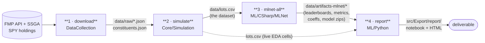

# Direct Indexing ML — tax-loss-harvesting decisions in a simulated portfolio

A C# (.NET 8) + Python pipeline that **manufactures its own dataset and learns from it**:
it replays real S&P 500 prices through a simulated \$10M direct-indexing portfolio, labels
every tax lot on every day with a harvesting rulebook, and trains supervised models to predict
*harvest propensity* — "will it be worth harvesting this lot within the next 30 days?"

> **New here, or coming back after a while?** Read this README for the front-door tour (what it
> is, how to run it, the methodology). For the full project recap, the comparison to the original
> proposal, and the v0.3–v0.4 plan, see **[`PSTAT231_RECAP.md`](PSTAT231_RECAP.md)**. For the
> first-principles math walk of the whole codebase, see **[`DataMemo/Lifecycle_v02.md`](DataMemo/Lifecycle_v02.md)**. (PSTAT 231 being the intro-ML grad project based course)

**Status:** v0.1 + v0.2 complete (v0.2 was the PSTAT 231 final submission). Champion model (gradient-boosted trees) scores ~0.86 PR-AUC on the soft-label target. See [Results](#results).

---

## Table of contents

- [What this is, in one minute](#what-this-is-in-one-minute)
- [Why it's built this way (the core idea)](#why-its-built-this-way-the-core-idea)
- [Architecture & lifecycle](#architecture--lifecycle)
- [The data point — what one row means](#the-data-point--what-one-row-means)
- [Repository layout](#repository-layout)
- [Prerequisites](#prerequisites)
- [Quickstart](#quickstart)
- [Command reference](#command-reference)
- [Results](#results)
- [Methodology & philosophy](#methodology--philosophy)
- [Roadmap](#roadmap)
- [Further reading](#further-reading)

---

## What this is, in one minute

**Direct indexing** = holding the individual stocks of an index (instead of one index fund) so you
can sell *individual lots* at a loss to realize a tax benefit ("tax-loss harvesting"), while a fund
holder cannot. Selling a loser banks a **tax alpha** — `τ · |loss|` dollars of offset against
realized gains — at the cost of a little **tracking error** (drift from the index), which you can
neutralize by rebuying a correlated substitute or the same stock 30 days later (the wash-sale rule).

The decision *"should I harvest lot k today?"* has a correct answer computable from observable state —
a four-condition rulebook we call the **oracle**. That makes it a well-posed machine-learning problem.
But the *valuable* question isn't "does the rule fire today?" (you can just run the rule); it's
**"will the rule fire within the next 30 trading days?"** — harvest *propensity* — which depends on
unknown future prices and can only be *estimated* from today's state. That estimation is what the
models learn.

No public dataset records lot-level tax state under this rulebook. So the project **generates** the
dataset by simulating a portfolio over real historical prices.

## Why it's built this way (the core idea)

The whole codebase derives from the tax code in five steps:

1. **Tax asymmetry → why direct indexing exists.** A lot below cost basis holds an *option* worth
   `τ(h)·|qₖ(Pₜ − pₖ)|` dollars (`τ` = 37% short-term / 20% long-term). That option only exists at
   **lot granularity** — an index-fund holder owns no lots.
2. **The decision has a correct answer → the oracle.** Harvesting is constrained by a loss threshold,
   a tracking-error budget, a realized-gains budget, and a wash-sale lockout:

   ```
   f*(x) = 𝟙[L ≤ −2%] · 𝟙[σ_TE ≤ 5%] · 𝟙[G_YTD > 0] · 𝟙[WashClock ≥ 30]
   ```

   Geometrically this is the intersection of four half-spaces — a convex polytope Ω, with `f* = 𝟙_Ω`.
3. **Why simulate → the rulebook is executable.** Replay real prices through a portfolio that obeys
   the rule and log every `(lot, day)` state. The simulator *is* the problem's physics (with real
   price risk), not an approximation of it.
4. **Why ML when `f*` is known code →** (a) a *recoverability sanity check* (a broken pipeline can't
   relearn a deterministic rule from 170K labels); (b) the real target is the **future**, which `f*`
   can't see; (c) the learned propensity model `η̂(x) ≈ E[future harvestability | x]` is a value-function
   surrogate — the stepping stone to a reinforcement-learning policy later.
5. **The invariant that governs everything:**

   > **Labels may peek at the future (at dataset-construction time). Features never may.**

   Soft labels are computed from prices at *t+1 … t+30* — legal, because labels are the answer key and
   exist only at training time. Every *feature* is computable from information available at day *t*.
   At deployment the future doesn't exist; the model bridges the gap. That is what supervised learning
   *is*, made explicit.

## Architecture & lifecycle

Four layers, each a **map between files on disk**. Layers communicate *only* through serialized
artifacts — so any layer can be rerun, replaced, or audited in isolation. That file-boundary design is
the architectural thesis of the project.



| Stage | Command | Input → Output | What happens |
|---|---|---|---|
| **1 · Download** | `download` | API → `data/raw/`, `constituents.json` | Fetch SPY constituents (SSGA holdings xlsx) + per-ticker EOD price history (FMP). Window is dynamic (configurable years + a 200-day warmup so `MA_200` is defined on day one). |
| **2 · Simulate** | `simulate` | prices → `data/lots.csv` | Open an equal-dollar \$10M portfolio, step day by day: value it, compute tracking error, snapshot every open lot, apply the oracle, harvest + queue a 30-day rebuy when it fires. Each row is one `(lot, day)` observation with features **and** labels. |
| **3 · Train** | `mlnet-all` | `lots.csv` → `data/artifacts-mlnet/` | Cross-validate 5 models on 2 targets, select champions, evaluate only the champions on the sealed test set, emit metrics/leaderboards. Plus PCA + K-means diagnostics. |
| **4 · Report** | `report` | artifacts → `src/Export/report/` | Generate a codebook (with a schema-drift assert against `lots.csv`), execute the analysis notebook, export self-contained HTML. |

A run is the composition `download → simulate → mlnet-all → report`. Each step is **idempotent** and
**replayable from its on-disk inputs**, so you can rerun any stage without redoing the ones before it
(as long as their outputs exist).

## The data point — what one row means

One row of `data/lots.csv` is an immutable "photograph" of one lot at one day — the type
[`LotStateVector`](src/Core/Portfolio/LotStateVector.cs), which is the load-bearing schema of the
whole codebase (20 types depend on it).

| Group | Columns |
|---|---|
| **Lot-level** | `L` unrealized return · `H` holding days · `S` short/long flag · `B` cost basis · `W` lot weight · `K` open lots in same ticker |
| **Portfolio-level** | `G_YTD` realized gain YTD · `Sigma_TE` tracking error · `WashClock` days since last harvest (999 = never) |
| **Asset-level** | `R_t` daily return · `SigmaRange` range-vol proxy · `DeltaMA50` · `DeltaMA200` |
| **Derived** | `TaxAlpha` · `DaysToYE` |
| **Labels** | `Y_Oracle ∈ {0,1}` (hard, "fires today?") · `Y_Soft_BT ∈ [0,1]` (fraction of next 30 real days the rule fires; NaN near the window end) · `Y_Soft_GBM ∈ [0,1]` (same, over 200 simulated price paths) |
| **Metadata** | `Symbol` · `Sector` · `Timestep` *(dropped before modeling)* |

The soft labels are the project's real target: holding portfolio state frozen, *would the oracle fire
in the next 30 days?* — `Y_Soft_BT` averages that 0/1 predicate along the one real price path;
`Y_Soft_GBM` counts first-passage over 200 simulated paths. There is **no optimization and no ML inside
the labeler** — it evaluates a fixed rule forward and averages.

## Repository layout

```
.
├── PROJECT_RECAP.md          ← start here for the full recap + v0.3–v0.4 roadmap
├── README.md                 ← you are here
├── DirectIndexing.sln
├── src/
│   ├── Program.cs            ← the orchestrator: one switch maps command → layer
│   ├── DataCollection/       ← Layer 1: MarketDataDownloader, Models
│   ├── Core/
│   │   ├── Portfolio/        ← Lot, PortfolioState, LotStateVector (the schema)
│   │   ├── Oracle/           ← OracleBoundary (the pure, stateless rulebook f*)
│   │   └── Simulation/       ← PriceLoader, SimulationEngine, SoftLabelBuilder,
│   │                            TrackingErrorProxy, GbmSimulator, MonteCarloEngine
│   ├── Export/               ← SimulationExporter + generated plots/report (gitignored)
│   ├── Tests/                ← state machine, oracle gates, TE invariants, leakage regressions
│   └── ML/
│       ├── CSharp/MLNet/     ← Layer 3: trainers, splits, preprocessing, tuning, metrics
│       └── Python/           ← Layer 4: report/codebook/eda/render scripts + notebook (uv-managed)
├── DataMemo/                 ← design + math docs (see Further reading)
└── data/                     ← raw cache, lots.csv, artifacts (all gitignored — re-derivable)
```

## Prerequisites

| Tool | Version | Needed for |
|---|---|---|
| [.NET SDK](https://dotnet.microsoft.com/download) | **8.0** | everything (the orchestrator + all C# layers) |
| [`uv`](https://docs.astral.sh/uv/) | recent | Layer 4 (report) — manages the Python ≥ 3.11 environment under `src/ML/Python/` |
| FMP API key | — | **only** `download`. Set `FMP_API_KEY` in your environment. Not needed if you already have `data/raw/` (it ships in the submission zip). |

The Python environment is created/used automatically by the `report` commands via the `PythonRunner`
subprocess seam — you don't normally invoke Python directly. To set it up manually:
`cd src/ML/Python && uv sync`.

## Quickstart

```bash
# 0. (first time only) point at your FMP key — skip if data/raw/ already exists
export FMP_API_KEY=your_key_here

# 1. fetch prices + constituents              → data/raw/, constituents.json
dotnet run --project src -- download

# 2. simulate the portfolio + label every lot → data/lots.csv
dotnet run --project src -- simulate

# 3. cross-validate 5 models, test champions  → data/artifacts-mlnet/
dotnet run --project src -- mlnet-all

# 4. build the report (codebook + notebook + HTML) → src/Export/report/
dotnet run --project src -- report
```

Or run the whole training+report in one shot once `lots.csv` exists:

```bash
dotnet run --project src -- report-all     # = mlnet-all then report
```

Verify everything works:

```bash
dotnet run --project src -- test           # 30+ assertions incl. leakage regressions
```

> You can also `cd src && dotnet run <command>` instead of the `--project src --` form.

## Command reference

**Pipeline (the main path):**

| Command | Layer | What it does |
|---|---|---|
| `download` | 1 | Fetch constituents + EOD prices → `data/raw/`, `constituents.json` (needs `FMP_API_KEY`) |
| `simulate` | 2 | Backtest the \$10M portfolio, label every lot-day → `data/lots.csv` |
| `simulate-mc` | 2 | Monte-Carlo variant on synthetic GBM prices → `data/lots-mc.csv` |
| `mlnet-all` | 3 | CV all 5 models × 2 targets, test the champions, render → `data/artifacts-mlnet/` |
| `report` | 4 | Codebook + execute `final_report.ipynb` + export HTML → `src/Export/report/` (exits 2 with a list if artifacts are missing) |
| `report-all` | 3+4 | `mlnet-all` then `report`, one command |
| `submission` | packaging | Assemble `submission.zip` at the repo root (deliverables at zip root; raw cache included so it reproduces with no API key; `--no-data` drops `lots.csv`) |

**Devtools & granular subcommands:**

| Command | What it does |
|---|---|
| `test` | Run the test suite (portfolio state machine, oracle gates, TE invariants, GBM stats, splits/imputation/weights/grid-search, **leakage regressions**) |
| `deps` | Regex-scan `src/**/*.cs` → dependency/coupling atlas (`src/Export/diagrams/Dependencies.md`: mermaid layer/class/inheritance graphs + fan-in/out tables) |
| `mlnet-eda` / `mlnet-unsupervised` / `mlnet-render` | Run individual ML.NET sub-stages (EDA stats, PCA+K-means, Python rendering) |
| `mlnet-gbt` / `mlnet-rf` / `mlnet-elnet` / `mlnet-linreg` / `mlnet-supervised` | Train a single model family in isolation |
| `mlnet-compare` | Run the CV leaderboard / champion comparison without the full pipeline |

## Results

**Headline (PSTAT 231 v0.2 submission — 2-year window, 170,751 rows):**

| Model | soft target (base rate 19.9%) | oracle target (sanity check) |
|---|---|---|
| **Gradient-boosted trees ★** | CV **0.858** → test **0.862** PR-AUC | 0.9997 |
| **Random forest ★** | 0.694 | 0.9987 |
| Logistic (L2) | 0.650 | 0.987 |
| Elastic net | 0.635 | 0.442 |
| Linear regression (demo) | 0.559 (~10% of predictions escape `[0,1]`) | 0.372 |

What the numbers *mean* (the science, not the recitation):

- **GBT's CV→test gap is +0.004** — the honesty signature: tuned cleanly, nothing leaked or overfit to
  folds. At the F1-optimal threshold: ~76% precision / ~83% recall against a 19.9% base rate.
- **The linear tier (~0.65) is representation-limited, not regularization-limited** — every linear model
  chose its *weakest* penalty, so the ceiling is the functional form, not overfitting.
- **The GBT–RF gap (0.16)** — same trees, different composition: boosting *sharpens* the thin positive
  region that bagging *blurs*.
- **Trees recover the known oracle near-perfectly (≥ 0.999)** — the recoverability sanity check passes.

> **⚠️ The repo has since moved past the frozen submission.** The live pipeline now runs on a ~20-year
> window (≈1.85M rows) instead of 2 years, which *changed* one finding (logistic on the oracle target
> drops sharply once real bull/bear regimes make multiple gates bind). The table above is the frozen
> PSTAT submission snapshot — when quoting a number, know which window you mean. See
> [`PROJECT_RECAP.md` §6](PROJECT_RECAP.md) for the full divergence and what it implies for v0.3.

## Methodology & philosophy

Five disciplines hold the project together. Breaking any of them silently corrupts the results — they
are the things to preserve as the project grows.

- **Labels may peek at the future; features never may.** The single invariant (see [core idea](#why-its-built-this-way-the-core-idea) #5). Every new feature must be computable from information available at day *t*; only labels may use *t+1 … t+30*.
- **Leakage invariants are types, not conventions.** Median imputation and class weights have *no overload* that accepts the full dataset — they only accept a training fold. Normalization and one-hot encoding live inside the fitted pipeline. The leakage mistake scikit-learn lets you make implicitly, the C# layer makes *unrepresentable*. (Details: [`DataMemo/MLNetLeakageAudit.md`](DataMemo/MLNetLeakageAudit.md).)
- **Champion selection is enforced by code shape.** Cross-validation ranks all five models; only the top-two classifiers ever reach the function that touches the sealed test set. "Only the best one or two models touch test" is a *structural* property, not a promise.
- **PR-AUC, not ROC-AUC, for rare positives.** With a 1.6% (oracle) or 19.9% (soft) positive rate,
  ROC-AUC is blind to a flood of false positives; precision-recall AUC is the metric that punishes
  drowning the true positives in alarms. (And PR-AUC is still *not* the deployment objective — a model
  with higher PR-AUC can produce *less* tax alpha if it fires on correlated lots at once; that economic
  evaluation is the next layer, see roadmap.)
- **Layers communicate only through files.** No hidden shared mutable state crosses a layer boundary;
  the entire input to any layer is inspectable on disk. This is what lets the Python report layer be
  swapped, the ML layer be rewritten (it was — from Python to ML.NET), or any stage be audited alone.

> **A note on scope.** This started as a PSTAT 131/231 course project. The professor's guidance was to
> simplify to "a fixed dataset + one binary outcome + multiple models." This project keeps that clean
> modeling core but deliberately keeps the **simulator** — because there *is* no fixed dataset to pull
> for this problem; the simulator is how the tabular dataset is manufactured, with real price risk. The
> trade-offs of that choice, and how the final project diverged from the original proposal, are written
> up in [`PROJECT_RECAP.md` §5](PROJECT_RECAP.md).

## Roadmap

Conceptually, the long arc is: **supervised oracle approximation → continuous tax-value modeling → a
reinforcement-learning policy that needs no hand-coded rule at all.**

| Version | Timeline | Focus |
|---|---|---|
| **v0.1** | PSTAT 231 (Spring 2026) | ✅ Supervised baseline: hard + soft labels, ~15 features, 4+ models with k-fold CV |
| **v0.2** | PSTAT 231 (Spring 2026) | ✅ Champion selection, PCA/K-means, report layer + submission packaging |
| **v0.3** | Summer / Junior Fall | Promote `G_YTD` to a continuous tax ledger; volatility sub-model (GARCH/EWMA σ̂, Ledoit-Wolf shrinkage); richer soft-label families; portfolio-level tax-alpha metrics |
| **v0.4** | Junior Year | Reinforcement-learning policy layer (PPO/SAC) on a policy-driven simulation environment, warm-started from the supervised model; quantify how much alpha RL recovers over the baseline |
| **v0.5** | Senior Capstone | Full-system integration: live data, client-parameterized policies, real-history backtests |
| **v1.0** | Post-graduation | Production deployment; RIA-style direct-indexing service |

The eventual deployment goal is a live direct-indexing system (the author as its own first client), with
the open research bet being whether RL and neural methods recover meaningfully more tax alpha — at equal
or lower tracking error — than the supervised oracle-approximation baseline.

**The full version-by-version plan, the open-issue ledger, and the recommended critical path for v0.3
and v0.4 live in [`PROJECT_RECAP.md` §7–§9](PROJECT_RECAP.md).**

## Further reading

| Document | What's in it |
|---|---|
| [`PROJECT_RECAP.md`](PROJECT_RECAP.md) | The orientation doc: full v0.1–v0.2 recap, current-state vs. frozen-submission divergence, comparison to the original proposal, and the v0.3–v0.4 roadmap with a recommended path. |
| [`DataMemo/Lifecycle_v02.md`](DataMemo/Lifecycle_v02.md) | First-principles walk of the *entire* codebase: every layer's signature, the day-loop sequence, the lot lifecycle state machine, and the math each piece implements. |
| [`DataMemo/SimulationMath.md`](DataMemo/SimulationMath.md) · [`PortfolioMath.md`](DataMemo/PortfolioMath.md) | The simulation and portfolio mathematics (seeding, year-end resets, tracking-error derivation, the endogenous dataset-size identity). |
| [`DataMemo/ML_Derivations_Explicit_Rigorous_DollarMath.md`](DataMemo/ML_Derivations_Explicit_Rigorous_DollarMath.md) | Per-model derivations (each hypothesis space as an explicit set + objective). |
| [`DataMemo/MLNetLeakageAudit.md`](DataMemo/MLNetLeakageAudit.md) | Where every fit happens and why none of them leak. |
| [`DataMemo/GYTD_Redesign_Plan.md`](DataMemo/GYTD_Redesign_Plan.md) | The v0.3 design: promoting the gains gate to a continuous tax ledger. |
| [`DataMemo/DataMemo.ipynb`](DataMemo/DataMemo.ipynb) | The original pre-implementation proposal (with the professor's feedback). |
| [`AI_USAGE.md`](AI_USAGE.md) | AI-assistance disclosure for the course submission. |
