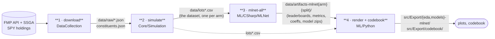

# Direct Indexing ML — tax-loss-harvesting decisions in a simulated portfolio

A C# (.NET 8) + Python pipeline that **manufactures its own dataset and learns from it**:
it replays real S&P 500 prices through a simulated \$10M direct-indexing portfolio, labels
every tax lot on every day with a harvesting rulebook, and trains supervised models to predict
*harvest propensity* — "will it be worth harvesting this lot within the next 30 days?"

> **New here, or coming back after a while?** This README is the front door: what it is, how to
> run it, the methodology. **[`ROADMAP.md`](ROADMAP.md)** is the authoritative plan, status, and
> audit findings. For the mathematics, start at
> **[`DataMemo/spec/SymbolTable.md`](DataMemo/spec/SymbolTable.md)**: every object, typed,
> linked to the code member that implements it and the test that pins it. The docs are tiered
> (live spec / frozen decisions / archive); see [`DataMemo/README.md`](DataMemo/README.md).
> (PSTAT 231 is the intro-ML graduate project course this began in.)

**Status:** v0.1 → v0.26 complete, plus a **pre-v0.3 downsizing**. **v0.3 is implemented** (its
measurements on the 20-year data run on your machine; see [`ROADMAP.md`](ROADMAP.md)). The v0.4
policy layer is designed in [`DataMemo/decisions/PolicyLayer_v04.md`](DataMemo/decisions/PolicyLayer_v04.md).

v0.2 was the PSTAT 231 submission. The pipeline was then scaled to a custom range of up to ~20
years (2006–2026, 1.85M lot-day rows through the 2008, 2020 and 2022 drawdowns), which exposed
the defects v0.25/v0.26 fixed:

- **v0.25: oracle redesign.** The `G_YTD` gains gate was economically invalid, so it became a
  `TaxLedger` and a scalarized objective `U = TaxValue − λσ_TE² − c_trade` behind three hard
  gates. The oracle-target tree-over-linear gap collapsed `0.155 → 0.015`: much of the original
  "trees win" headline had been manufactured by the gate's box corner.
- **v0.26: validation hardening.** Purged chronological splits (`--split=temporal`). ROC-AUC held
  and the deterministic-oracle control stayed ~1.0, so split-level leakage is ruled out. The
  PR-AUC drop was the cost-basis-aging prevalence crash.
- **Downsizing (2026-09-30).** GBT (champion) + logistic (linear control); one simulator with
  several price sources; the gated oracle arm retired; the math ↔ code spine (typed
  `SymbolTable.md`, `[math:id]` anchors, `docs-check`).
- **v0.3: the state and the scoreboard.** The ledger now answers *what an opportunity is worth*,
  and the volatility model answers *how uncertain and how dynamic it is*.
  - **The book obeys the tax code:** §1091 on both sides (0 audited violations, down from 24%),
    a calendar §1222 holding period, and a Schedule D ledger by character whose carryforward is
    actually consumed (F6–F8).
  - **TE is point-in-time** (Ledoit–Wolf $\hat\Sigma_t$, dollar weights; F1).
  - **σ̂ is a first-class object** with three separately ablated roles: feature, FHS soft
    labels, and an FHS training world.
  - **Evaluation is economic:** after-tax and liquidation wealth per policy rung (`ladder`).
  - **A finding that shapes v0.4:** a loss-only TLH book is *carryforward-saturated*, so the
    marginal harvest is worth $\tau_f\delta$ and $\delta$ is the dominant economic parameter.

The surviving headline is stronger than the original: the tree advantage on the **temporal**
(forward-propensity) target is real and oracle-invariant. See [Results](#results).

---

## Table of contents

- [What this is, in one minute](#what-this-is-in-one-minute)
- [Why it's built this way (the core idea)](#why-its-built-this-way-the-core-idea)
- [Architecture & lifecycle](#architecture--lifecycle)
- [The data point — what one row means](#the-data-point--what-one-row-means)
- [Repository layout](#repository-layout)
- [Prerequisites](#prerequisites)
- [Quickstart](#quickstart)
- [Command reference](#command-reference)
- [Results](#results)
- [Methodology & philosophy](#methodology--philosophy)
- [Roadmap](#roadmap)
- [Further reading](#further-reading)

---

## What this is, in one minute

**Direct indexing** = holding the individual stocks of an index (instead of one index fund) so you
can sell *individual lots* at a loss to realize a tax benefit ("tax-loss harvesting"), while a fund
holder cannot. Selling a loser banks a **tax alpha** — `τ · |loss|` dollars of offset against
realized gains — at the cost of a little **tracking error** (drift from the index), which you can
neutralize by rebuying a correlated substitute or the same stock 30 days later (the wash-sale rule).

The decision *"should I harvest lot k today?"* has a correct answer computable from observable state —
a four-condition rulebook we call the **oracle**. That makes it a well-posed machine-learning problem.
But the *valuable* question isn't "does the rule fire today?" (you can just run the rule); it's
**"will the rule fire within the next 30 trading days?"** — harvest *propensity* — which depends on
unknown future prices and can only be *estimated* from today's state. That estimation is what the
models learn.

No public dataset records lot-level tax state under this rulebook. So the project **generates** the
dataset by simulating a portfolio over real historical prices.

## Why it's built this way (the core idea)

The whole codebase derives from the tax code in five steps:

1. **Tax asymmetry → why direct indexing exists.** A lot below cost basis holds an *option* worth
   `τ(h)·|qₖ(Pₜ − pₖ)|` dollars (`τ` = 37% short-term / 20% long-term). That option only exists at
   **lot granularity** — an index-fund holder owns no lots.
2. **The decision has a correct answer → the oracle.** Harvesting is constrained by a loss
   threshold, a wash-sale lockout, a tracking-error ceiling, and — the economic part — whether
   the harvest is *worth its cost*:

   ```
   f*(x) = 𝟙[L ≤ −2%] · 𝟙[WashClock > 30] · 𝟙[σ_TE ≤ θ_max] · 𝟙[U(x) > 0]
   where  U(x) = TaxValue − λ·σ_TE² − c_trade
   ```

   The decision boundary is the **level set** `{U = 0}` — a smooth surface, not a box corner.

   > *This changed in v0.25.* The original rule was a four-way AND whose third gate required
   > `G_YTD > 0` ("the portfolio must have realized gains this year") — a convex **polytope**.
   > That gate turned out to be economically invalid for an individual investor (capital losses
   > carry forward indefinitely), so the gains information moved *inside* `TaxValue` as a
   > capacity-aware value term. Removing it collapsed the tree-over-linear gap on the oracle
   > target from 0.155 to 0.015 — the polytope corner, not problem structure, had been doing
   > the work. See [`DataMemo/decisions/GYTD_Redesign_Plan.md`](DataMemo/decisions/GYTD_Redesign_Plan.md).
3. **Why simulate → the rulebook is executable.** Replay real prices through a portfolio that obeys
   the rule and log every `(lot, day)` state. The simulator *is* the problem's physics (with real
   price risk), not an approximation of it.
4. **Why ML when `f*` is known code →** (a) a *recoverability sanity check* (a broken pipeline can't
   relearn a deterministic rule from 170K labels); (b) the real target is the **future**, which `f*`
   can't see; (c) the learned propensity model `η̂(x) ≈ E[future harvestability | x]` is a value-function
   surrogate — the stepping stone to a reinforcement-learning policy later.
5. **The invariant that governs everything:**

   > **Labels may peek at the future (at dataset-construction time). Features never may.**

   Soft labels are computed from prices at *t+1 … t+30* — legal, because labels are the answer key and
   exist only at training time. Every *feature* is computable from information available at day *t*.
   At deployment the future doesn't exist; the model bridges the gap. That is what supervised learning
   *is*, made explicit. (One known violation is open: σ_TE's covariance is estimated from the full
   history. It is fixed first thing in v0.3; see ROADMAP finding F1.)

## Architecture & lifecycle

Four layers, each a **map between files on disk**. Layers communicate *only* through serialized
artifacts — so any layer can be rerun, replaced, or audited in isolation. That file-boundary design is
the architectural thesis of the project.


```mermaid
flowchart LR
    FMP[(FMP API + SSGA<br/>SPY holdings)] --> L1
    L1["**1 · download**<br/>DataCollection"] -->|"data/raw/*.json<br/>constituents.json"| L2
    L2["**2 · simulate**<br/>Core/Simulation"] -->|"data/lots*.csv<br/>(the dataset, one per arm)"| L3
    L3["**3 · mlnet-all**<br/>ML/CSharp/MLNet"] -->|"data/artifacts-mlnet{arm}{split}/<br/>(leaderboards, metrics,<br/>coeffs, model zips)"| L4
    L4["**4 · render + codebook**<br/>ML/Python"] -->|"src/Export/{eda,models}-mlnet/<br/>src/Export/codebook/"| OUT([plots, codebook])
    L2 -.->|"lots*.csv"| L4
```

| Stage | Command | Input → Output | What happens |
|---|---|---|---|
| **1 · Download** | `download [--from YYYY-MM-DD --to YYYY-MM-DD]` | API → `data/raw/`, `constituents.json` | Fetch SPY constituents (SSGA holdings xlsx) + per-ticker EOD price history (FMP). Pass explicit `--from`/`--to` (up to ~20 years, the API's ≈5,000-bar cap), or omit both for a rolling 2-year window. The fetch extends ~200 trading days back so `MA_200` is defined on day one. |
| **2 · Simulate** | `simulate [--contrib] [--ctrade=x]` | prices → `data/lots{arm}.csv` | Open an equal-dollar \$10M book and step day by day: value it, compute tracking error, update the `TaxLedger`, snapshot every open lot, apply the scalarized oracle, harvest + queue a 30-day rebuy when it fires, then (with `--contrib`) mint fresh lots from periodic contributions. `simulate-mc` runs the **same engine** over a synthetic GBM price world. |
| **3 · Train** | `mlnet-all [--lots=…] [--split=temporal]` | `lots*.csv` → `data/artifacts-mlnet{arm}{split}/` | Cross-validate **GBT + logistic** on two targets, write a leaderboard naming the champion (argmax CV PR-AUC), then evaluate both on the held-out test set. Renders EDA and model plots. |
| **4 · Codebook** | `codebook [--lots=…]` | CSV header → `src/Export/codebook/` | Render the column dictionary from the single schema source, **failing** if the CSV header drifted from it. |

A run is the composition `download → simulate → mlnet-all`. Each step is **idempotent** and
**replayable from its on-disk inputs**. Two consistency checks run alongside: `test` (the C#
suite) and `docs-check` (the math ↔ code spine; see Methodology).

## The data point — what one row means

One row of `data/lots.csv` is an immutable "photograph" of one lot at one day — the type
[`LotStateVector`](src/Core/Portfolio/LotStateVector.cs), which is the load-bearing schema of the
whole codebase. It is **schema v6** (`d = 23` numeric features, 31 columns). v0.3-8 added the σ̂
feature role (EWMA σ̂ of the name and the market, and the loss-barrier coordinate); v0.3-3 split
the ledger by §1222 character (Schedule D netting with consumed carryforward). v0.25 (schema v3)
turned the `G_YTD` scalar into the three-field `TaxLedger` block, replaced `TaxAlpha` with the
capacity-aware `TaxValue`, and added the `Y_TaxValue` / `Y_Utility` labels. v4 dropped the retired
gated-oracle spectator label. Every column's type, units and code source are in
[`DataMemo/spec/SymbolTable.md`](DataMemo/spec/SymbolTable.md) §B.

| Group | Columns |
|---|---|
| **Lot-level** | `L` unrealized return · `H` lot age (trading days) · `S` §1222 long-term flag (calendar) · `B` cost basis · `W` lot weight · `K` open lots in same ticker |
| **Portfolio-level** (TaxLedger) | `NetST` / `NetLT` signed net realized P&L YTD by character · `CarryST` / `CarryLT` prior-year loss carryforward by character (26 USC §1212(b); consumed by later gains) · `OrdinaryOffsetBudget` the $3k/yr allowance not yet claimed (carryforward claims it first) · `Sigma_TE` tracking error · `WashClock` calendar days to the lot's nearest §1091 event (both sides; 999 = none) |
| **Asset-level** | `R_t` daily return · `SigmaRange` range-vol proxy · `DeltaMA50` · `DeltaMA200` · `SigmaHat` EWMA σ̂ of the name · `SigmaMkt` EWMA σ̂ of the market (shared per day) |
| **Derived** | `TaxValue` = this year's tax saved (at the rate of whatever the loss displaces) + τ_f·δ·(newly banked carryforward), a counterfactual difference of the Schedule D netting · `DaysToYE` · `ZBarrier` z = log-distance to the loss trigger in forecast σ over 30 d · `PBarrier` 2Φ(−z) |
| **Labels** | `Y_Oracle ∈ {0,1}` (hard, "fires today?") · `Y_Soft_BT ∈ [0,1]` (fraction of next 30 real days the rule fires; NaN near the window end) · `Y_Soft_GBM ∈ [0,1]` (P(fires at least once in 30 days) over 200 simulated paths — a first-passage probability, not an occupation fraction; `--soft-gbm=fhs` simulates FHS paths) · `Y_TaxValue ∈ ℝ≥0` (regression target = `TaxValue`) · `Y_Utility ∈ ℝ` (the per-lot scalarized objective `U(x)`; the RL reward is defined at portfolio level, see SymbolTable §I) |
| **Metadata** | `Symbol` · `Sector` · `Timestep` *(dropped before modeling)* |

The soft labels are the project's real target: holding portfolio state frozen, *would the oracle fire
in the next 30 days?* — `Y_Soft_BT` averages that 0/1 predicate along the one real price path;
`Y_Soft_GBM` counts first-passage over 200 simulated paths. There is **no optimization and no ML inside
the labeler** — it evaluates a fixed rule forward and averages.

## Repository layout

```
.
├── README.md                 ← you are here
├── ROADMAP.md                ← the authoritative plan, status, audit findings, standing rules
├── DirectIndexing.sln
├── src/
│   ├── Program.cs            ← the orchestrator: one switch maps command → layer
│   ├── DataCollection/       ← Layer 1: MarketDataDownloader
│   ├── Core/
│   │   ├── Portfolio/        ← Lot, PortfolioState, TaxLedger, LotStateVector (the schema)
│   │   ├── Oracle/           ← OracleConfig + OracleBoundary (the pure, stateless f*)
│   │   └── Simulation/       ← PriceLoader (real + synthetic GBM worlds), SimulationEngine,
│   │                            SoftLabelBuilder, TrackingErrorProxy, GbmSimulator, ContributionPolicy
│   ├── Export/               ← SimulationExporter; generated plots (gitignored); report/ = frozen v0.2 deliverable
│   ├── Tests/                ← state machine, ledger, oracle, TE, GBM, synthetic world, splits, metrics
│   └── ML/
│       ├── CSharp/MLNet/     ← Layer 3: GBT + logistic, tax-value regression, splits, preprocessing, metrics
│       └── Python/           ← Layer 4: eda/render/codebook + check_math_sync (uv-managed)
├── DataMemo/                 ← spec/ (live math) · decisions/ (frozen) · archive/ (history)
└── data/                     ← raw cache, lots*.csv, artifacts-mlnet*/ (all gitignored, re-derivable)
```

## Prerequisites

| Tool | Version | Needed for |
|---|---|---|
| [.NET SDK](https://dotnet.microsoft.com/download) | **8.0** | everything (the orchestrator + all C# layers) |
| [`uv`](https://docs.astral.sh/uv/) | recent | Layer 4 (render, codebook, `docs-check`) — manages the Python ≥ 3.11 environment under `src/ML/Python/` |
| FMP API key | — | **only** `download`. Set `FMP_API_KEY` in your environment. Not needed if you already have `data/raw/` (it ships in the submission zip). |

The Python environment is created/used automatically via the `PythonRunner` subprocess seam — you
don't normally invoke Python directly. To set it up manually:
`cd src/ML/Python && uv sync`.

## Quickstart

```bash
# 0. (first time only) point at your FMP key — skip if data/raw/ already exists
export FMP_API_KEY=your_key_here

# 1. fetch prices + constituents                     → data/raw/, constituents.json
dotnet run --project src -- download --from 2006-07-01 --to 2026-06-12

# 2. simulate + label every lot (the state)          → data/lots_contrib_trim.csv
dotnet run --project src -- simulate --contrib --trim

# 3. how good is σ̂? (QLIKE per estimator × horizon × regime) → data/artifacts-vol/qlike.json
dotnet run --project src -- vol-eval

# 4. supervised layer, honest split                  → data/artifacts-mlnet_contrib_trim-temporal/
dotnet run --project src -- mlnet-all --lots=data/lots_contrib_trim.csv --split=temporal

# 5. the scoreboard: never / threshold / oracle       → data/runs/ladder_contrib_trim/
dotnet run --project src -- ladder --contrib --trim

# 6. schema + math ↔ code checks
dotnet run --project src -- codebook --lots=data/lots_contrib_trim.csv
dotnet run --project src -- docs-check
```

No market data? The whole sequence runs on synthetic worlds. GBM is the control (constant σ);
FHS has clustered volatility and fat tails, and is the RL training world:

```bash
dotnet run --project src -- simulate-mc --world=fhs --mc-standalone=60 --mc-days=1260 --contrib --trim
dotnet run --project src -- vol-eval --mc-standalone=60 --mc-days=1260
dotnet run --project src -- mlnet-all --lots=data/lots-mc-fhs_contrib_trim.csv --split=temporal
dotnet run --project src -- ladder --world=fhs --mc-standalone=40 --mc-days=1008 --seeds=10 --contrib --trim
```

Verify everything:

```bash
dotnet run --project src -- test         # the C# suite
dotnet run --project src -- docs-check   # SymbolTable ↔ code ↔ tests ↔ links
```

> Paths are anchored at the repo root, so `dotnet run --project src -- …` from the root and
> `cd src && dotnet run -- …` behave identically. `--lots=` is resolved against your shell's
> working directory.

## Command reference

**Pipeline:**

| Command | Layer | What it does |
|---|---|---|
| `download [--from D --to D]` | 1 | Fetch constituents + EOD prices → `data/raw/`, `constituents.json` (needs `FMP_API_KEY`) |
| `simulate` | 2 | Backtest the \$10M book over real prices, label every lot-day → `data/lots{arm}.csv` |
| `simulate-mc` | 2 | The same engine over a synthetic world: `--world=gbm` (σ per name calibrated from the cache, or `--mc-standalone=<names>`) or `--world=fhs` (filtered historical simulation from the cache, or a GARCH-factor panel when standalone) → `data/lots-mc{-fhs}{arm}.csv` |
| `vol-eval` | 2 | QLIKE of constant / trailing-21 / EWMA / walk-forward GARCH / range σ̂ forecasts, h ∈ {1,5,21}, by market-vol tercile → `data/artifacts-vol/qlike{-mc}.json` |
| `mlnet-all` | 3 | CV GBT + logistic per target (`--target=`, default `soft_bt,oracle`), leaderboard, test both with σ̂_m-stratified metrics, render |
| `ladder` | 4 | Economic scoreboard: rungs never / threshold / oracle on one world (`--seeds=K` for paired mean ± s.e.) → `data/runs/ladder{tags}/` |
| `codebook` | 4 | Column dictionary from `codebook_schema.py`; exits non-zero if the CSV header drifted |

**Granular and devtools:**

| Command | What it does |
|---|---|
| `mlnet-gbt` / `mlnet-logistic` | Train one model on both targets |
| `mlnet-compare` / `mlnet-soft` / `mlnet-oracle` | The comparison run for both / one target (finish a partial `mlnet-all`) |
| `mlnet-tax` | Regress `Y_TaxValue` without the `TaxValue` feature (function recovery: linear R² ≈ 0.10 vs trees ≈ 0.9) |
| `mlnet-eda` / `mlnet-render` | EDA plots / model plots only |
| `test` | The C# suite (state machine, ledger, oracle, TE, GBM, synthetic world, splits, metrics exact values, champion rule) |
| `docs-check` | The math ↔ code spine: fails on an orphaned or missing `[math:id]` anchor, a vanished member, a constant that differs from its declaration, schema drift, or a broken link |
| `deps` | Regex-scan `src/**/*.cs` → dependency atlas (`src/Export/diagrams/Dependencies.md`) |

Retired in the pre-v0.3 downsizing: `mlnet-rf/-elnet/-linreg/-unsupervised/-supervised/-baseline`,
`report`, `report-all`, `submission`, and `--oracle=gated` (it now exits with a pointer to the archive).

### Flags, arms & artifact layout

**Simulation flags** (`simulate` / `simulate-mc` / `ladder`) shape the *label generator*. Each arm
writes its own dataset, because the acting policy changes which rows exist:

| Flag | Default | Effect |
|---|---|---|
| `--contrib` (+ `--contrib-interval=N --contrib-rate=R --contrib-names=M`) | off | Periodic contributions mint fresh lots in the most underweight §1091-eligible names that hold no harvestable lot (the cost-basis-aging fix) → `_contrib`. `--contrib-allow-harvestable` drops the skip rule (ablation) |
| `--trim` (+ `--trim-interval=N --trim-band=B`) | off | Sell-winner trim: gain lots of names above (1+B)× equal weight, highest basis first, reinvested → `_trim`. Makes realized gains endogenous |
| `--no-reharvest-guard` | guard on | Drops the stricter-than-§1091 "no second harvest within 30 d of the ticker's own loss sale" term → `_noreharvest` |
| `--cov=fullsample\|pit\|pit-lw` | `pit-lw` | Σ̂ for σ_TE: legacy full-history (look-ahead arm), point-in-time sample, point-in-time Ledoit–Wolf |
| `--te-weights=names\|dollars` | `dollars` | Active weights for σ_TE (`names` = legacy equal-per-name) |
| `--soft-gbm=gbm\|fhs` | `gbm` | Model-based soft label: constant-σ GBM paths or filtered historical simulation → `_softfhs` |
| `--world=gbm\|fhs` | `gbm` | Synthetic world for `simulate-mc` / `ladder` |
| `--ctrade=<dollars>` | `10` | Flat round-trip friction in `U` → `_ctrade<x>` |
| `--mc-days=N --mc-seed=N --mc-standalone=<names> --mc-sigma=S` | 504 / 42 / off / 0.25 | Synthetic-world shape |
| `--seeds=K` | 1 | `ladder` only: K synthetic worlds, paired differences vs never-harvest |

**Evaluation flags** (any `mlnet-*` mode):

| Flag | Default | Effect |
|---|---|---|
| `--lots=<path>` | `data/lots.csv` | Which dataset (arm) to train/evaluate on |
| `--split=temporal` | stratified-random | Chronological purged split: embargo ≥ the 30-day label horizon, so no training label window reaches the test period |
| `--embargo=<days>` | `30` | The purge width |
| `--testfrac=<0..1>` | `0.20` | `0.5` = the decade walk-forward |
| `--target=a,b` | `soft_bt,oracle` | Binary targets: `soft_bt` (30-day hit), `oracle`, `soft_bt_90` (90-day hit; raises the embargo to 90) |
| `--features=no-vol` | all | Drops the σ̂ block (`SigmaHat, SigmaMkt, ZBarrier, PBarrier`) — the role-1 ablation (`-novol`); run under `--split=temporal` |

**Artifact directories are derived, never hand-named:** `data/artifacts-mlnet{arm}{split}{-novol}/`,
e.g. `artifacts-mlnet/` (canonical), `artifacts-mlnet-temporal/`,
`artifacts-mlnet_contrib-temporal/`, `artifacts-mlnet-mc/`.

## Results

**Current (20-year, scalarized oracle, schema v3/v4, CV PR-AUC, random split;
`decisions/GYTD_Redesign_Plan.md` §6.1):**

| Model | oracle target | soft target |
|---|---|---|
| **GBT (champion)** | 0.9956 | 0.8158 |
| Logistic (linear control) | 0.9804 | 0.6233 |

The gap is the measurement. It is ≈0.015 on the cross-sectional oracle (its level-set boundary
is nearly linear-recoverable) and ≈0.19 on the temporal propensity target (genuinely non-linear).
Under honest temporal splits (v0.26), GBT on the soft target reaches test **ROC-AUC 0.997,
PR-AUC 0.459 at 0.22% prevalence (≈210× no-skill)**.

**Historical: the PSTAT 231 v0.2 submission (2-year window, 170,751 rows, the retired gated
oracle, and the full five-model zoo; RF, elastic net and linreg were since retired, see
[`archive/RetiredComponents.md`](DataMemo/archive/RetiredComponents.md)):**

| Model | soft target (base rate 19.9%) | oracle target (sanity check) |
|---|---|---|
| **Gradient-boosted trees ★** | CV **0.858** → test **0.862** PR-AUC | 0.9997 |
| **Random forest ★** | 0.694 | 0.9987 |
| Logistic (L2) | 0.650 | 0.987 |
| Elastic net | 0.635 | 0.442 |
| Linear regression (demo) | 0.559 (~10% of predictions escape `[0,1]`) | 0.372 |

What the numbers *mean* (the science, not the recitation):

- **GBT's CV→test gap is +0.004** — the honesty signature: tuned cleanly, nothing leaked or overfit to
  folds. At the F1-optimal threshold: ~76% precision / ~83% recall against a 19.9% base rate.
- **The linear tier (~0.65) is representation-limited, not regularization-limited** — every linear model
  chose its *weakest* penalty, so the ceiling is the functional form, not overfitting.
- **The GBT–RF gap (0.16)** — same trees, different composition: boosting *sharpens* the thin positive
  region that bagging *blurs*.
- **Trees recover the known oracle near-perfectly (≥ 0.999)** — the recoverability sanity check passes.

**The 20-year stress test (current live run — 2006–2026, 1,846,015 rows, 409 survivor tickers):**

| Metric | 2-yr submission | 20-yr run |
|---|---|---|
| `Y_Oracle` / soft base rate | 1.6% / 19.9% | **0.20% / 2.47%** (cost-basis aging) |
| GBT — soft target, CV → test PR-AUC | 0.858 → 0.862 | **0.850 → 0.844** ✅ robust |
| GBT — oracle target, test PR-AUC | 0.9997 | 0.975 |
| Logistic — oracle target, CV PR-AUC | 0.987 | **0.123** ← the flip |
| `G_YTD > 0` gate open | 100% of rows | 94.3% (all closure in 2008–09) |

Three things the scale-up established (full narrative in the rewritten
[`final_report.ipynb`](src/ML/Python/notebooks/final_report.ipynb)):

- **Robustness** — the genuine prediction task (forward 30-day harvest propensity) survives two
  decades and three crashes essentially intact, against a 12× rarer base rate.
- **The geometry flip** — logistic regression nearly solved the oracle on the calm 2-year window
  and collapses on the 20-year one: *a conjunction is only as non-linear as the gates the data
  makes bind*, and that is set by the regime, not the rule.
- **Two simulation defects exposed** — lots opened once age out of harvestability (the harvest
  signal is nearly extinct after the first decade), and the `G_YTD` gains gate is both vestigial
  (open 94% of the time) and **self-strangling** (the 2008–09 harvest bursts burn the $1M seed to
  zero and freeze harvesting mid-crisis). The gate was replaced in **v0.25** (issue #23). Aging
  is the v0.3 P0 (contributions, shipped).

> When quoting a number, know which window and which oracle you mean. The 2-year and first
> 20-year tables sit on the retired 4-gate rule. Full divergence story:
> [`PSTAT231_RECAP.md` §6](DataMemo/archive/PSTAT231_RECAP.md).

## Methodology & philosophy

Six disciplines hold the project together. Breaking any of them silently corrupts the results — they
are the things to preserve as the project grows.

- **Labels may peek at the future; features never may.** The single invariant (see [core idea](#why-its-built-this-way-the-core-idea) #5). Every new feature must be computable from information available at day *t*; only labels may use *t+1 … t+30*.
- **Leakage invariants are types, not conventions.** Median imputation and class weights have *no overload* that accepts the full dataset — they only accept a training fold. Normalization and one-hot encoding live inside the fitted pipeline. The leakage mistake scikit-learn lets you make implicitly, the C# layer makes *unrepresentable*. (Details: [`DataMemo/spec/MLNetLeakageAudit.md`](DataMemo/spec/MLNetLeakageAudit.md).)
- **Selection reads CV only.** GBT and logistic are a pre-registered pair: the champion is `SelectChampion` = argmax of mean CV PR-AUC, a pure function of CV results. The test set is touched only after the leaderboard is written, so nothing is ever selected on test.
- **PR-AUC, not ROC-AUC, for rare positives — but report both since v0.26.** With a rare positive rate,
  ROC-AUC is blind to a flood of false positives; precision-recall AUC punishes drowning the true
  positives in alarms. But the two measure different things and v0.26 uses that: ROC-AUC is
  prevalence-*insensitive* (pure ranking → the leakage control), PR-AUC is prevalence-*bounded* (its
  no-skill floor is the base rate). Under honest temporal splits ROC held while PR-AUC fell — the drop
  was the aging prevalence crash, not lost skill. So the standing rule is now **ROC-AUC + PR-AUC +
  test-period prevalence, together**. (And PR-AUC is still *not* the deployment objective — a model with
  higher PR-AUC can produce *less* tax alpha if it fires on correlated lots at once; that economic
  evaluation is the next layer, see roadmap.)
- **Layers communicate only through files.** No hidden shared mutable state crosses a layer boundary;
  the entire input to any layer is inspectable on disk. This is what lets the Python layer be
  swapped, the ML layer be rewritten (it was — from Python to ML.NET), or any stage be audited alone.
- **The mathematics is a checked spec, not prose.** Every object has a typed row (with units) in
  [`DataMemo/spec/SymbolTable.md`](DataMemo/spec/SymbolTable.md), a `[math:id]` anchor on the code
  that implements it, and a test that pins it. `docs-check` fails on drift in either direction.
  Two of the audit's correctness bugs were unpinned units (trading vs calendar days); this is the
  guard against the next one.

> **A note on scope.** This started as a PSTAT 131/231 course project. The professor's guidance was to
> simplify to "a fixed dataset + one binary outcome + multiple models." This project keeps that clean
> modeling core but deliberately keeps the **simulator** — because there *is* no fixed dataset to pull
> for this problem; the simulator is how the tabular dataset is manufactured, with real price risk. The
> trade-offs of that choice, and how the final project diverged from the original proposal, are written
> up in [`PSTAT231_RECAP.md` §5](DataMemo/archive/PSTAT231_RECAP.md).

## Roadmap

The long arc: **supervised oracle approximation → continuous tax-value modeling → a
reinforcement-learning policy over a deterministic execution stack.** The authoritative plan,
gates and findings are in **[`ROADMAP.md`](ROADMAP.md)**. In brief:

| Version | Focus | Status |
|---|---|---|
| v0.1 – v0.26 | supervised baseline → champions → 20y scale-up → oracle redesign → purged temporal validation | ✅ |
| pre-v0.3 | downsizing (GBT + logistic; one engine, two price sources; schema v4) + the math ↔ code spine | ✅ |
| **v0.3** | §1091 both sides · §1222 calendar · Schedule D ledger (character pools, consumed carryforward) · sell-winner trim · point-in-time Ledoit–Wolf Σ̂ + dollar TE · σ̂ estimators + QLIKE · σ̂ as feature / FHS labels / FHS world · #17 labels · policy seam + `ladder` | ✅ implemented; 20-year measurements pending (ROADMAP v0.3-5) |
| v0.4a | constrained-optimizer execution baseline (the RL go/no-go) | designed |
| v0.4b | RL policy layer: low-dimensional actions $(\vartheta,m,b,g)$, running TE cost + tax-position potential, CEM → fitted-Q → PPO only if needed ([design](DataMemo/decisions/PolicyLayer_v04.md)) | designed |
| v0.45 | universe & replacement: core+reserve via PCA on Σ̂ (issue #6), `SubScore` | planned (after RL) |
| v0.5 → v1.0 | end-to-end evaluation, distillation → RIA-style deployment | planned |

The open research bet is whether RL recovers meaningfully more after-tax alpha, at equal or lower
tracking error, than the oracle and the constrained-optimizer baselines.

## Further reading

| Document | What's in it |
|---|---|
| [**`ROADMAP.md`**](ROADMAP.md) | **The authoritative plan**: status, audit findings F1–F7, standing rules, the v0.3 PR sequence, gates, open questions |
| [**`DataMemo/spec/SymbolTable.md`**](DataMemo/spec/SymbolTable.md) | **Start here for the math**: every object typed (with units) ↔ code member ↔ test; the notation contract; the pinned RL reward |
| [`DataMemo/README.md`](DataMemo/README.md) | The three documentation tiers and how to read math alongside code |
| [`DataMemo/spec/MLDerivations.md`](DataMemo/spec/MLDerivations.md) | The ML mathematics: feature space, oracle, label family, protocol, the two models |
| [`DataMemo/spec/SimulationMath.md`](DataMemo/spec/SimulationMath.md) · [`PortfolioMath.md`](DataMemo/spec/PortfolioMath.md) | Simulation and portfolio mathematics: day loop, ledger, TE, synthetic world |
| [`DataMemo/spec/MLNetLayer.md`](DataMemo/spec/MLNetLayer.md) · [`MLNetLeakageAudit.md`](DataMemo/spec/MLNetLeakageAudit.md) | The ML.NET layer and its training-fold-only invariants |
| [`DataMemo/decisions/`](DataMemo/README.md) | Why v0.25 (the oracle redesign) and v0.26 (temporal validation) are the way they are |
| [`DataMemo/archive/RetiredComponents.md`](DataMemo/archive/RetiredComponents.md) | Everything the downsizing removed, with its final numbers and lesson |
| [`DataMemo/archive/`](DataMemo/README.md) | History: theory memos, the v0.2 lifecycle walk, the course recap, the architecture thread, the original proposal |
| [`src/Export/report/`](src/Export/report/README.md) | The frozen PSTAT 231 submission report |

## Project Images: 


