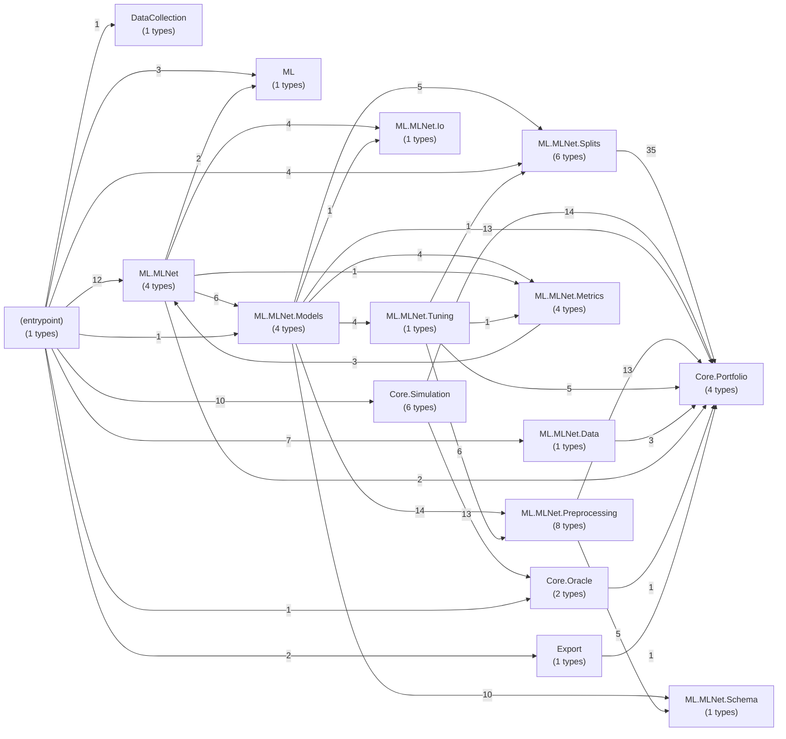
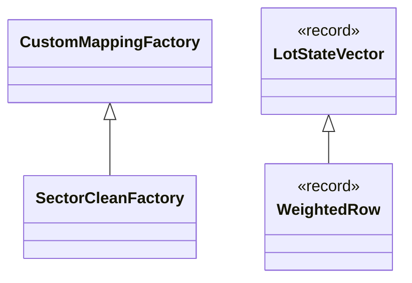

# Dependency & Coupling Atlas — .NET layer

> Generated 2026-09-30 by `dotnet run deps` (`scripts/dependencies.py`, brute-force regex scan — no compiler). Scanned **36 .cs files**, **46 types**, **100 reference edges**. Same approach as Zombtoy `DevTools/Diagrams`, adapted for C# records. Approximation note: instance-typed receivers (`loader.Load()`) can't be resolved without a compiler, so §5's call table covers static calls and constructions; §2's *reference* graph (any use of a known type name) is the complete coupling picture.

## 1. Layer graph — namespace level

Arrows read "references"; weights are total type-name mentions.

```mermaid
flowchart LR
    NS0["(entrypoint)<br/>(1 types)"]
    NS1["Core.Oracle<br/>(2 types)"]
    NS2["Core.Portfolio<br/>(4 types)"]
    NS3["Core.Simulation<br/>(6 types)"]
    NS4["DataCollection<br/>(1 types)"]
    NS5["Export<br/>(1 types)"]
    NS6["ML<br/>(1 types)"]
    NS7["ML.MLNet<br/>(4 types)"]
    NS8["ML.MLNet.Data<br/>(1 types)"]
    NS9["ML.MLNet.Io<br/>(1 types)"]
    NS10["ML.MLNet.Metrics<br/>(4 types)"]
    NS11["ML.MLNet.Models<br/>(4 types)"]
    NS12["ML.MLNet.Preprocessing<br/>(8 types)"]
    NS13["ML.MLNet.Schema<br/>(1 types)"]
    NS14["ML.MLNet.Splits<br/>(6 types)"]
    NS15["ML.MLNet.Tuning<br/>(1 types)"]
    NS14 -->|35| NS2
    NS3 -->|14| NS2
    NS11 -->|14| NS12
    NS3 -->|13| NS1
    NS11 -->|13| NS2
    NS12 -->|13| NS2
    NS0 -->|12| NS7
    NS11 -->|10| NS13
    NS0 -->|10| NS3
    NS0 -->|7| NS8
    NS7 -->|6| NS11
    NS15 -->|6| NS12
    NS11 -->|5| NS14
    NS12 -->|5| NS13
    NS15 -->|5| NS2
    NS7 -->|4| NS9
    NS11 -->|4| NS10
    NS11 -->|4| NS15
    NS0 -->|4| NS14
    NS8 -->|3| NS2
    NS10 -->|3| NS7
    NS0 -->|3| NS6
    NS7 -->|2| NS2
    NS7 -->|2| NS6
    NS0 -->|2| NS5
    NS1 -->|1| NS2
    NS5 -->|1| NS2
    NS7 -->|1| NS10
    NS11 -->|1| NS9
    NS15 -->|1| NS14
    NS15 -->|1| NS10
    NS0 -->|1| NS1
    NS0 -->|1| NS4
    NS0 -->|1| NS11
```

## 2. Class dependency graph — type references, clustered by namespace

Edge weight = number of times the source type's body mentions the target type.

```mermaid
flowchart LR
    subgraph NS0["(entrypoint)"]
        Program["Program<br/><i>entrypoint</i>"]
    end
    subgraph NS1["Core.Oracle"]
        OracleBoundary["OracleBoundary"]
        OracleConfig["OracleConfig<br/><i>record</i>"]
    end
    subgraph NS2["Core.Portfolio"]
        Lot["Lot"]
        LotStateVector["LotStateVector<br/><i>record</i>"]
        PortfolioState["PortfolioState"]
        TaxLedger["TaxLedger"]
    end
    subgraph NS3["Core.Simulation"]
        ContributionPolicy["ContributionPolicy<br/><i>record</i>"]
        GbmSimulator["GbmSimulator"]
        PriceLoader["PriceLoader"]
        SimulationEngine["SimulationEngine"]
        SoftLabelBuilder["SoftLabelBuilder"]
        TrackingErrorProxy["TrackingErrorProxy"]
    end
    subgraph NS4["DataCollection"]
        MarketDataDownloader["MarketDataDownloader"]
    end
    subgraph NS5["Export"]
        SimulationExporter["SimulationExporter"]
    end
    subgraph NS6["ML"]
        PythonRunner["PythonRunner"]
    end
    subgraph NS7["ML.MLNet"]
        BaseMetrics["BaseMetrics<br/><i>record</i>"]
        Confusion["Confusion<br/><i>record</i>"]
        CurvePointDto["CurvePointDto<br/><i>record</i>"]
        MLnetPipeline["MLnetPipeline"]
    end
    subgraph NS8["ML.MLNet.Data"]
        LotStateVectorCsvReader["LotStateVectorCsvReader"]
    end
    subgraph NS9["ML.MLNet.Io"]
        Artifacts["Artifacts"]
    end
    subgraph NS10["ML.MLNet.Metrics"]
        BinaryMetrics["BinaryMetrics"]
        BinaryMetricsResult["BinaryMetricsResult"]
        CurvePoint["CurvePoint<br/><i>record</i>"]
        ScoredRow["ScoredRow"]
    end
    subgraph NS11["ML.MLNet.Models"]
        GradientBoostedTreesTrainer["GradientBoostedTreesTrainer"]
        LogisticTrainer["LogisticTrainer"]
        RegressionScoredRow["RegressionScoredRow"]
        TaxValueRegressionPipeline["TaxValueRegressionPipeline"]
    end
    subgraph NS12["ML.MLNet.Preprocessing"]
        ClassWeights["ClassWeights"]
        MLReadyRow["MLReadyRow<br/><i>record</i>"]
        MedianImputer["MedianImputer"]
        PreprocessingPipeline["PreprocessingPipeline"]
        SectorCleanFactory["SectorCleanFactory"]
        SectorIn["SectorIn"]
        SectorOut["SectorOut"]
        WeightedRow["WeightedRow<br/><i>record</i>"]
    end
    subgraph NS13["ML.MLNet.Schema"]
        FeatureLists["FeatureLists"]
    end
    subgraph NS14["ML.MLNet.Splits"]
        DataSplit["DataSplit"]
        SplitMode["SplitMode<br/><i>enum</i>"]
        SplitPolicy["SplitPolicy"]
        StratifiedKFold["StratifiedKFold"]
        StratifiedSplit["StratifiedSplit"]
        TemporalSplit["TemporalSplit"]
    end
    subgraph NS15["ML.MLNet.Tuning"]
        GridSearchCV["GridSearchCV"]
    end
    BaseMetrics -->|4| CurvePointDto
    BaseMetrics -->|4| Artifacts
    BaseMetrics -->|3| LogisticTrainer
    BaseMetrics -->|3| GradientBoostedTreesTrainer
    BaseMetrics -->|2| Confusion
    BaseMetrics -->|2| LotStateVector
    BaseMetrics -->|2| PythonRunner
    BaseMetrics -->|1| BinaryMetricsResult
    BinaryMetrics -->|8| CurvePoint
    BinaryMetrics -->|3| BinaryMetricsResult
    BinaryMetrics -->|3| ScoredRow
    BinaryMetrics -->|3| Confusion
    BinaryMetricsResult -->|4| CurvePoint
    ClassWeights -->|3| WeightedRow
    ClassWeights -->|2| LotStateVector
    DataSplit -->|8| LotStateVector
    DataSplit -->|5| SplitPolicy
    DataSplit -->|2| SplitMode
    DataSplit -->|2| TemporalSplit
    DataSplit -->|1| StratifiedSplit
    DataSplit -->|1| StratifiedKFold
    GradientBoostedTreesTrainer -->|6| LotStateVector
    GradientBoostedTreesTrainer -->|3| MedianImputer
    GradientBoostedTreesTrainer -->|3| FeatureLists
    GradientBoostedTreesTrainer -->|2| DataSplit
    GradientBoostedTreesTrainer -->|2| GridSearchCV
    GradientBoostedTreesTrainer -->|1| BinaryMetricsResult
    GradientBoostedTreesTrainer -->|1| ClassWeights
    GradientBoostedTreesTrainer -->|1| BinaryMetrics
    GradientBoostedTreesTrainer -->|1| PreprocessingPipeline
    GridSearchCV -->|5| LotStateVector
    GridSearchCV -->|3| MedianImputer
    GridSearchCV -->|1| DataSplit
    GridSearchCV -->|1| ClassWeights
    GridSearchCV -->|1| BinaryMetrics
    GridSearchCV -->|1| MLReadyRow
    GridSearchCV -->|1| WeightedRow
    LogisticTrainer -->|6| LotStateVector
    LogisticTrainer -->|4| FeatureLists
    LogisticTrainer -->|3| MedianImputer
    LogisticTrainer -->|2| DataSplit
    LogisticTrainer -->|2| GridSearchCV
    LogisticTrainer -->|1| BinaryMetricsResult
    LogisticTrainer -->|1| ClassWeights
    LogisticTrainer -->|1| BinaryMetrics
    LogisticTrainer -->|1| PreprocessingPipeline
    LotStateVectorCsvReader -->|3| LotStateVector
    MedianImputer -->|9| LotStateVector
    MedianImputer -->|5| MLReadyRow
    OracleBoundary -->|3| OracleConfig
    OracleBoundary -->|1| LotStateVector
    PortfolioState -->|3| Lot
    PortfolioState -->|1| TaxLedger
    PreprocessingPipeline -->|1| SectorCleanFactory
    PriceLoader -->|1| GbmSimulator
    Program -->|12| MLnetPipeline
    Program -->|7| LotStateVectorCsvReader
    Program -->|5| PriceLoader
    Program -->|3| SplitPolicy
    Program -->|3| PythonRunner
    Program -->|2| SimulationEngine
    Program -->|2| SoftLabelBuilder
    Program -->|2| SimulationExporter
    Program -->|1| OracleConfig
    Program -->|1| SplitMode
    Program -->|1| ContributionPolicy
    Program -->|1| MarketDataDownloader
    Program -->|1| TaxValueRegressionPipeline
    SectorCleanFactory -->|2| SectorIn
    SectorCleanFactory -->|2| SectorOut
    SectorOut -->|5| FeatureLists
    SectorOut -->|3| SectorCleanFactory
    SimulationEngine -->|6| OracleBoundary
    SimulationEngine -->|5| PriceLoader
    SimulationEngine -->|5| Lot
    SimulationEngine -->|4| LotStateVector
    SimulationEngine -->|3| OracleConfig
    SimulationEngine -->|3| ContributionPolicy
    SimulationEngine -->|2| TrackingErrorProxy
    SimulationEngine -->|1| PortfolioState
    SimulationExporter -->|1| LotStateVector
    SoftLabelBuilder -->|3| OracleConfig
    SoftLabelBuilder -->|3| LotStateVector
    SoftLabelBuilder -->|2| PriceLoader
    SoftLabelBuilder -->|1| GbmSimulator
    SoftLabelBuilder -->|1| TaxLedger
    SoftLabelBuilder -->|1| OracleBoundary
    SplitPolicy -->|4| SplitMode
    StratifiedKFold -->|6| LotStateVector
    StratifiedSplit -->|8| LotStateVector
    TaxValueRegressionPipeline -->|3| MedianImputer
    TaxValueRegressionPipeline -->|3| FeatureLists
    TaxValueRegressionPipeline -->|1| LotStateVector
    TaxValueRegressionPipeline -->|1| DataSplit
    TaxValueRegressionPipeline -->|1| Artifacts
    TaxValueRegressionPipeline -->|1| MLReadyRow
    TaxValueRegressionPipeline -->|1| RegressionScoredRow
    TemporalSplit -->|13| LotStateVector
    TrackingErrorProxy -->|2| PriceLoader
    WeightedRow -->|2| LotStateVector
```

## 3. Inheritance & interface implementation

```mermaid
classDiagram
    class CustomMappingFactory
    class LotStateVector { <<record>> }
    class SectorCleanFactory
    class WeightedRow { <<record>> }
    CustomMappingFactory <|-- SectorCleanFactory
    LotStateVector <|-- WeightedRow
```

(`WeightedRow : LotStateVector` is the load-bearing one — the per-row training weight rides on the same immutable schema the simulator wrote.)

## 4. Coupling metrics

Fan-out = types this type references (breadth) / total mentions (weight). Fan-in = types that reference it. High fan-in = load-bearing schema; high fan-out = orchestrator.

| Type | Kind | Namespace | Fan-out (types / refs) | Fan-in (types / refs) |
|---|---|---|---|---|
| `LotStateVector` | record | Core.Portfolio | 0 / 0 | 17 / 80 |
| `Program` | entrypoint | (entrypoint) | 13 / 41 | 0 / 0 |
| `GradientBoostedTreesTrainer` | class | ML.MLNet.Models | 9 / 20 | 1 / 3 |
| `LogisticTrainer` | class | ML.MLNet.Models | 9 / 21 | 1 / 3 |
| `DataSplit` | class | ML.MLNet.Splits | 6 / 19 | 4 / 6 |
| `SimulationEngine` | class | Core.Simulation | 8 / 29 | 1 / 2 |
| `GridSearchCV` | class | ML.MLNet.Tuning | 7 / 13 | 2 / 4 |
| `BaseMetrics` | record | ML.MLNet | 8 / 21 | 0 / 0 |
| `TaxValueRegressionPipeline` | class | ML.MLNet.Models | 7 / 11 | 1 / 1 |
| `SoftLabelBuilder` | class | Core.Simulation | 6 / 11 | 1 / 2 |
| `BinaryMetrics` | class | ML.MLNet.Metrics | 4 / 17 | 3 / 3 |
| `MedianImputer` | class | ML.MLNet.Preprocessing | 2 / 14 | 4 / 12 |
| `PriceLoader` | class | Core.Simulation | 1 / 1 | 4 / 14 |
| `BinaryMetricsResult` | class | ML.MLNet.Metrics | 1 / 4 | 4 / 6 |
| `ClassWeights` | class | ML.MLNet.Preprocessing | 2 / 5 | 3 / 3 |
| `OracleBoundary` | class | Core.Oracle | 2 / 4 | 2 / 7 |
| `OracleConfig` | record | Core.Oracle | 0 / 0 | 4 / 10 |
| `SectorCleanFactory` | class | ML.MLNet.Preprocessing | 2 / 4 | 2 / 4 |
| `FeatureLists` | class | ML.MLNet.Schema | 0 / 0 | 4 / 15 |
| `PortfolioState` | class | Core.Portfolio | 2 / 4 | 1 / 1 |
| `WeightedRow` | record | ML.MLNet.Preprocessing | 1 / 2 | 2 / 4 |
| `MLReadyRow` | record | ML.MLNet.Preprocessing | 0 / 0 | 3 / 7 |
| `PreprocessingPipeline` | class | ML.MLNet.Preprocessing | 1 / 1 | 2 / 2 |
| `SectorOut` | class | ML.MLNet.Preprocessing | 2 / 8 | 1 / 2 |
| `SplitMode` | enum | ML.MLNet.Splits | 0 / 0 | 3 / 7 |
| `SplitPolicy` | class | ML.MLNet.Splits | 1 / 4 | 2 / 8 |
| `Lot` | class | Core.Portfolio | 0 / 0 | 2 / 8 |
| `TaxLedger` | class | Core.Portfolio | 0 / 0 | 2 / 2 |
| `ContributionPolicy` | record | Core.Simulation | 0 / 0 | 2 / 4 |
| `GbmSimulator` | class | Core.Simulation | 0 / 0 | 2 / 2 |
| `TrackingErrorProxy` | class | Core.Simulation | 1 / 2 | 1 / 2 |
| `SimulationExporter` | class | Export | 1 / 1 | 1 / 2 |
| `LotStateVectorCsvReader` | class | ML.MLNet.Data | 1 / 3 | 1 / 7 |
| `Artifacts` | class | ML.MLNet.Io | 0 / 0 | 2 / 5 |
| `Confusion` | record | ML.MLNet | 0 / 0 | 2 / 5 |
| `CurvePoint` | record | ML.MLNet.Metrics | 0 / 0 | 2 / 12 |
| `StratifiedKFold` | class | ML.MLNet.Splits | 1 / 6 | 1 / 1 |
| `StratifiedSplit` | class | ML.MLNet.Splits | 1 / 8 | 1 / 1 |
| `TemporalSplit` | class | ML.MLNet.Splits | 1 / 13 | 1 / 2 |
| `PythonRunner` | class | ML | 0 / 0 | 2 / 5 |
| `MarketDataDownloader` | class | DataCollection | 0 / 0 | 1 / 1 |
| `MLnetPipeline` | class | ML.MLNet | 0 / 0 | 1 / 12 |
| `CurvePointDto` | record | ML.MLNet | 0 / 0 | 1 / 4 |
| `ScoredRow` | class | ML.MLNet.Metrics | 0 / 0 | 1 / 3 |
| `RegressionScoredRow` | class | ML.MLNet.Models | 0 / 0 | 1 / 1 |
| `SectorIn` | class | ML.MLNet.Preprocessing | 0 / 0 | 1 / 2 |

## 5. Cross-class call detail

Statically resolvable call sites: `Receiver.Method(...)` where the receiver is a known project type, plus `new Type(...)` constructions (`.ctor`).

| Caller | Callee | Members used |
|---|---|---|
| `BaseMetrics` | `Artifacts` | `WriteCsv`, `WriteJson` |
| `BaseMetrics` | `CurvePointDto` | `.ctor` |
| `BaseMetrics` | `GradientBoostedTreesTrainer` | `Run`, `RunCV` |
| `BaseMetrics` | `LogisticTrainer` | `Run`, `RunCV` |
| `BaseMetrics` | `PythonRunner` | `Run` |
| `BinaryMetrics` | `BinaryMetricsResult` | `.ctor` |
| `BinaryMetrics` | `CurvePoint` | `.ctor` |
| `ClassWeights` | `WeightedRow` | `From` |
| `DataSplit` | `StratifiedKFold` | `Folds` |
| `DataSplit` | `StratifiedSplit` | `Split` |
| `DataSplit` | `TemporalSplit` | `PurgedFolds`, `TrainTest` |
| `GradientBoostedTreesTrainer` | `BinaryMetrics` | `Compute` |
| `GradientBoostedTreesTrainer` | `ClassWeights` | `AttachBalancedWeights` |
| `GradientBoostedTreesTrainer` | `DataSplit` | `TrainTest` |
| `GradientBoostedTreesTrainer` | `GridSearchCV` | `Search` |
| `GradientBoostedTreesTrainer` | `MedianImputer` | `Apply`, `Fit` |
| `GradientBoostedTreesTrainer` | `PreprocessingPipeline` | `Build` |
| `GridSearchCV` | `BinaryMetrics` | `Compute` |
| `GridSearchCV` | `ClassWeights` | `AttachBalancedWeights` |
| `GridSearchCV` | `DataSplit` | `Folds` |
| `GridSearchCV` | `MedianImputer` | `Apply`, `Fit` |
| `LogisticTrainer` | `BinaryMetrics` | `Compute` |
| `LogisticTrainer` | `ClassWeights` | `AttachBalancedWeights` |
| `LogisticTrainer` | `DataSplit` | `TrainTest` |
| `LogisticTrainer` | `GridSearchCV` | `Search` |
| `LogisticTrainer` | `MedianImputer` | `Apply`, `Fit` |
| `LogisticTrainer` | `PreprocessingPipeline` | `Build` |
| `LotStateVectorCsvReader` | `LotStateVector` | `.ctor` |
| `MedianImputer` | `MLReadyRow` | `.ctor` |
| `PriceLoader` | `GbmSimulator` | `NextGaussian` |
| `Program` | `LotStateVectorCsvReader` | `Read` |
| `Program` | `MLnetPipeline` | `RunAllSupervised`, `RunRender`, `RunSupervisedModel` |
| `Program` | `MarketDataDownloader` | `.ctor` |
| `Program` | `PriceLoader` | `.ctor`, `CalibrateGbmUniverse`, `FromGbm`, `UniformGbmUniverse` |
| `Program` | `PythonRunner` | `Run` |
| `Program` | `SimulationEngine` | `.ctor` |
| `Program` | `SimulationExporter` | `WriteCsv` |
| `Program` | `SoftLabelBuilder` | `.ctor` |
| `Program` | `TaxValueRegressionPipeline` | `Run` |
| `SectorOut` | `SectorCleanFactory` | `.ctor` |
| `SimulationEngine` | `Lot` | `.ctor` |
| `SimulationEngine` | `LotStateVector` | `.ctor` |
| `SimulationEngine` | `OracleBoundary` | `Label`, `Utility` |
| `SimulationEngine` | `TrackingErrorProxy` | `.ctor` |
| `SoftLabelBuilder` | `OracleBoundary` | `Label` |
| `SoftLabelBuilder` | `TaxLedger` | `ComputeTaxValue` |
| `TaxValueRegressionPipeline` | `Artifacts` | `WriteJson` |
| `TaxValueRegressionPipeline` | `DataSplit` | `TrainTest` |
| `TaxValueRegressionPipeline` | `MedianImputer` | `Apply`, `Fit` |

## 6. File inventory

| Namespace | Type | Kind | File |
|---|---|---|---|
| (entrypoint) | `Program` | entrypoint | `Program.cs` |
| Core.Oracle | `OracleBoundary` | class | `Core/Oracle/OracleBoundary.cs` |
| Core.Oracle | `OracleConfig` | record | `Core/Oracle/OracleConfig.cs` |
| Core.Portfolio | `Lot` | class | `Core/Portfolio/Lot.cs` |
| Core.Portfolio | `LotStateVector` | record | `Core/Portfolio/LotStateVector.cs` |
| Core.Portfolio | `PortfolioState` | class | `Core/Portfolio/PortfolioState.cs` |
| Core.Portfolio | `TaxLedger` | class | `Core/Portfolio/TaxLedger.cs` |
| Core.Simulation | `ContributionPolicy` | record | `Core/Simulation/ContributionPolicy.cs` |
| Core.Simulation | `GbmSimulator` | class | `Core/Simulation/GbmSimulator.cs` |
| Core.Simulation | `PriceLoader` | class | `Core/Simulation/PriceLoader.cs` |
| Core.Simulation | `SimulationEngine` | class | `Core/Simulation/SimulationEngine.cs` |
| Core.Simulation | `SoftLabelBuilder` | class | `Core/Simulation/SoftLabelBuilder.cs` |
| Core.Simulation | `TrackingErrorProxy` | class | `Core/Simulation/TrackingErrorProxy.cs` |
| DataCollection | `MarketDataDownloader` | class | `DataCollection/MarketDataDownloader.cs` |
| Export | `SimulationExporter` | class | `Export/SimulationExporter.cs` |
| ML | `PythonRunner` | class | `ML/CSharp/PythonRunner.cs` |
| ML.MLNet | `BaseMetrics` | record | `ML/CSharp/MLNet/MLnetPipeline.cs` |
| ML.MLNet | `Confusion` | record | `ML/CSharp/MLNet/MLnetPipeline.cs` |
| ML.MLNet | `CurvePointDto` | record | `ML/CSharp/MLNet/MLnetPipeline.cs` |
| ML.MLNet | `MLnetPipeline` | class | `ML/CSharp/MLNet/MLnetPipeline.cs` |
| ML.MLNet.Data | `LotStateVectorCsvReader` | class | `ML/CSharp/MLNet/Data/LotStateVectorCsvReader.cs` |
| ML.MLNet.Io | `Artifacts` | class | `ML/CSharp/MLNet/Io/Artifacts.cs` |
| ML.MLNet.Metrics | `BinaryMetrics` | class | `ML/CSharp/MLNet/Metrics/BinaryMetrics.cs` |
| ML.MLNet.Metrics | `BinaryMetricsResult` | class | `ML/CSharp/MLNet/Metrics/BinaryMetrics.cs` |
| ML.MLNet.Metrics | `CurvePoint` | record | `ML/CSharp/MLNet/Metrics/BinaryMetrics.cs` |
| ML.MLNet.Metrics | `ScoredRow` | class | `ML/CSharp/MLNet/Metrics/BinaryMetrics.cs` |
| ML.MLNet.Models | `GradientBoostedTreesTrainer` | class | `ML/CSharp/MLNet/Models/GradientBoostedTreesTrainer.cs` |
| ML.MLNet.Models | `LogisticTrainer` | class | `ML/CSharp/MLNet/Models/LogisticTrainer.cs` |
| ML.MLNet.Models | `RegressionScoredRow` | class | `ML/CSharp/MLNet/Models/TaxValueRegressionPipeline.cs` |
| ML.MLNet.Models | `TaxValueRegressionPipeline` | class | `ML/CSharp/MLNet/Models/TaxValueRegressionPipeline.cs` |
| ML.MLNet.Preprocessing | `ClassWeights` | class | `ML/CSharp/MLNet/Preprocessing/ClassWeights.cs` |
| ML.MLNet.Preprocessing | `MLReadyRow` | record | `ML/CSharp/MLNet/Preprocessing/MLReadyRow.cs` |
| ML.MLNet.Preprocessing | `MedianImputer` | class | `ML/CSharp/MLNet/Preprocessing/MedianImputer.cs` |
| ML.MLNet.Preprocessing | `PreprocessingPipeline` | class | `ML/CSharp/MLNet/Preprocessing/PreprocessingPipeline.cs` |
| ML.MLNet.Preprocessing | `SectorCleanFactory` | class | `ML/CSharp/MLNet/Preprocessing/PreprocessingPipeline.cs` |
| ML.MLNet.Preprocessing | `SectorIn` | class | `ML/CSharp/MLNet/Preprocessing/PreprocessingPipeline.cs` |
| ML.MLNet.Preprocessing | `SectorOut` | class | `ML/CSharp/MLNet/Preprocessing/PreprocessingPipeline.cs` |
| ML.MLNet.Preprocessing | `WeightedRow` | record | `ML/CSharp/MLNet/Preprocessing/ClassWeights.cs` |
| ML.MLNet.Schema | `FeatureLists` | class | `ML/CSharp/MLNet/Schema/FeatureLists.cs` |
| ML.MLNet.Splits | `DataSplit` | class | `ML/CSharp/MLNet/Splits/DataSplit.cs` |
| ML.MLNet.Splits | `SplitMode` | enum | `ML/CSharp/MLNet/Splits/SplitPolicy.cs` |
| ML.MLNet.Splits | `SplitPolicy` | class | `ML/CSharp/MLNet/Splits/SplitPolicy.cs` |
| ML.MLNet.Splits | `StratifiedKFold` | class | `ML/CSharp/MLNet/Splits/StratifiedKFold.cs` |
| ML.MLNet.Splits | `StratifiedSplit` | class | `ML/CSharp/MLNet/Splits/StratifiedSplit.cs` |
| ML.MLNet.Splits | `TemporalSplit` | class | `ML/CSharp/MLNet/Splits/TemporalSplit.cs` |
| ML.MLNet.Tuning | `GridSearchCV` | class | `ML/CSharp/MLNet/Tuning/GridSearchCV.cs` |
